<div style="display: flex; justify-content: flex-start;">
  <a href="https://twitter.com/gorky_flor14144" target="_blank">
    
  </a>
  <a href="https://www.linkedin.com/in/gorky-florez-castillo-865663250/" target="_blank">
    
  </a>
  <a href="https://github.com/GorkyFlorez" target="_blank">
    
  </a>
  <a href="https://web.facebook.com/yordy.florez.1/?_rdc=1&_rdr" target="_blank">
    
  </a>
  <a href="https://www.instagram.com/gorkiflorez/" target="_blank">
    
  </a>
  <a href="https://www.researchgate.net/profile/Gorky-Florez-Castillo" target="_blank">
    
  </a>
  <a href="https://scholar.google.es/citations?user=NB1rMykAAAAJ&hl=es" target="_blank">
    
  </a>
  <a href="https://id.pinterest.com/gorkyflorezcastillo/" target="_blank">
    
  </a>
</div>


<link rel="icon" type="image/png" href="favicon.ico"/>
 


<style>
/*----------LOGO above TOC---------*/
#TOC::before {
  content: "";
  display: block;
  height: 200px; /* Ajusta la altura según sea necesario */
  margin: 2em 20px 40px 20px; /* Ajusta los márgenes según sea necesario */
  background-image: url("https://encrypted-tbn0.gstatic.com/images?q=tbn:ANd9GcTEd3h2-4bBTbWytGRCE0-7YyxNIamg6Nq88Ndas-oWCyq3Xt7NfFDPg79gNQ&s"); /* Cambia la URL de la imagen según corresponda */
  background-size: contain;
  background-position: center center;
  background-repeat: no-repeat;
}
</style>


<div style="display: flex; justify-content: center;">


</div>


# **_Cargar los datos en R_** 

## Datos de cargados manualmente
En R, cargar datos manualmente se refiere al proceso de introducir los datos directamente en el código del programa, en lugar de cargarlos desde un archivo externo. Esto se logra asignando los valores directamente a un objeto en R.

Por ejemplo, en el fragmento de código proporcionado, se crea un vector llamado "datos" que contiene una serie de valores numéricos. Cada valor separado por comas dentro de los paréntesis corresponde a un dato individual en el vector.

```r
datos <- c(41.59, 46.55, 73.38, 51.06, 51.94, 75.73, 56.91, 31.02, 39.70, 
           43.32, 68.36, 55.40, 56.01, 51.66, 41.66, 76.80, 57.47, 20.50, 
           60.52, 42.91, 33.98, 46.73, 34.61, 39.07, 40.62, 24.70, 62.57, 
           52.30, 32.93, 68.81, 56.40, 45.57, 63.43, 63.17, 62.32, 60.33, 
           58.31, 49.07, 45.41, 44.29, 39.58, 46.88, 31.02, 82.53, 68.12, 
           33.15, 43.96, 43.00, 61.70, 48.75)
```

## Cargar datos mediante URL
Cargar datos mediante URL en R implica acceder a conjuntos de datos alojados en servidores remotos a través de enlaces URL. Para esto, se utiliza la función read.table() o una función similar, pasando la URL como argumento al parámetro file. Es importante asegurarse de que la URL proporcione acceso directo al archivo de datos, y de que los datos estén en un formato compatible con la función de lectura que se está utilizando.

En el ejemplo proporcionado, se muestra cómo cargar datos desde una URL específica que apunta a un archivo de datos en formato tabular. La función read.table() se utiliza para leer el archivo y almacenar los datos en un objeto en R.

```r
url = 'https://raw.githubusercontent.com/fhernanb/datos/master/medidas_cuerpo'
datos <- read.table(file=url, header=T)
datos
```

<div data-pagedtable="false">
  <script data-pagedtable-source type="application/json">
{"columns":[{"label":["edad"],"name":[1],"type":["int"],"align":["right"]},{"label":["peso"],"name":[2],"type":["dbl"],"align":["right"]},{"label":["altura"],"name":[3],"type":["dbl"],"align":["right"]},{"label":["sexo"],"name":[4],"type":["chr"],"align":["left"]},{"label":["muneca"],"name":[5],"type":["dbl"],"align":["right"]},{"label":["biceps"],"name":[6],"type":["dbl"],"align":["right"]}],"data":[{"1":"43","2":"87.3","3":"188.0","4":"Hombre","5":"12.2","6":"35.8"},{"1":"65","2":"80.0","3":"174.0","4":"Hombre","5":"12.0","6":"35.0"},{"1":"45","2":"82.3","3":"176.5","4":"Hombre","5":"11.2","6":"38.5"},{"1":"37","2":"73.6","3":"180.3","4":"Hombre","5":"11.2","6":"32.2"},{"1":"55","2":"74.1","3":"167.6","4":"Hombre","5":"11.8","6":"32.9"},{"1":"33","2":"85.9","3":"188.0","4":"Hombre","5":"12.4","6":"38.5"},{"1":"25","2":"73.2","3":"180.3","4":"Hombre","5":"10.6","6":"38.3"},{"1":"35","2":"76.3","3":"167.6","4":"Hombre","5":"11.3","6":"35.0"},{"1":"28","2":"65.9","3":"183.0","4":"Hombre","5":"10.2","6":"32.1"},{"1":"26","2":"90.9","3":"183.0","4":"Hombre","5":"12.0","6":"40.4"},{"1":"43","2":"89.1","3":"179.1","4":"Hombre","5":"11.3","6":"36.5"},{"1":"30","2":"62.3","3":"170.2","4":"Hombre","5":"11.5","6":"34.2"},{"1":"26","2":"82.7","3":"177.8","4":"Hombre","5":"11.5","6":"35.2"},{"1":"51","2":"79.1","3":"179.1","4":"Hombre","5":"11.8","6":"34.0"},{"1":"30","2":"98.2","3":"190.5","4":"Hombre","5":"10.7","6":"34.8"},{"1":"24","2":"84.1","3":"177.8","4":"Hombre","5":"11.5","6":"38.6"},{"1":"35","2":"83.2","3":"180.3","4":"Hombre","5":"11.1","6":"36.4"},{"1":"37","2":"83.2","3":"180.3","4":"Hombre","5":"10.5","6":"34.0"},{"1":"22","2":"51.6","3":"161.2","4":"Mujer","5":"9.2","6":"24.3"},{"1":"20","2":"59.0","3":"167.5","4":"Mujer","5":"9.9","6":"27.8"},{"1":"19","2":"49.2","3":"159.5","4":"Mujer","5":"8.9","6":"24.0"},{"1":"25","2":"63.0","3":"157.0","4":"Mujer","5":"9.5","6":"28.0"},{"1":"21","2":"53.6","3":"155.8","4":"Mujer","5":"9.1","6":"26.9"},{"1":"23","2":"59.0","3":"170.0","4":"Mujer","5":"10.0","6":"26.5"},{"1":"26","2":"47.6","3":"159.1","4":"Mujer","5":"9.4","6":"24.1"},{"1":"22","2":"69.8","3":"166.0","4":"Mujer","5":"10.7","6":"29.2"},{"1":"28","2":"66.8","3":"176.2","4":"Mujer","5":"9.8","6":"29.0"},{"1":"40","2":"75.2","3":"160.2","4":"Mujer","5":"11.5","6":"33.6"},{"1":"32","2":"55.2","3":"172.5","4":"Mujer","5":"8.6","6":"24.8"},{"1":"25","2":"54.2","3":"170.9","4":"Mujer","5":"9.7","6":"25.4"},{"1":"25","2":"62.5","3":"172.9","4":"Mujer","5":"9.2","6":"25.9"},{"1":"29","2":"42.0","3":"153.4","4":"Mujer","5":"8.3","6":"24.0"},{"1":"22","2":"50.0","3":"160.0","4":"Mujer","5":"8.6","6":"25.6"},{"1":"25","2":"49.8","3":"147.2","4":"Mujer","5":"9.0","6":"26.0"},{"1":"23","2":"49.2","3":"168.2","4":"Mujer","5":"9.6","6":"23.5"},{"1":"37","2":"73.2","3":"175.0","4":"Mujer","5":"11.0","6":"31.0"}],"options":{"columns":{"min":{},"max":[10]},"rows":{"min":[10],"max":[10]},"pages":{}}}
  </script>
</div>

<div style="display: flex; justify-content: center;">


</div>


En este caso, la URL apunta al archivo "medidas_cuerpo" alojado en GitHub. La opción header = TRUE se utiliza para indicar que la primera fila del archivo contiene los nombres de las columnas.

## Cargar datos en formato txt

Cuando se trata de cargar datos en formato de archivo de texto (por ejemplo, .txt), R proporciona varias funciones, entre ellas read.table(), que permite leer datos tabulares desde un archivo de texto. La función read.table() es versátil y puede manejar una variedad de formatos de archivo de texto, incluidos aquellos con delimitadores específicos, como tabulaciones o comas.

Aquí tienes un ejemplo de cómo cargar datos desde un archivo de texto en formato .txt:

```r
panes  = read.table("data1.txt", header = T) #heade: los encabezados son los titulos
panes
```

<div data-pagedtable="false">
  <script data-pagedtable-source type="application/json">
{"columns":[{"label":["Subtipo"],"name":[1],"type":["chr"],"align":["left"]},{"label":["Genero"],"name":[2],"type":["chr"],"align":["left"]},{"label":["Expresion"],"name":[3],"type":["dbl"],"align":["right"]}],"data":[{"1":"A","2":"m","3":"-0.54"},{"1":"A","2":"f","3":"-0.80"},{"1":"B","2":"f","3":"-1.03"},{"1":"C","2":"m","3":"-0.41"}],"options":{"columns":{"min":{},"max":[10]},"rows":{"min":[10],"max":[10]},"pages":{}}}
  </script>
</div>

```r
tortas = read.table("data2.txt", header = T)
```

```
## Warning in read.table("data2.txt", header = T): incomplete final line found by
## readTableHeader on 'data2.txt'
```

```r
tortas
```

<div data-pagedtable="false">
  <script data-pagedtable-source type="application/json">
{"columns":[{"label":["edad"],"name":[1],"type":["int"],"align":["right"]},{"label":["ciudad"],"name":[2],"type":["chr"],"align":["left"]}],"data":[{"1":"32","2":"Cusco"},{"1":"21","2":"Puerto"},{"1":"34","2":"Arequipa"},{"1":"67","2":"Lima"}],"options":{"columns":{"min":{},"max":[10]},"rows":{"min":[10],"max":[10]},"pages":{}}}
  </script>
</div>

```r
vara =  read.table("varespec.txt", header = T)
vara
```

<div data-pagedtable="false">
  <script data-pagedtable-source type="application/json">
{"columns":[{"label":["ID"],"name":[1],"type":["int"],"align":["right"]},{"label":["Callvulg"],"name":[2],"type":["dbl"],"align":["right"]},{"label":["Empenigr"],"name":[3],"type":["dbl"],"align":["right"]},{"label":["Rhodtome"],"name":[4],"type":["dbl"],"align":["right"]},{"label":["Vaccmyrt"],"name":[5],"type":["dbl"],"align":["right"]},{"label":["Vaccviti"],"name":[6],"type":["dbl"],"align":["right"]},{"label":["Pinusylv"],"name":[7],"type":["dbl"],"align":["right"]},{"label":["Descflex"],"name":[8],"type":["dbl"],"align":["right"]},{"label":["Betupube"],"name":[9],"type":["dbl"],"align":["right"]},{"label":["Vacculig"],"name":[10],"type":["dbl"],"align":["right"]},{"label":["Diphcomp"],"name":[11],"type":["dbl"],"align":["right"]},{"label":["Dicrsp"],"name":[12],"type":["dbl"],"align":["right"]},{"label":["Dicrfusc"],"name":[13],"type":["dbl"],"align":["right"]},{"label":["Dicrpoly"],"name":[14],"type":["dbl"],"align":["right"]},{"label":["Hylosple"],"name":[15],"type":["dbl"],"align":["right"]},{"label":["Pleuschr"],"name":[16],"type":["dbl"],"align":["right"]},{"label":["Polypili"],"name":[17],"type":["dbl"],"align":["right"]},{"label":["Polyjuni"],"name":[18],"type":["dbl"],"align":["right"]},{"label":["Polycomm"],"name":[19],"type":["dbl"],"align":["right"]},{"label":["Pohlnuta"],"name":[20],"type":["dbl"],"align":["right"]},{"label":["Ptilcili"],"name":[21],"type":["dbl"],"align":["right"]},{"label":["Barbhatc"],"name":[22],"type":["dbl"],"align":["right"]},{"label":["Cladarbu"],"name":[23],"type":["dbl"],"align":["right"]},{"label":["Cladrang"],"name":[24],"type":["dbl"],"align":["right"]},{"label":["Cladstel"],"name":[25],"type":["dbl"],"align":["right"]},{"label":["Cladunci"],"name":[26],"type":["dbl"],"align":["right"]},{"label":["Cladcocc"],"name":[27],"type":["dbl"],"align":["right"]},{"label":["Cladcorn"],"name":[28],"type":["dbl"],"align":["right"]},{"label":["Cladgrac"],"name":[29],"type":["dbl"],"align":["right"]},{"label":["Cladfimb"],"name":[30],"type":["dbl"],"align":["right"]},{"label":["Cladcris"],"name":[31],"type":["dbl"],"align":["right"]},{"label":["Cladchlo"],"name":[32],"type":["dbl"],"align":["right"]},{"label":["Cladbotr"],"name":[33],"type":["dbl"],"align":["right"]},{"label":["Cladamau"],"name":[34],"type":["dbl"],"align":["right"]},{"label":["Cladsp"],"name":[35],"type":["dbl"],"align":["right"]},{"label":["Cetreric"],"name":[36],"type":["dbl"],"align":["right"]},{"label":["Cetrisla"],"name":[37],"type":["dbl"],"align":["right"]},{"label":["Flavniva"],"name":[38],"type":["dbl"],"align":["right"]},{"label":["Nepharct"],"name":[39],"type":["dbl"],"align":["right"]},{"label":["Stersp"],"name":[40],"type":["dbl"],"align":["right"]},{"label":["Peltapht"],"name":[41],"type":["dbl"],"align":["right"]},{"label":["Icmaeric"],"name":[42],"type":["dbl"],"align":["right"]},{"label":["Cladcerv"],"name":[43],"type":["dbl"],"align":["right"]},{"label":["Claddefo"],"name":[44],"type":["dbl"],"align":["right"]},{"label":["Cladphyl"],"name":[45],"type":["dbl"],"align":["right"]}],"data":[{"1":"18","2":"0.55","3":"11.13","4":"0.00","5":"0.00","6":"17.80","7":"0.07","8":"0.00","9":"0.00","10":"1.60","11":"2.07","12":"0.00","13":"1.62","14":"0.00","15":"0.00","16":"4.67","17":"0.02","18":"0.13","19":"0.00","20":"0.13","21":"0.12","22":"0.00","23":"21.73","24":"21.47","25":"3.50","26":"0.30","27":"0.18","28":"0.23","29":"0.25","30":"0.25","31":"0.23","32":"0.00","33":"0.00","34":"0.08","35":"0.02","36":"0.02","37":"0.00","38":"0.12","39":"0.02","40":"0.62","41":"0.02","42":"0.00","43":"0.00","44":"0.25","45":"0.00"},{"1":"15","2":"0.67","3":"0.17","4":"0.00","5":"0.35","6":"12.13","7":"0.12","8":"0.00","9":"0.00","10":"0.00","11":"0.00","12":"0.33","13":"10.92","14":"0.02","15":"0.00","16":"37.75","17":"0.02","18":"0.23","19":"0.00","20":"0.03","21":"0.02","22":"0.00","23":"12.05","24":"8.13","25":"0.18","26":"2.65","27":"0.13","28":"0.18","29":"0.23","30":"0.25","31":"1.23","32":"0.00","33":"0.00","34":"0.00","35":"0.00","36":"0.15","37":"0.03","38":"0.00","39":"0.00","40":"0.85","41":"0.00","42":"0.00","43":"0.00","44":"1.00","45":"0.00"},{"1":"24","2":"0.10","3":"1.55","4":"0.00","5":"0.00","6":"13.47","7":"0.25","8":"0.00","9":"0.00","10":"0.00","11":"0.00","12":"23.43","13":"0.00","14":"1.68","15":"0.00","16":"32.92","17":"0.00","18":"0.23","19":"0.00","20":"0.32","21":"0.03","22":"0.00","23":"3.58","24":"5.52","25":"0.07","26":"8.93","27":"0.00","28":"0.20","29":"0.48","30":"0.00","31":"0.07","32":"0.10","33":"0.02","34":"0.00","35":"0.00","36":"0.78","37":"0.12","38":"0.00","39":"0.00","40":"0.03","41":"0.00","42":"0.00","43":"0.00","44":"0.33","45":"0.00"},{"1":"27","2":"0.00","3":"15.13","4":"2.42","5":"5.92","6":"15.97","7":"0.00","8":"3.70","9":"0.00","10":"1.12","11":"0.00","12":"0.00","13":"3.63","14":"0.00","15":"6.70","16":"58.07","17":"0.00","18":"0.00","19":"0.13","20":"0.02","21":"0.08","22":"0.08","23":"1.42","24":"7.63","25":"2.55","26":"0.15","27":"0.00","28":"0.38","29":"0.12","30":"0.10","31":"0.03","32":"0.00","33":"0.02","34":"0.00","35":"0.02","36":"0.00","37":"0.00","38":"0.00","39":"0.00","40":"0.00","41":"0.07","42":"0.00","43":"0.00","44":"0.15","45":"0.00"},{"1":"23","2":"0.00","3":"12.68","4":"0.00","5":"0.00","6":"23.73","7":"0.03","8":"0.00","9":"0.00","10":"0.00","11":"0.00","12":"0.00","13":"3.42","14":"0.02","15":"0.00","16":"19.42","17":"0.02","18":"2.12","19":"0.00","20":"0.17","21":"1.80","22":"0.02","23":"9.08","24":"9.22","25":"0.05","26":"0.73","27":"0.08","28":"1.42","29":"0.50","30":"0.17","31":"1.78","32":"0.05","33":"0.05","34":"0.00","35":"0.00","36":"0.00","37":"0.00","38":"0.02","39":"0.00","40":"1.58","41":"0.33","42":"0.00","43":"0.00","44":"1.97","45":"0.00"},{"1":"19","2":"0.00","3":"8.92","4":"0.00","5":"2.42","6":"10.28","7":"0.12","8":"0.02","9":"0.00","10":"0.00","11":"0.00","12":"0.00","13":"0.32","14":"0.02","15":"0.00","16":"21.03","17":"0.02","18":"1.58","19":"0.18","20":"0.07","21":"0.27","22":"0.02","23":"7.23","24":"4.95","25":"22.08","26":"0.25","27":"0.10","28":"0.25","29":"0.18","30":"0.10","31":"0.12","32":"0.05","33":"0.02","34":"0.00","35":"0.00","36":"0.00","37":"0.00","38":"0.02","39":"0.00","40":"0.28","41":"0.00","42":"0.00","43":"0.00","44":"0.37","45":"0.00"},{"1":"22","2":"4.73","3":"5.12","4":"1.55","5":"6.05","6":"12.40","7":"0.10","8":"0.78","9":"0.02","10":"2.00","11":"0.00","12":"0.03","13":"37.07","14":"0.00","15":"0.00","16":"26.38","17":"0.00","18":"0.00","19":"0.00","20":"0.10","21":"0.03","22":"0.00","23":"6.10","24":"3.60","25":"0.23","26":"2.38","27":"0.17","28":"0.13","29":"0.18","30":"0.20","31":"0.20","32":"0.02","33":"0.00","34":"0.00","35":"0.02","36":"0.02","37":"0.00","38":"0.00","39":"0.00","40":"0.00","41":"0.00","42":"0.00","43":"0.00","44":"0.15","45":"0.00"},{"1":"16","2":"4.47","3":"7.33","4":"0.00","5":"2.15","6":"4.33","7":"0.10","8":"0.00","9":"0.00","10":"0.00","11":"0.00","12":"1.02","13":"25.80","14":"0.23","15":"0.00","16":"18.98","17":"0.00","18":"0.02","19":"0.00","20":"0.13","21":"0.10","22":"0.00","23":"7.13","24":"14.03","25":"0.02","26":"0.82","27":"0.15","28":"0.05","29":"0.22","30":"0.22","31":"0.17","32":"0.00","33":"0.00","34":"0.00","35":"0.02","36":"0.18","37":"0.08","38":"0.00","39":"0.00","40":"0.03","41":"0.00","42":"0.07","43":"0.00","44":"0.67","45":"0.00"},{"1":"28","2":"0.00","3":"1.63","4":"0.35","5":"18.27","6":"7.13","7":"0.05","8":"0.40","9":"0.00","10":"0.20","11":"0.00","12":"0.30","13":"0.52","14":"0.20","15":"9.97","16":"70.03","17":"0.00","18":"0.08","19":"0.00","20":"0.07","21":"0.03","22":"0.00","23":"0.17","24":"0.87","25":"0.00","26":"0.05","27":"0.02","28":"0.03","29":"0.07","30":"0.10","31":"0.02","32":"0.00","33":"0.02","34":"0.00","35":"0.00","36":"0.00","37":"0.02","38":"0.00","39":"0.00","40":"0.02","41":"0.00","42":"0.00","43":"0.00","44":"0.08","45":"0.00"},{"1":"13","2":"24.13","3":"1.90","4":"0.07","5":"0.22","6":"5.30","7":"0.12","8":"0.00","9":"0.00","10":"0.00","11":"0.07","12":"0.02","13":"2.50","14":"0.00","15":"0.00","16":"5.52","17":"0.00","18":"0.02","19":"0.00","20":"0.03","21":"0.25","22":"0.07","23":"23.07","24":"23.67","25":"11.90","26":"0.95","27":"0.17","28":"0.05","29":"0.23","30":"0.18","31":"0.57","32":"0.02","33":"0.07","34":"0.00","35":"0.07","36":"0.18","37":"0.02","38":"0.00","39":"0.00","40":"0.03","41":"0.02","42":"0.00","43":"0.00","44":"0.47","45":"0.00"},{"1":"14","2":"3.75","3":"5.65","4":"0.00","5":"0.08","6":"5.30","7":"0.10","8":"0.00","9":"0.00","10":"0.00","11":"0.00","12":"0.00","13":"11.32","14":"0.00","15":"0.00","16":"7.75","17":"0.00","18":"0.30","19":"0.02","20":"0.07","21":"0.00","22":"0.00","23":"17.45","24":"1.32","25":"0.12","26":"23.68","27":"0.22","28":"0.50","29":"0.15","30":"0.23","31":"0.97","32":"0.00","33":"0.00","34":"0.00","35":"0.00","36":"0.68","37":"0.02","38":"0.00","39":"0.00","40":"0.33","41":"0.00","42":"0.02","43":"0.00","44":"1.57","45":"0.05"},{"1":"20","2":"0.02","3":"6.45","4":"0.00","5":"0.00","6":"14.13","7":"0.07","8":"0.00","9":"0.00","10":"0.47","11":"0.00","12":"0.85","13":"1.87","14":"0.08","15":"1.35","16":"13.73","17":"0.07","18":"0.05","19":"0.00","20":"0.12","21":"0.00","22":"0.00","23":"6.80","24":"11.22","25":"0.05","26":"4.75","27":"0.03","28":"0.12","29":"0.22","30":"0.18","31":"0.07","32":"0.00","33":"0.02","34":"0.00","35":"0.02","36":"0.15","37":"0.00","38":"0.00","39":"0.02","40":"0.00","41":"0.00","42":"0.00","43":"0.00","44":"1.20","45":"0.00"},{"1":"25","2":"0.00","3":"6.93","4":"0.00","5":"0.00","6":"10.60","7":"0.02","8":"0.10","9":"0.02","10":"0.05","11":"0.07","12":"14.02","13":"10.82","14":"0.00","15":"0.02","16":"28.77","17":"0.00","18":"6.98","19":"0.13","20":"0.00","21":"0.22","22":"0.00","23":"6.00","24":"2.25","25":"0.00","26":"0.80","27":"0.12","28":"0.57","29":"0.17","30":"0.15","31":"0.07","32":"0.00","33":"0.00","34":"0.00","35":"0.02","36":"0.03","37":"0.02","38":"0.00","39":"4.87","40":"0.10","41":"0.07","42":"0.00","43":"0.02","44":"0.05","45":"0.00"},{"1":"7","2":"0.00","3":"5.30","4":"0.00","5":"0.00","6":"8.20","7":"0.00","8":"0.05","9":"0.00","10":"8.10","11":"0.28","12":"0.00","13":"0.45","14":"0.03","15":"0.00","16":"0.10","17":"0.00","18":"0.25","19":"0.00","20":"0.03","21":"0.00","22":"0.00","23":"35.00","24":"42.50","25":"0.28","26":"0.35","27":"0.08","28":"0.20","29":"0.25","30":"0.18","31":"0.13","32":"0.08","33":"0.00","34":"0.00","35":"0.00","36":"0.05","37":"0.00","38":"0.23","39":"0.20","40":"0.93","41":"0.00","42":"0.03","43":"0.00","44":"0.10","45":"0.00"},{"1":"5","2":"0.00","3":"0.13","4":"0.00","5":"0.00","6":"2.75","7":"0.03","8":"0.00","9":"0.00","10":"0.00","11":"0.00","12":"0.00","13":"0.25","14":"0.03","15":"0.00","16":"0.03","17":"0.18","18":"0.65","19":"0.00","20":"0.00","21":"0.00","22":"0.00","23":"18.50","24":"59.00","25":"0.98","26":"0.28","27":"0.23","28":"0.23","29":"0.23","30":"0.10","31":"0.05","32":"0.00","33":"0.00","34":"0.03","35":"0.00","36":"0.18","37":"0.00","38":"0.28","39":"0.00","40":"10.28","41":"0.00","42":"0.10","43":"0.00","44":"0.25","45":"0.00"},{"1":"6","2":"0.30","3":"5.75","4":"0.00","5":"0.00","6":"10.50","7":"0.10","8":"0.00","9":"0.00","10":"0.00","11":"0.00","12":"0.00","13":"0.85","14":"0.00","15":"0.00","16":"0.05","17":"0.03","18":"0.08","19":"0.00","20":"0.00","21":"0.08","22":"0.00","23":"39.00","24":"37.50","25":"11.30","26":"3.45","27":"0.18","28":"0.20","29":"0.25","30":"0.25","31":"0.23","32":"0.03","33":"0.00","34":"0.00","35":"0.03","36":"0.35","37":"0.00","38":"0.08","39":"0.00","40":"0.03","41":"0.00","42":"0.00","43":"0.00","44":"0.28","45":"0.00"},{"1":"3","2":"0.03","3":"3.65","4":"0.00","5":"0.00","6":"4.43","7":"0.00","8":"0.00","9":"0.00","10":"1.65","11":"0.50","12":"0.00","13":"0.55","14":"0.00","15":"0.00","16":"0.05","17":"0.00","18":"0.00","19":"0.00","20":"0.03","21":"0.03","22":"0.00","23":"8.80","24":"29.50","25":"55.60","26":"0.25","27":"0.08","28":"0.25","29":"0.25","30":"0.15","31":"0.10","32":"0.03","33":"0.00","34":"0.03","35":"0.00","36":"0.05","37":"0.00","38":"0.15","39":"0.15","40":"0.28","41":"0.00","42":"0.00","43":"0.00","44":"0.08","45":"0.00"},{"1":"4","2":"3.40","3":"0.63","4":"0.00","5":"0.00","6":"1.98","7":"0.05","8":"0.05","9":"0.00","10":"0.03","11":"0.00","12":"0.00","13":"0.20","14":"0.00","15":"0.00","16":"1.53","17":"0.00","18":"0.10","19":"0.00","20":"0.05","21":"0.00","22":"0.00","23":"15.73","24":"20.03","25":"28.20","26":"0.73","27":"0.10","28":"0.15","29":"0.13","30":"0.10","31":"0.15","32":"0.00","33":"0.00","34":"0.00","35":"0.05","36":"0.28","37":"0.05","38":"10.03","39":"0.00","40":"0.95","41":"0.00","42":"0.00","43":"0.05","44":"0.08","45":"0.00"},{"1":"2","2":"0.05","3":"9.30","4":"0.00","5":"0.00","6":"8.50","7":"0.03","8":"0.00","9":"0.00","10":"0.00","11":"0.00","12":"0.00","13":"0.03","14":"0.00","15":"0.00","16":"0.75","17":"0.00","18":"0.03","19":"0.00","20":"0.00","21":"0.03","22":"0.00","23":"0.48","24":"24.50","25":"75.00","26":"0.20","27":"0.00","28":"0.03","29":"0.03","30":"0.05","31":"0.03","32":"0.03","33":"0.00","34":"0.00","35":"0.00","36":"0.00","37":"0.00","38":"0.00","39":"0.00","40":"0.00","41":"0.00","42":"0.00","43":"0.03","44":"0.03","45":"0.00"},{"1":"9","2":"0.00","3":"3.47","4":"0.00","5":"0.25","6":"20.50","7":"0.25","8":"0.00","9":"0.00","10":"0.00","11":"0.25","12":"0.00","13":"0.38","14":"0.25","15":"0.00","16":"4.07","17":"0.00","18":"0.25","19":"0.00","20":"0.25","21":"0.25","22":"0.00","23":"0.46","24":"4.00","25":"84.30","26":"0.25","27":"0.25","28":"0.25","29":"0.25","30":"0.25","31":"0.25","32":"0.25","33":"0.00","34":"0.00","35":"0.25","36":"0.25","37":"0.25","38":"0.67","39":"0.00","40":"0.00","41":"0.00","42":"0.00","43":"0.00","44":"0.25","45":"0.25"},{"1":"12","2":"0.25","3":"11.50","4":"0.00","5":"0.00","6":"15.80","7":"1.20","8":"0.00","9":"0.00","10":"0.00","11":"0.00","12":"0.25","13":"0.25","14":"0.00","15":"0.00","16":"6.00","17":"0.00","18":"0.00","19":"0.00","20":"0.25","21":"0.00","22":"0.00","23":"3.60","24":"14.60","25":"63.30","26":"1.30","27":"0.00","28":"0.25","29":"0.25","30":"0.25","31":"0.25","32":"0.00","33":"0.00","34":"0.00","35":"0.00","36":"0.00","37":"0.25","38":"0.00","39":"0.00","40":"0.00","41":"0.00","42":"0.00","43":"0.00","44":"0.25","45":"0.00"},{"1":"10","2":"0.25","3":"11.00","4":"0.00","5":"0.00","6":"11.90","7":"0.25","8":"0.00","9":"0.00","10":"0.00","11":"0.00","12":"0.00","13":"0.25","14":"0.25","15":"0.00","16":"0.67","17":"0.00","18":"0.25","19":"0.00","20":"0.25","21":"0.00","22":"0.00","23":"1.30","24":"8.70","25":"84.30","26":"0.25","27":"0.25","28":"0.25","29":"0.00","30":"0.25","31":"0.25","32":"0.25","33":"0.00","34":"0.00","35":"0.00","36":"0.25","37":"0.25","38":"0.25","39":"0.00","40":"0.25","41":"0.00","42":"0.00","43":"0.00","44":"0.25","45":"0.25"},{"1":"11","2":"2.37","3":"0.67","4":"0.00","5":"0.00","6":"12.90","7":"0.80","8":"0.00","9":"0.00","10":"0.00","11":"0.00","12":"0.00","13":"0.25","14":"0.25","15":"0.00","16":"17.70","17":"0.25","18":"0.25","19":"0.00","20":"0.25","21":"0.67","22":"0.00","23":"9.67","24":"29.80","25":"31.80","26":"2.53","27":"0.25","28":"0.25","29":"0.25","30":"0.00","31":"0.25","32":"0.00","33":"0.00","34":"0.00","35":"0.00","36":"0.00","37":"0.25","38":"0.00","39":"0.00","40":"0.93","41":"0.25","42":"0.00","43":"0.00","44":"0.00","45":"0.25"},{"1":"21","2":"0.00","3":"16.00","4":"4.00","5":"15.00","6":"25.00","7":"0.25","8":"0.50","9":"0.25","10":"0.00","11":"0.00","12":"0.25","13":"0.25","14":"3.00","15":"0.00","16":"2.00","17":"0.00","18":"0.25","19":"0.25","20":"0.25","21":"10.00","22":"3.00","23":"0.70","24":"4.70","25":"10.90","26":"0.25","27":"0.00","28":"0.05","29":"0.25","30":"0.25","31":"0.25","32":"0.25","33":"0.25","34":"0.00","35":"0.00","36":"0.00","37":"0.67","38":"0.00","39":"0.00","40":"0.00","41":"0.00","42":"0.00","43":"0.00","44":"0.40","45":"0.00"}],"options":{"columns":{"min":{},"max":[10]},"rows":{"min":[10],"max":[10]},"pages":{}}}
  </script>
</div>

<div style="display: flex; justify-content: center;">


</div>


En este ejemplo:

"data1.txt" es el nombre del archivo de texto que contiene los datos que deseas cargar. Asegúrate de que el archivo esté en el mismo directorio de trabajo que tu script de R, o especifica la ruta completa al archivo si está en un directorio diferente.

header = TRUE indica que la primera fila del archivo contiene los nombres de las columnas. Si los datos no tienen encabezados, puedes establecer header = FALSE o simplemente omitir este parámetro.

La función read.table() interpreta automáticamente el contenido del archivo de texto y lo carga en un objeto de datos en R. Una vez ejecutado el código, el objeto panes contendrá los datos del archivo "data1.txt", y estarán listos para ser utilizados en análisis posteriores dentro de R.


## Cargar datos en CSV
Para cargar datos en formato CSV (Comma-Separated Values) en R, puedes utilizar la función read.csv() o read_csv() del paquete readr. Ambas funciones son capaces de leer datos de archivos CSV y cargarlos en un objeto de datos en R. Aquí te muestro cómo hacerlo con read.csv():


```r
#install.packages(readr)  comando para instalar paquetes en R
library(readr)
varas1 = read.csv("varespec.csv")
varas1
```

<div data-pagedtable="false">
  <script data-pagedtable-source type="application/json">
{"columns":[{"label":["ID"],"name":[1],"type":["int"],"align":["right"]},{"label":["Callvulg"],"name":[2],"type":["dbl"],"align":["right"]},{"label":["Empenigr"],"name":[3],"type":["dbl"],"align":["right"]},{"label":["Rhodtome"],"name":[4],"type":["dbl"],"align":["right"]},{"label":["Vaccmyrt"],"name":[5],"type":["dbl"],"align":["right"]},{"label":["Vaccviti"],"name":[6],"type":["dbl"],"align":["right"]},{"label":["Pinusylv"],"name":[7],"type":["dbl"],"align":["right"]},{"label":["Descflex"],"name":[8],"type":["dbl"],"align":["right"]},{"label":["Betupube"],"name":[9],"type":["dbl"],"align":["right"]},{"label":["Vacculig"],"name":[10],"type":["dbl"],"align":["right"]},{"label":["Diphcomp"],"name":[11],"type":["dbl"],"align":["right"]},{"label":["Dicrsp"],"name":[12],"type":["dbl"],"align":["right"]},{"label":["Dicrfusc"],"name":[13],"type":["dbl"],"align":["right"]},{"label":["Dicrpoly"],"name":[14],"type":["dbl"],"align":["right"]},{"label":["Hylosple"],"name":[15],"type":["dbl"],"align":["right"]},{"label":["Pleuschr"],"name":[16],"type":["dbl"],"align":["right"]},{"label":["Polypili"],"name":[17],"type":["dbl"],"align":["right"]},{"label":["Polyjuni"],"name":[18],"type":["dbl"],"align":["right"]},{"label":["Polycomm"],"name":[19],"type":["dbl"],"align":["right"]},{"label":["Pohlnuta"],"name":[20],"type":["dbl"],"align":["right"]},{"label":["Ptilcili"],"name":[21],"type":["dbl"],"align":["right"]},{"label":["Barbhatc"],"name":[22],"type":["dbl"],"align":["right"]},{"label":["Cladarbu"],"name":[23],"type":["dbl"],"align":["right"]},{"label":["Cladrang"],"name":[24],"type":["dbl"],"align":["right"]},{"label":["Cladstel"],"name":[25],"type":["dbl"],"align":["right"]},{"label":["Cladunci"],"name":[26],"type":["dbl"],"align":["right"]},{"label":["Cladcocc"],"name":[27],"type":["dbl"],"align":["right"]},{"label":["Cladcorn"],"name":[28],"type":["dbl"],"align":["right"]},{"label":["Cladgrac"],"name":[29],"type":["dbl"],"align":["right"]},{"label":["Cladfimb"],"name":[30],"type":["dbl"],"align":["right"]},{"label":["Cladcris"],"name":[31],"type":["dbl"],"align":["right"]},{"label":["Cladchlo"],"name":[32],"type":["dbl"],"align":["right"]},{"label":["Cladbotr"],"name":[33],"type":["dbl"],"align":["right"]},{"label":["Cladamau"],"name":[34],"type":["dbl"],"align":["right"]},{"label":["Cladsp"],"name":[35],"type":["dbl"],"align":["right"]},{"label":["Cetreric"],"name":[36],"type":["dbl"],"align":["right"]},{"label":["Cetrisla"],"name":[37],"type":["dbl"],"align":["right"]},{"label":["Flavniva"],"name":[38],"type":["dbl"],"align":["right"]},{"label":["Nepharct"],"name":[39],"type":["dbl"],"align":["right"]},{"label":["Stersp"],"name":[40],"type":["dbl"],"align":["right"]},{"label":["Peltapht"],"name":[41],"type":["dbl"],"align":["right"]},{"label":["Icmaeric"],"name":[42],"type":["dbl"],"align":["right"]},{"label":["Cladcerv"],"name":[43],"type":["dbl"],"align":["right"]},{"label":["Claddefo"],"name":[44],"type":["dbl"],"align":["right"]},{"label":["Cladphyl"],"name":[45],"type":["dbl"],"align":["right"]}],"data":[{"1":"18","2":"0.55","3":"11.13","4":"0.00","5":"0.00","6":"17.80","7":"0.07","8":"0.00","9":"0.00","10":"1.60","11":"2.07","12":"0.00","13":"1.62","14":"0.00","15":"0.00","16":"4.67","17":"0.02","18":"0.13","19":"0.00","20":"0.13","21":"0.12","22":"0.00","23":"21.73","24":"21.47","25":"3.50","26":"0.30","27":"0.18","28":"0.23","29":"0.25","30":"0.25","31":"0.23","32":"0.00","33":"0.00","34":"0.08","35":"0.02","36":"0.02","37":"0.00","38":"0.12","39":"0.02","40":"0.62","41":"0.02","42":"0.00","43":"0.00","44":"0.25","45":"0.00"},{"1":"15","2":"0.67","3":"0.17","4":"0.00","5":"0.35","6":"12.13","7":"0.12","8":"0.00","9":"0.00","10":"0.00","11":"0.00","12":"0.33","13":"10.92","14":"0.02","15":"0.00","16":"37.75","17":"0.02","18":"0.23","19":"0.00","20":"0.03","21":"0.02","22":"0.00","23":"12.05","24":"8.13","25":"0.18","26":"2.65","27":"0.13","28":"0.18","29":"0.23","30":"0.25","31":"1.23","32":"0.00","33":"0.00","34":"0.00","35":"0.00","36":"0.15","37":"0.03","38":"0.00","39":"0.00","40":"0.85","41":"0.00","42":"0.00","43":"0.00","44":"1.00","45":"0.00"},{"1":"24","2":"0.10","3":"1.55","4":"0.00","5":"0.00","6":"13.47","7":"0.25","8":"0.00","9":"0.00","10":"0.00","11":"0.00","12":"23.43","13":"0.00","14":"1.68","15":"0.00","16":"32.92","17":"0.00","18":"0.23","19":"0.00","20":"0.32","21":"0.03","22":"0.00","23":"3.58","24":"5.52","25":"0.07","26":"8.93","27":"0.00","28":"0.20","29":"0.48","30":"0.00","31":"0.07","32":"0.10","33":"0.02","34":"0.00","35":"0.00","36":"0.78","37":"0.12","38":"0.00","39":"0.00","40":"0.03","41":"0.00","42":"0.00","43":"0.00","44":"0.33","45":"0.00"},{"1":"27","2":"0.00","3":"15.13","4":"2.42","5":"5.92","6":"15.97","7":"0.00","8":"3.70","9":"0.00","10":"1.12","11":"0.00","12":"0.00","13":"3.63","14":"0.00","15":"6.70","16":"58.07","17":"0.00","18":"0.00","19":"0.13","20":"0.02","21":"0.08","22":"0.08","23":"1.42","24":"7.63","25":"2.55","26":"0.15","27":"0.00","28":"0.38","29":"0.12","30":"0.10","31":"0.03","32":"0.00","33":"0.02","34":"0.00","35":"0.02","36":"0.00","37":"0.00","38":"0.00","39":"0.00","40":"0.00","41":"0.07","42":"0.00","43":"0.00","44":"0.15","45":"0.00"},{"1":"23","2":"0.00","3":"12.68","4":"0.00","5":"0.00","6":"23.73","7":"0.03","8":"0.00","9":"0.00","10":"0.00","11":"0.00","12":"0.00","13":"3.42","14":"0.02","15":"0.00","16":"19.42","17":"0.02","18":"2.12","19":"0.00","20":"0.17","21":"1.80","22":"0.02","23":"9.08","24":"9.22","25":"0.05","26":"0.73","27":"0.08","28":"1.42","29":"0.50","30":"0.17","31":"1.78","32":"0.05","33":"0.05","34":"0.00","35":"0.00","36":"0.00","37":"0.00","38":"0.02","39":"0.00","40":"1.58","41":"0.33","42":"0.00","43":"0.00","44":"1.97","45":"0.00"},{"1":"19","2":"0.00","3":"8.92","4":"0.00","5":"2.42","6":"10.28","7":"0.12","8":"0.02","9":"0.00","10":"0.00","11":"0.00","12":"0.00","13":"0.32","14":"0.02","15":"0.00","16":"21.03","17":"0.02","18":"1.58","19":"0.18","20":"0.07","21":"0.27","22":"0.02","23":"7.23","24":"4.95","25":"22.08","26":"0.25","27":"0.10","28":"0.25","29":"0.18","30":"0.10","31":"0.12","32":"0.05","33":"0.02","34":"0.00","35":"0.00","36":"0.00","37":"0.00","38":"0.02","39":"0.00","40":"0.28","41":"0.00","42":"0.00","43":"0.00","44":"0.37","45":"0.00"},{"1":"22","2":"4.73","3":"5.12","4":"1.55","5":"6.05","6":"12.40","7":"0.10","8":"0.78","9":"0.02","10":"2.00","11":"0.00","12":"0.03","13":"37.07","14":"0.00","15":"0.00","16":"26.38","17":"0.00","18":"0.00","19":"0.00","20":"0.10","21":"0.03","22":"0.00","23":"6.10","24":"3.60","25":"0.23","26":"2.38","27":"0.17","28":"0.13","29":"0.18","30":"0.20","31":"0.20","32":"0.02","33":"0.00","34":"0.00","35":"0.02","36":"0.02","37":"0.00","38":"0.00","39":"0.00","40":"0.00","41":"0.00","42":"0.00","43":"0.00","44":"0.15","45":"0.00"},{"1":"16","2":"4.47","3":"7.33","4":"0.00","5":"2.15","6":"4.33","7":"0.10","8":"0.00","9":"0.00","10":"0.00","11":"0.00","12":"1.02","13":"25.80","14":"0.23","15":"0.00","16":"18.98","17":"0.00","18":"0.02","19":"0.00","20":"0.13","21":"0.10","22":"0.00","23":"7.13","24":"14.03","25":"0.02","26":"0.82","27":"0.15","28":"0.05","29":"0.22","30":"0.22","31":"0.17","32":"0.00","33":"0.00","34":"0.00","35":"0.02","36":"0.18","37":"0.08","38":"0.00","39":"0.00","40":"0.03","41":"0.00","42":"0.07","43":"0.00","44":"0.67","45":"0.00"},{"1":"28","2":"0.00","3":"1.63","4":"0.35","5":"18.27","6":"7.13","7":"0.05","8":"0.40","9":"0.00","10":"0.20","11":"0.00","12":"0.30","13":"0.52","14":"0.20","15":"9.97","16":"70.03","17":"0.00","18":"0.08","19":"0.00","20":"0.07","21":"0.03","22":"0.00","23":"0.17","24":"0.87","25":"0.00","26":"0.05","27":"0.02","28":"0.03","29":"0.07","30":"0.10","31":"0.02","32":"0.00","33":"0.02","34":"0.00","35":"0.00","36":"0.00","37":"0.02","38":"0.00","39":"0.00","40":"0.02","41":"0.00","42":"0.00","43":"0.00","44":"0.08","45":"0.00"},{"1":"13","2":"24.13","3":"1.90","4":"0.07","5":"0.22","6":"5.30","7":"0.12","8":"0.00","9":"0.00","10":"0.00","11":"0.07","12":"0.02","13":"2.50","14":"0.00","15":"0.00","16":"5.52","17":"0.00","18":"0.02","19":"0.00","20":"0.03","21":"0.25","22":"0.07","23":"23.07","24":"23.67","25":"11.90","26":"0.95","27":"0.17","28":"0.05","29":"0.23","30":"0.18","31":"0.57","32":"0.02","33":"0.07","34":"0.00","35":"0.07","36":"0.18","37":"0.02","38":"0.00","39":"0.00","40":"0.03","41":"0.02","42":"0.00","43":"0.00","44":"0.47","45":"0.00"},{"1":"14","2":"3.75","3":"5.65","4":"0.00","5":"0.08","6":"5.30","7":"0.10","8":"0.00","9":"0.00","10":"0.00","11":"0.00","12":"0.00","13":"11.32","14":"0.00","15":"0.00","16":"7.75","17":"0.00","18":"0.30","19":"0.02","20":"0.07","21":"0.00","22":"0.00","23":"17.45","24":"1.32","25":"0.12","26":"23.68","27":"0.22","28":"0.50","29":"0.15","30":"0.23","31":"0.97","32":"0.00","33":"0.00","34":"0.00","35":"0.00","36":"0.68","37":"0.02","38":"0.00","39":"0.00","40":"0.33","41":"0.00","42":"0.02","43":"0.00","44":"1.57","45":"0.05"},{"1":"20","2":"0.02","3":"6.45","4":"0.00","5":"0.00","6":"14.13","7":"0.07","8":"0.00","9":"0.00","10":"0.47","11":"0.00","12":"0.85","13":"1.87","14":"0.08","15":"1.35","16":"13.73","17":"0.07","18":"0.05","19":"0.00","20":"0.12","21":"0.00","22":"0.00","23":"6.80","24":"11.22","25":"0.05","26":"4.75","27":"0.03","28":"0.12","29":"0.22","30":"0.18","31":"0.07","32":"0.00","33":"0.02","34":"0.00","35":"0.02","36":"0.15","37":"0.00","38":"0.00","39":"0.02","40":"0.00","41":"0.00","42":"0.00","43":"0.00","44":"1.20","45":"0.00"},{"1":"25","2":"0.00","3":"6.93","4":"0.00","5":"0.00","6":"10.60","7":"0.02","8":"0.10","9":"0.02","10":"0.05","11":"0.07","12":"14.02","13":"10.82","14":"0.00","15":"0.02","16":"28.77","17":"0.00","18":"6.98","19":"0.13","20":"0.00","21":"0.22","22":"0.00","23":"6.00","24":"2.25","25":"0.00","26":"0.80","27":"0.12","28":"0.57","29":"0.17","30":"0.15","31":"0.07","32":"0.00","33":"0.00","34":"0.00","35":"0.02","36":"0.03","37":"0.02","38":"0.00","39":"4.87","40":"0.10","41":"0.07","42":"0.00","43":"0.02","44":"0.05","45":"0.00"},{"1":"7","2":"0.00","3":"5.30","4":"0.00","5":"0.00","6":"8.20","7":"0.00","8":"0.05","9":"0.00","10":"8.10","11":"0.28","12":"0.00","13":"0.45","14":"0.03","15":"0.00","16":"0.10","17":"0.00","18":"0.25","19":"0.00","20":"0.03","21":"0.00","22":"0.00","23":"35.00","24":"42.50","25":"0.28","26":"0.35","27":"0.08","28":"0.20","29":"0.25","30":"0.18","31":"0.13","32":"0.08","33":"0.00","34":"0.00","35":"0.00","36":"0.05","37":"0.00","38":"0.23","39":"0.20","40":"0.93","41":"0.00","42":"0.03","43":"0.00","44":"0.10","45":"0.00"},{"1":"5","2":"0.00","3":"0.13","4":"0.00","5":"0.00","6":"2.75","7":"0.03","8":"0.00","9":"0.00","10":"0.00","11":"0.00","12":"0.00","13":"0.25","14":"0.03","15":"0.00","16":"0.03","17":"0.18","18":"0.65","19":"0.00","20":"0.00","21":"0.00","22":"0.00","23":"18.50","24":"59.00","25":"0.98","26":"0.28","27":"0.23","28":"0.23","29":"0.23","30":"0.10","31":"0.05","32":"0.00","33":"0.00","34":"0.03","35":"0.00","36":"0.18","37":"0.00","38":"0.28","39":"0.00","40":"10.28","41":"0.00","42":"0.10","43":"0.00","44":"0.25","45":"0.00"},{"1":"6","2":"0.30","3":"5.75","4":"0.00","5":"0.00","6":"10.50","7":"0.10","8":"0.00","9":"0.00","10":"0.00","11":"0.00","12":"0.00","13":"0.85","14":"0.00","15":"0.00","16":"0.05","17":"0.03","18":"0.08","19":"0.00","20":"0.00","21":"0.08","22":"0.00","23":"39.00","24":"37.50","25":"11.30","26":"3.45","27":"0.18","28":"0.20","29":"0.25","30":"0.25","31":"0.23","32":"0.03","33":"0.00","34":"0.00","35":"0.03","36":"0.35","37":"0.00","38":"0.08","39":"0.00","40":"0.03","41":"0.00","42":"0.00","43":"0.00","44":"0.28","45":"0.00"},{"1":"3","2":"0.03","3":"3.65","4":"0.00","5":"0.00","6":"4.43","7":"0.00","8":"0.00","9":"0.00","10":"1.65","11":"0.50","12":"0.00","13":"0.55","14":"0.00","15":"0.00","16":"0.05","17":"0.00","18":"0.00","19":"0.00","20":"0.03","21":"0.03","22":"0.00","23":"8.80","24":"29.50","25":"55.60","26":"0.25","27":"0.08","28":"0.25","29":"0.25","30":"0.15","31":"0.10","32":"0.03","33":"0.00","34":"0.03","35":"0.00","36":"0.05","37":"0.00","38":"0.15","39":"0.15","40":"0.28","41":"0.00","42":"0.00","43":"0.00","44":"0.08","45":"0.00"},{"1":"4","2":"3.40","3":"0.63","4":"0.00","5":"0.00","6":"1.98","7":"0.05","8":"0.05","9":"0.00","10":"0.03","11":"0.00","12":"0.00","13":"0.20","14":"0.00","15":"0.00","16":"1.53","17":"0.00","18":"0.10","19":"0.00","20":"0.05","21":"0.00","22":"0.00","23":"15.73","24":"20.03","25":"28.20","26":"0.73","27":"0.10","28":"0.15","29":"0.13","30":"0.10","31":"0.15","32":"0.00","33":"0.00","34":"0.00","35":"0.05","36":"0.28","37":"0.05","38":"10.03","39":"0.00","40":"0.95","41":"0.00","42":"0.00","43":"0.05","44":"0.08","45":"0.00"},{"1":"2","2":"0.05","3":"9.30","4":"0.00","5":"0.00","6":"8.50","7":"0.03","8":"0.00","9":"0.00","10":"0.00","11":"0.00","12":"0.00","13":"0.03","14":"0.00","15":"0.00","16":"0.75","17":"0.00","18":"0.03","19":"0.00","20":"0.00","21":"0.03","22":"0.00","23":"0.48","24":"24.50","25":"75.00","26":"0.20","27":"0.00","28":"0.03","29":"0.03","30":"0.05","31":"0.03","32":"0.03","33":"0.00","34":"0.00","35":"0.00","36":"0.00","37":"0.00","38":"0.00","39":"0.00","40":"0.00","41":"0.00","42":"0.00","43":"0.03","44":"0.03","45":"0.00"},{"1":"9","2":"0.00","3":"3.47","4":"0.00","5":"0.25","6":"20.50","7":"0.25","8":"0.00","9":"0.00","10":"0.00","11":"0.25","12":"0.00","13":"0.38","14":"0.25","15":"0.00","16":"4.07","17":"0.00","18":"0.25","19":"0.00","20":"0.25","21":"0.25","22":"0.00","23":"0.46","24":"4.00","25":"84.30","26":"0.25","27":"0.25","28":"0.25","29":"0.25","30":"0.25","31":"0.25","32":"0.25","33":"0.00","34":"0.00","35":"0.25","36":"0.25","37":"0.25","38":"0.67","39":"0.00","40":"0.00","41":"0.00","42":"0.00","43":"0.00","44":"0.25","45":"0.25"},{"1":"12","2":"0.25","3":"11.50","4":"0.00","5":"0.00","6":"15.80","7":"1.20","8":"0.00","9":"0.00","10":"0.00","11":"0.00","12":"0.25","13":"0.25","14":"0.00","15":"0.00","16":"6.00","17":"0.00","18":"0.00","19":"0.00","20":"0.25","21":"0.00","22":"0.00","23":"3.60","24":"14.60","25":"63.30","26":"1.30","27":"0.00","28":"0.25","29":"0.25","30":"0.25","31":"0.25","32":"0.00","33":"0.00","34":"0.00","35":"0.00","36":"0.00","37":"0.25","38":"0.00","39":"0.00","40":"0.00","41":"0.00","42":"0.00","43":"0.00","44":"0.25","45":"0.00"},{"1":"10","2":"0.25","3":"11.00","4":"0.00","5":"0.00","6":"11.90","7":"0.25","8":"0.00","9":"0.00","10":"0.00","11":"0.00","12":"0.00","13":"0.25","14":"0.25","15":"0.00","16":"0.67","17":"0.00","18":"0.25","19":"0.00","20":"0.25","21":"0.00","22":"0.00","23":"1.30","24":"8.70","25":"84.30","26":"0.25","27":"0.25","28":"0.25","29":"0.00","30":"0.25","31":"0.25","32":"0.25","33":"0.00","34":"0.00","35":"0.00","36":"0.25","37":"0.25","38":"0.25","39":"0.00","40":"0.25","41":"0.00","42":"0.00","43":"0.00","44":"0.25","45":"0.25"},{"1":"11","2":"2.37","3":"0.67","4":"0.00","5":"0.00","6":"12.90","7":"0.80","8":"0.00","9":"0.00","10":"0.00","11":"0.00","12":"0.00","13":"0.25","14":"0.25","15":"0.00","16":"17.70","17":"0.25","18":"0.25","19":"0.00","20":"0.25","21":"0.67","22":"0.00","23":"9.67","24":"29.80","25":"31.80","26":"2.53","27":"0.25","28":"0.25","29":"0.25","30":"0.00","31":"0.25","32":"0.00","33":"0.00","34":"0.00","35":"0.00","36":"0.00","37":"0.25","38":"0.00","39":"0.00","40":"0.93","41":"0.25","42":"0.00","43":"0.00","44":"0.00","45":"0.25"},{"1":"21","2":"0.00","3":"16.00","4":"4.00","5":"15.00","6":"25.00","7":"0.25","8":"0.50","9":"0.25","10":"0.00","11":"0.00","12":"0.25","13":"0.25","14":"3.00","15":"0.00","16":"2.00","17":"0.00","18":"0.25","19":"0.25","20":"0.25","21":"10.00","22":"3.00","23":"0.70","24":"4.70","25":"10.90","26":"0.25","27":"0.00","28":"0.05","29":"0.25","30":"0.25","31":"0.25","32":"0.25","33":"0.25","34":"0.00","35":"0.00","36":"0.00","37":"0.67","38":"0.00","39":"0.00","40":"0.00","41":"0.00","42":"0.00","43":"0.00","44":"0.40","45":"0.00"}],"options":{"columns":{"min":{},"max":[10]},"rows":{"min":[10],"max":[10]},"pages":{}}}
  </script>
</div>
En este ejemplo:

"varespec.csv" es el nombre del archivo CSV que contiene los datos que deseas cargar. Asegúrate de que el archivo esté en el mismo directorio de trabajo que tu script de R, o especifica la ruta completa al archivo si está en un directorio diferente.

La función read.csv() interpreta automáticamente el contenido del archivo CSV y lo carga en un objeto de datos en R. Los datos se almacenan en el objeto varas1 y están listos para ser utilizados en análisis posteriores dentro de R.

## Cargar datos en Excel

Para cargar datos desde un archivo de Excel en R, puedes usar la función read_excel() del paquete readxl. Aquí tienes un ejemplo de cómo hacerlo:

```r
library(readxl)
Mandarinas = read_excel("RMODUL1.xlsx", sheet = 1) # sheet es el numero o nombre de la hoja en Excel
Mandarinas 
```

<div data-pagedtable="false">
  <script data-pagedtable-source type="application/json">
{"columns":[{"label":["Arbol"],"name":[1],"type":["chr"],"align":["left"]},{"label":["TratA"],"name":[2],"type":["dbl"],"align":["right"]},{"label":["TratB"],"name":[3],"type":["dbl"],"align":["right"]},{"label":["TratC"],"name":[4],"type":["dbl"],"align":["right"]},{"label":["TratD"],"name":[5],"type":["dbl"],"align":["right"]}],"data":[{"1":"Naranja1","2":"25","3":"33","4":"45","5":"68"},{"1":"Naranja2","2":"30","3":"32","4":"46","5":"70"},{"1":"Naranja3","2":"40","3":"42","4":"51","5":"76"},{"1":"Naranja4","2":"32","3":"28","4":"48","5":"56"},{"1":"Naranja5","2":"28","3":"16","4":"47","5":"54"},{"1":"Naranja6","2":"25","3":"27","4":"52","5":"52"},{"1":"Naranja7","2":"15","3":"45","4":"54","5":"54"},{"1":"Naranja8","2":"12","3":"67","4":"56","5":"82"},{"1":"Naranja9","2":"43","3":"87","4":"60","5":"90"},{"1":"Naranja10","2":"21","3":"50","4":"56","5":"85"},{"1":"Naranja11","2":"22","3":"40","4":"58","5":"88"},{"1":"Naranja12","2":"16","3":"25","4":"60","5":"98"}],"options":{"columns":{"min":{},"max":[10]},"rows":{"min":[10],"max":[10]},"pages":{}}}
  </script>
</div>

```r
str(Mandarinas) # cual es la estructura de los datos
```

```
## tibble [12 × 5] (S3: tbl_df/tbl/data.frame)
##  $ Arbol: chr [1:12] "Naranja1" "Naranja2" "Naranja3" "Naranja4" ...
##  $ TratA: num [1:12] 25 30 40 32 28 25 15 12 43 21 ...
##  $ TratB: num [1:12] 33 32 42 28 16 27 45 67 87 50 ...
##  $ TratC: num [1:12] 45 46 51 48 47 52 54 56 60 56 ...
##  $ TratD: num [1:12] 68 70 76 56 54 52 54 82 90 85 ...
```

```r
dim(Mandarinas) # cuales son las dimenciones de los datos 
```

```
## [1] 12  5
```

```r
summary(Mandarinas) # estadistica basica de los datos
```

```
##     Arbol               TratA           TratB           TratC      
##  Length:12          Min.   :12.00   Min.   :16.00   Min.   :45.00  
##  Class :character   1st Qu.:19.75   1st Qu.:27.75   1st Qu.:47.75  
##  Mode  :character   Median :25.00   Median :36.50   Median :53.00  
##                     Mean   :25.75   Mean   :41.00   Mean   :52.75  
##                     3rd Qu.:30.50   3rd Qu.:46.25   3rd Qu.:56.50  
##                     Max.   :43.00   Max.   :87.00   Max.   :60.00  
##      TratD      
##  Min.   :52.00  
##  1st Qu.:55.50  
##  Median :73.00  
##  Mean   :72.75  
##  3rd Qu.:85.75  
##  Max.   :98.00
```
En este ejemplo:

"RMODUL1.xlsx" es el nombre del archivo de Excel del que deseas cargar los datos. Asegúrate de que el archivo esté en el mismo directorio de trabajo que tu script de R, o especifica la ruta completa al archivo si está en un directorio diferente.

sheet = 1 especifica que quieres cargar los datos de la primera hoja del archivo de Excel. Puedes cambiar el número o el nombre de la hoja según sea necesario.

Después de cargar los datos, puedes utilizar print(), str(), dim() y summary() para explorar los datos cargados y obtener información sobre su estructura, dimensiones y estadísticas básicas.


# **_Graficos basicos de estadistica_** 

## Creamos un data frame con las columnas region, sexo, hg y peso


```r
## Creamos un data frame con las columnas region, sexo, hg y peso

# Creamos un nuevo data frame llamado dagraf utilizando la función data.frame().
# Este data frame tendrá cuatro columnas: region, sexo, Hg y peso.
# La función sample() genera muestras aleatorias de un vector dado.
# La función factor() convierte un vector en un factor, que es una variable categórica.
# La función rep() repite los elementos de un vector.
# La función runif() genera números aleatorios uniformemente distribuidos.
# La función rnorm() genera números aleatorios de una distribución normal.

dagraf = 
  data.frame(region = sample(
    factor(
      rep(c("Pacifico Norte", "Pacifico Central", "Pacifico Sur"), times = 1000), 
      levels = c("Pacifico Norte", "Pacifico Central", "Pacifico Sur")), 
    81),
    sexo = sample(
      factor(
        rep(c("macho", "hembra"), times = 1000), 
        levels = c("macho", "hembra")), 
      81), 
    Hg = rep(runif(n = 27, min = 15, max = 28), times = 3),
    peso = rnorm(n = 81, mean = 75, sd = 4.5))

# Llamamos a la variable dagraf para ver los datos que hemos creado.
dagraf      
```

<div data-pagedtable="false">
  <script data-pagedtable-source type="application/json">
{"columns":[{"label":["region"],"name":[1],"type":["fct"],"align":["left"]},{"label":["sexo"],"name":[2],"type":["fct"],"align":["left"]},{"label":["Hg"],"name":[3],"type":["dbl"],"align":["right"]},{"label":["peso"],"name":[4],"type":["dbl"],"align":["right"]}],"data":[{"1":"Pacifico Central","2":"hembra","3":"24.08599","4":"79.00794"},{"1":"Pacifico Norte","2":"hembra","3":"23.64210","4":"72.19896"},{"1":"Pacifico Norte","2":"hembra","3":"17.97864","4":"81.04934"},{"1":"Pacifico Central","2":"macho","3":"16.73147","4":"68.24078"},{"1":"Pacifico Norte","2":"macho","3":"19.30657","4":"74.10352"},{"1":"Pacifico Norte","2":"hembra","3":"15.54465","4":"65.19067"},{"1":"Pacifico Sur","2":"hembra","3":"20.66474","4":"74.24566"},{"1":"Pacifico Norte","2":"hembra","3":"21.46752","4":"74.76539"},{"1":"Pacifico Sur","2":"macho","3":"25.77594","4":"78.59282"},{"1":"Pacifico Central","2":"hembra","3":"17.38387","4":"72.16102"},{"1":"Pacifico Sur","2":"hembra","3":"22.02054","4":"79.24797"},{"1":"Pacifico Norte","2":"hembra","3":"16.78039","4":"80.02206"},{"1":"Pacifico Central","2":"macho","3":"18.29909","4":"74.10710"},{"1":"Pacifico Central","2":"hembra","3":"21.91760","4":"71.25680"},{"1":"Pacifico Sur","2":"hembra","3":"22.44694","4":"80.54621"},{"1":"Pacifico Norte","2":"hembra","3":"20.30086","4":"71.85708"},{"1":"Pacifico Norte","2":"macho","3":"19.91367","4":"78.42107"},{"1":"Pacifico Central","2":"macho","3":"27.65741","4":"84.89973"},{"1":"Pacifico Norte","2":"macho","3":"23.50569","4":"73.18399"},{"1":"Pacifico Norte","2":"macho","3":"23.61675","4":"73.79465"},{"1":"Pacifico Sur","2":"macho","3":"27.76051","4":"72.18328"},{"1":"Pacifico Sur","2":"macho","3":"18.35235","4":"73.09709"},{"1":"Pacifico Sur","2":"macho","3":"21.69967","4":"68.31530"},{"1":"Pacifico Sur","2":"hembra","3":"16.36487","4":"74.17236"},{"1":"Pacifico Central","2":"hembra","3":"17.69575","4":"74.79876"},{"1":"Pacifico Norte","2":"hembra","3":"22.31991","4":"75.48086"},{"1":"Pacifico Central","2":"macho","3":"23.85609","4":"72.93075"},{"1":"Pacifico Sur","2":"hembra","3":"24.08599","4":"77.55828"},{"1":"Pacifico Sur","2":"hembra","3":"23.64210","4":"77.32995"},{"1":"Pacifico Central","2":"hembra","3":"17.97864","4":"77.28009"},{"1":"Pacifico Central","2":"macho","3":"16.73147","4":"70.24787"},{"1":"Pacifico Norte","2":"macho","3":"19.30657","4":"72.15890"},{"1":"Pacifico Sur","2":"hembra","3":"15.54465","4":"65.40145"},{"1":"Pacifico Central","2":"macho","3":"20.66474","4":"72.61970"},{"1":"Pacifico Central","2":"macho","3":"21.46752","4":"75.19045"},{"1":"Pacifico Central","2":"hembra","3":"25.77594","4":"83.78112"},{"1":"Pacifico Norte","2":"macho","3":"17.38387","4":"71.82881"},{"1":"Pacifico Sur","2":"macho","3":"22.02054","4":"77.66730"},{"1":"Pacifico Sur","2":"macho","3":"16.78039","4":"74.70872"},{"1":"Pacifico Norte","2":"hembra","3":"18.29909","4":"76.60344"},{"1":"Pacifico Norte","2":"macho","3":"21.91760","4":"73.41085"},{"1":"Pacifico Sur","2":"macho","3":"22.44694","4":"71.01863"},{"1":"Pacifico Central","2":"macho","3":"20.30086","4":"69.48184"},{"1":"Pacifico Sur","2":"hembra","3":"19.91367","4":"74.77444"},{"1":"Pacifico Central","2":"macho","3":"27.65741","4":"65.48082"},{"1":"Pacifico Sur","2":"hembra","3":"23.50569","4":"73.19746"},{"1":"Pacifico Sur","2":"macho","3":"23.61675","4":"70.08593"},{"1":"Pacifico Sur","2":"hembra","3":"27.76051","4":"71.52344"},{"1":"Pacifico Norte","2":"macho","3":"18.35235","4":"76.56039"},{"1":"Pacifico Central","2":"macho","3":"21.69967","4":"67.95877"},{"1":"Pacifico Norte","2":"hembra","3":"16.36487","4":"70.10235"},{"1":"Pacifico Central","2":"macho","3":"17.69575","4":"74.93550"},{"1":"Pacifico Norte","2":"macho","3":"22.31991","4":"75.19907"},{"1":"Pacifico Sur","2":"macho","3":"23.85609","4":"72.70370"},{"1":"Pacifico Sur","2":"macho","3":"24.08599","4":"68.04694"},{"1":"Pacifico Norte","2":"hembra","3":"23.64210","4":"74.69331"},{"1":"Pacifico Norte","2":"hembra","3":"17.97864","4":"82.35112"},{"1":"Pacifico Norte","2":"macho","3":"16.73147","4":"66.29937"},{"1":"Pacifico Sur","2":"hembra","3":"19.30657","4":"72.85413"},{"1":"Pacifico Norte","2":"macho","3":"15.54465","4":"72.15168"},{"1":"Pacifico Central","2":"macho","3":"20.66474","4":"79.10507"},{"1":"Pacifico Central","2":"hembra","3":"21.46752","4":"77.42560"},{"1":"Pacifico Sur","2":"hembra","3":"25.77594","4":"83.23794"},{"1":"Pacifico Sur","2":"hembra","3":"17.38387","4":"78.00843"},{"1":"Pacifico Central","2":"hembra","3":"22.02054","4":"78.78598"},{"1":"Pacifico Sur","2":"macho","3":"16.78039","4":"80.52612"},{"1":"Pacifico Sur","2":"macho","3":"18.29909","4":"74.42901"},{"1":"Pacifico Norte","2":"macho","3":"21.91760","4":"73.47109"},{"1":"Pacifico Central","2":"macho","3":"22.44694","4":"73.82993"},{"1":"Pacifico Central","2":"hembra","3":"20.30086","4":"76.16681"},{"1":"Pacifico Central","2":"hembra","3":"19.91367","4":"84.60860"},{"1":"Pacifico Central","2":"hembra","3":"27.65741","4":"75.03668"},{"1":"Pacifico Norte","2":"hembra","3":"23.50569","4":"74.47562"},{"1":"Pacifico Sur","2":"macho","3":"23.61675","4":"78.14777"},{"1":"Pacifico Central","2":"macho","3":"27.76051","4":"72.80668"},{"1":"Pacifico Norte","2":"macho","3":"18.35235","4":"77.40330"},{"1":"Pacifico Central","2":"macho","3":"21.69967","4":"75.30647"},{"1":"Pacifico Central","2":"macho","3":"16.36487","4":"74.12523"},{"1":"Pacifico Norte","2":"hembra","3":"17.69575","4":"69.36686"},{"1":"Pacifico Norte","2":"hembra","3":"22.31991","4":"74.95000"},{"1":"Pacifico Sur","2":"hembra","3":"23.85609","4":"71.85104"}],"options":{"columns":{"min":{},"max":[10]},"rows":{"min":[10],"max":[10]},"pages":{}}}
  </script>
</div>

```r
# Utilizamos la función str() para ver la estructura de los datos en el data frame dagraf.
str(dagraf) 
```

```
## 'data.frame':	81 obs. of  4 variables:
##  $ region: Factor w/ 3 levels "Pacifico Norte",..: 2 1 1 2 1 1 3 1 3 2 ...
##  $ sexo  : Factor w/ 2 levels "macho","hembra": 2 2 2 1 1 2 2 2 1 2 ...
##  $ Hg    : num  24.1 23.6 18 16.7 19.3 ...
##  $ peso  : num  79 72.2 81 68.2 74.1 ...
```
En resumen, este código crea un data frame llamado dagraf con cuatro columnas: region, sexo, Hg y peso. Las columnas region y sexo contienen datos categóricos aleatorios, la columna Hg contiene datos numéricos generados aleatoriamente y la columna peso contiene datos numéricos generados aleatoriamente de una distribución normal. Después de crear el data frame, se imprime su estructura utilizando la función str().


## Elaboracion de histograma 
hist(dagraf$Hg): Crea un histograma de la columna 'Hg' (mercurio) del data frame 'dagraf'. La función hist() genera un histograma de las frecuencias de los datos.

hist(dagraf[, 3]): Crea un histograma de la tercera columna del data frame 'dagraf', que corresponde a la columna 'Hg' (mercurio) también. La notación [, 3] selecciona todas las filas y la tercera columna del data frame 'dagraf'.

par(mfrow =c(1,2)): Esta línea configura el diseño de los gráficos en 1 fila y 2 columnas, lo que significa que los gráficos subsiguientes se mostrarán uno al lado del otro en la misma fila.

hist(dagraf$Hg): Crea otro histograma de la columna 'Hg' (mercurio) del data frame 'dagraf'. Como estamos dentro de un entorno gráfico dividido (par(mfrow =c(1,2))), este histograma se mostrará al lado del primero.

hist(dagraf[, 3]): Crea otro histograma de la tercera columna del data frame 'dagraf', que también es la columna 'Hg' (mercurio). Este histograma se mostrará al lado del primero debido a la configuración de par(mfrow =c(1,2)).


```r
#MEJORANDO EDICIONES
#Por ejemplo, podemos cambiar el nombre a los ejes (axes) y agregar un título.

# Configuramos el diseño de la disposición de los gráficos en 3 filas y 3 columnas
par(mfrow = c(3, 3))

# Creamos un histograma de la concentración de mercurio (Hg)
hist(dagraf$Hg,
     xlab = "Concentracion de Hg (mg/100 ml)", # Etiqueta del eje x
     ylab = "Frecuencia",                       # Etiqueta del eje y
     main = "Histograma de la concentracion de Hg") # Título del gráfico

# Creamos un histograma del peso corporal
hist(dagraf$peso,
     xlab = "Peso corporal (kg)",               # Etiqueta del eje x
     ylab = "Frecuencia",                       # Etiqueta del eje y
     main = "Histograma del peso corporal")     # Título del gráfico

# Creamos un histograma de la concentración de mercurio (Hg) sin mostrar la frecuencia relativa
hist(dagraf$Hg,
     xlab = "Concentracion de Hg (mg/100 ml)", # Etiqueta del eje x
     ylab = "Frecuencia (%)",                   # Etiqueta del eje y
     main = "",                                  # No se muestra título del gráfico
     freq = FALSE)                               # No mostrar frecuencia relativa

# Creamos un histograma del peso de peces con ajustes adicionales
hist(dagraf$peso,
     xlab = "Peso (kg)",                        # Etiqueta del eje x
     ylab = "Frecuencia",                       # Etiqueta del eje y
     main = "Histograma del peso de peces",     # Título del gráfico
     freq = TRUE,                                # Mostrar frecuencia absoluta
     cex.axis = 0.8,                             # Tamaño de las etiquetas de los ejes x e y
     cex.lab = 1.2)                              # Tamaño de las etiquetas de los ejes x e y

# Creamos un histograma del peso de peces con color personalizado
hist(dagraf$peso,
     xlab = "Peso (kg)",                        # Etiqueta del eje x
     ylab = "Frecuencia",                       # Etiqueta del eje y
     main = "Histograma del peso de peces",     # Título del gráfico
     freq = TRUE,                                # Mostrar frecuencia absoluta
     cex.axis = 1.2,                             # Tamaño de las etiquetas de los ejes x e y
     cex.lab = 1.2,                              # Tamaño de las etiquetas de los ejes x e y
     col = "#43B2FC85")                          # Color personalizado

# Creamos un histograma del peso de peces con color predefinido
hist(dagraf$peso,
     xlab = "Peso (kg)",                        # Etiqueta del eje x
     ylab = "Frecuencia",                       # Etiqueta del eje y
     main = "Histograma del peso de peces",     # Título del gráfico
     freq = TRUE,                                # Mostrar frecuencia absoluta
     cex.axis = 1.2,                             # Tamaño de las etiquetas de los ejes x e y
     cex.lab = 1.2,                              # Tamaño de las etiquetas de los ejes x e y
     col = "lightblue")                          # Color predefinido

# Creamos un histograma del peso de peces con color de fondo y borde personalizados
hist(dagraf$peso,
     xlab = "Peso (kg)",                        # Etiqueta del eje x
     ylab = "Frecuencia",                       # Etiqueta del eje y
     main = "Histograma del peso de peces",     # Título del gráfico
     freq = TRUE,                                # Mostrar frecuencia absoluta
     cex.axis = 1.2,                             # Tamaño de las etiquetas de los ejes x e y
     cex.lab = 1.2,                              # Tamaño de las etiquetas de los ejes x e y
     col = "#90EE90",                            # Color de fondo personalizado
     border = "red")                             # Color del borde personalizado

# Creamos un histograma del peso de peces con densidad y ángulo de inclinación personalizados
hist(dagraf$peso,
     xlab = "Peso (kg)",                        # Etiqueta del eje x
     ylab = "Frecuencia",                       # Etiqueta del eje y
     main = "Histograma del peso de peces",     # Título del gráfico
     freq = TRUE,                                # Mostrar frecuencia absoluta
     cex.axis = 1.2,                             # Tamaño de las etiquetas de
     col = "blue", border = "red", density = 5, angle = 90)

par(mfrow =c(1,1))
```

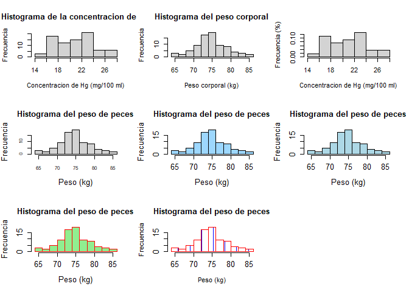<!-- -->


### Histograma con ggplot2
Creación del Data Frame: Se crea un nuevo data frame llamado 'PlantGrowth2' con dos columnas: 'group', que contiene el valor 'A' repetido la misma cantidad de veces que los datos de peso, y 'datos', que contiene los datos de peso.

Cálculo de Estadísticos Descriptivos y Pendiente: Utilizando la librería 'dplyr', se calculan estadísticos descriptivos como los cuantiles 25% y 75%, y se estima la pendiente de la curva de normalidad basada en estos cuantiles.

Realización del Gráfico con ggplot2: Se utiliza ggplot2 para generar un gráfico avanzado que incluye un histograma de densidad, una curva de densidad, una curva de normalidad teórica y una línea vertical punteada en la media. También se realiza una prueba de Shapiro-Wilk para evaluar la normalidad de los datos.

Personalización del Gráfico: Se personalizan los aspectos visuales del gráfico, como el color de llenado y borde, las etiquetas de ejes y título, el estilo del gráfico, la posición del título y la línea vertical punteada en la media. Además, se agrega una anotación para mostrar el valor p de la prueba de Shapiro-Wilk.


```r
## Adicionando curva de normalidad

# Creamos un nuevo data frame 'PlantGrowth2' con una sola columna 'datos' que contiene los datos de peso
# y otra columna 'group' que tiene el valor 'A' repetido la misma cantidad de veces que los datos de peso
PlantGrowth2 <- data.frame(group = rep("A", length(dagraf$peso)),
                           datos = dagraf$peso)

# Cargamos la librería 'dplyr' necesaria para usar la función '%>%'
library(dplyr)
```

```
## 
## Attaching package: 'dplyr'
```

```
## The following objects are masked from 'package:stats':
## 
##     filter, lag
```

```
## The following objects are masked from 'package:base':
## 
##     intersect, setdiff, setequal, union
```

```r
# Calculamos los estadísticos descriptivos y la pendiente de la curva de normalidad
intptemedia <- PlantGrowth2 %>%
  group_by(group) %>%
  summarize(q25 = quantile(dagraf$peso, 0.25),
            q75 = quantile(dagraf$peso, 0.75),
            norm25 = qnorm(0.25),
            norm75 = qnorm(0.75),
            pendiente = (q25 - q75) / (norm25 - norm75),
            int = q25 - pendiente * norm25,
            media = mean(dagraf$peso)) %>%
  select(group, pendiente, int, media)

# Realizamos el gráfico avanzado con ggplot2, que incluye histograma, curva de densidad y curva de normalidad
# Se añade una línea vertical punteada en la media
library(ggplot2)
shapiro.test(dagraf$peso)  # Prueba de Shapiro-Wilk para evaluar la normalidad de los datos
```

```
## 
## 	Shapiro-Wilk normality test
## 
## data:  dagraf$peso
## W = 0.98299, p-value = 0.3587
```

```r
ggplot(data = dagraf, aes(x = peso)) +
  geom_histogram(aes(y = ..density..), fill = "cyan3", color = "black") +# Histograma de densidad
  geom_density(fill = "skyblue", color = "blue", alpha = 0.4) + # Curva de densidad
  stat_function(fun = dnorm, colour = "firebrick",    # Curva de normalidad teórica
                args = list(mean = mean(dagraf$peso), sd = sd(dagraf$peso))) +
  theme_minimal() +  # Estilo del gráfico
  labs(title = "Histograma con curva normal teórica", x = "Valores", y = "Densidad") +# Etiquetas de ejes y título
  theme(plot.title = element_text(hjust = 0.5)) +  # Ajuste de posición del título
  geom_vline(data = intptemedia, aes(xintercept = media, colour = group),# Línea vertical en la media
             linetype = "dashed", size = 1.5) +  # Estilo de la línea
  theme(legend.position = "none") +      # No mostrar leyenda
  annotate("text", x=83,y =0.14,label ="P-value = 0.765",color ="black",size=3)  # Anotación de p-value
```

```
## Warning: Using `size` aesthetic for lines was deprecated in ggplot2 3.4.0.
## ℹ Please use `linewidth` instead.
## This warning is displayed once every 8 hours.
## Call `lifecycle::last_lifecycle_warnings()` to see where this warning was
## generated.
```

```
## Warning: The dot-dot notation (`..density..`) was deprecated in ggplot2 3.4.0.
## ℹ Please use `after_stat(density)` instead.
## This warning is displayed once every 8 hours.
## Call `lifecycle::last_lifecycle_warnings()` to see where this warning was
## generated.
```

```
## `stat_bin()` using `bins = 30`. Pick better value with `binwidth`.
```

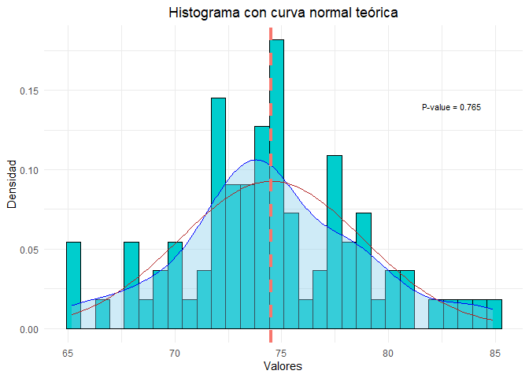<!-- -->

### Grafico de qqplot 


```r
##### Groficos de qq plot de la prueba de normalidad de los datos

# Establecemos un diseño de una fila y dos columnas para mostrar dos gráficos QQ-Plot
par(mfcol = c(1, 2))

# Graficamos el QQ-Plot para los datos de mercurio (Hg)
qqnorm(dagraf$Hg, pch = 19, col = "gray50", main = "QQ-Plot Concentración de mercurio")
qqline(dagraf$Hg, col = "red")  # Agregamos una línea de referencia roja

# Graficamos el QQ-Plot para los datos de peso
qqnorm(dagraf$peso, pch = 19, col = "red", main = "QQ-Plot Concentración de Pesos")
qqline(dagraf$peso, col = "blue")  # Agregamos una línea de referencia azul
```

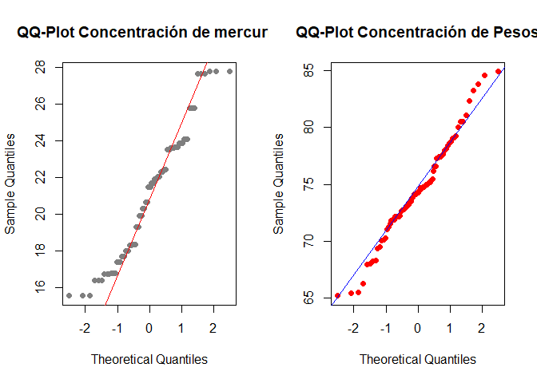<!-- -->

```r
# Restauramos el diseño de una sola celda
par(mfcol = c(1, 1))
```
Interpretación:

Los gráficos QQ-Plot se utilizan para visualizar si un conjunto de datos sigue una distribución normal.
En el primer gráfico (QQ-Plot de concentración de mercurio), los puntos están cerca de la línea de referencia roja, lo que sugiere que los datos de concentración de mercurio pueden seguir aproximadamente una distribución normal.
En el segundo gráfico (QQ-Plot de concentración de pesos), los puntos también están relativamente cerca de la línea de referencia azul, lo que indica que los datos de peso también pueden seguir una distribución normal, aunque hay algunas desviaciones en los extremos.


## Elaboracion de grafico de cajas y bigotes

Gráfico de Boxplot 1 (dagraf$peso):

Este gráfico muestra la distribución de los datos de peso en el conjunto de datos.
La caja representa el rango intercuartílico (IQR), que abarca desde el primer cuartil (Q1) hasta el tercer cuartil (Q3).
La línea dentro de la caja representa la mediana (Q2), que es el valor que divide el conjunto de datos en dos partes iguales.
Los "bigotes" muestran la dispersión de los datos más allá de los cuartiles, excluyendo los valores atípicos.
La etiqueta del eje y indica "Frecuencia", que es la frecuencia de ocurrencia de los diferentes valores de peso en el conjunto de datos.
Gráfico de Boxplot 2 (dagraf$peso, col = "forestgreen"):

Es similar al primer gráfico, pero con una diferencia de color. En este caso, la caja y los puntos del gráfico se representan en un tono verde oscuro ("forestgreen").
Gráfico de Boxplot 3 (dagraf$Hg, col = "lightblue", main = "Diagrama de cajas concent. Mercurio"):

Este gráfico muestra la distribución de los datos de concentración de mercurio en el conjunto de datos.
Se establece la etiqueta del eje y como "frecuencias", lo que sugiere que la frecuencia de ocurrencia de los diferentes valores de concentración de mercurio se está representando.
La caja y los puntos del gráfico se muestran en un tono azul claro ("lightblue").
Además, se proporciona un título al gráfico, que es "Diagrama de cajas concent. Mercurio".


```r
par(mfcol = c(1, 3))
## gr?ficos de boxplots o cajas
boxplot(dagraf$peso, ylab = "Frecuencia")
boxplot(dagraf$peso, ylab = "Frecuencia", col = "forestgreen")
boxplot(dagraf$Hg, ylab = "frecuencias", col= "lightblue", main= "Diagrama 
        de cajas concent. Mercurio")
```

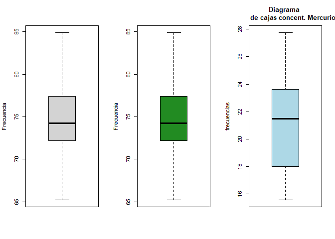<!-- -->

```r
par(mfcol = c(1, 1))
```

## Manipular elementos de caja y vigotes
Definición de colores:

Se definen dos vectores de colores (col.g1 y col.g2) que se utilizarán en los gráficos de caja para representar diferentes regiones.
Boxplot por Región:

Se crea un gráfico de caja donde el eje x representa las regiones y el eje y representa el peso en kg.
Se utilizan los colores definidos en col.g2 para cada región.
El parámetro vertical = TRUE indica que los gráficos de caja se mostrarán en posición vertical.
Se establecen tamaños de letra para los ejes (cex.axis) y etiquetas (cex.lab).
Se proporciona un título al gráfico.
Boxplot por Región (sintaxis alternativa):

Se muestra otro gráfico de caja utilizando una sintaxis alternativa donde se especifica el nombre de la variable (peso) y el nombre del conjunto de datos (dagraf) directamente.
Boxplot por Sexo:

Se genera un gráfico de caja separando los datos de peso por género (macho y hembra).
Boxplot por Región y Sexo:

Se crea un gráfico de caja donde se compara el peso según la región y el género.
Boxplot por Región y Sexo (horizontal):

Similar al gráfico anterior, pero se muestra en posición horizontal (horizontal = TRUE), con ejes de menor tamaño (cex.axis = 0.6) y etiquetas de ejes giradas (las = 2).
Personalización adicional de Boxplot por Región:

Otro gráfico de caja por región, con colores diferentes (yellow, blue, forestgreen) y etiquetas de región personalizadas (names = c("PN", "Central", "Sur")).
Estos gráficos de caja permiten comparar la distribución del peso en diferentes regiones y géneros, lo que puede ayudar a identificar patrones o diferencias significativas en los datos. Además, la personalización de colores y otros parámetros permite ajustar el aspecto de los gráficos para satisfacer las necesidades específicas de visualización.

```r
# Manipular elementos del grofico
levels(dagraf$region)
```

```
## [1] "Pacifico Norte"   "Pacifico Central" "Pacifico Sur"
```

```r
col.g1 = c("green", "blue", "grey80") # definir colores
col.g2 = c("GREEN", "blue", "grey80") # definir colores

boxplot(dagraf$peso ~ dagraf$region, 
        xlab = "Regiones", ylab="Frecuencia (Peso Kg)", col = col.g2, vertical = T,
        cex.axis = 1.2, cex.lab = 1.4, 
        main = "Diagrama de cajas del peso por regiones") #el vertical puedo cambiar a horizontal
```

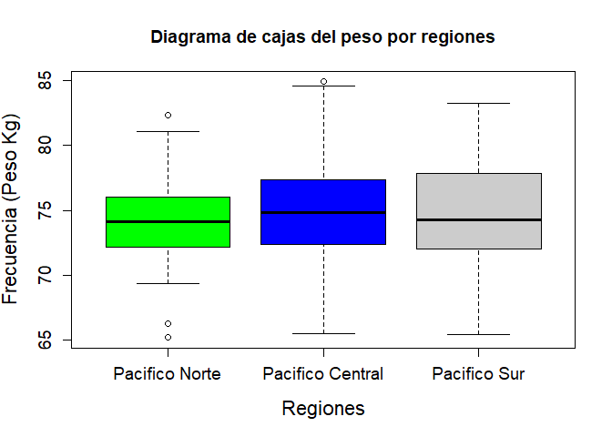<!-- -->

```r
boxplot(peso ~ region, data = dagraf)
```

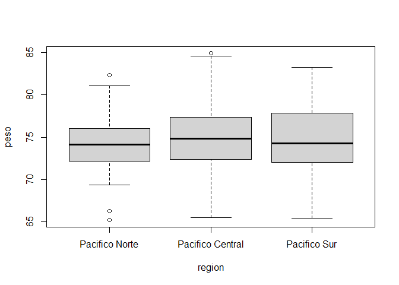<!-- -->

```r
boxplot(peso ~ sexo, data = dagraf)
```

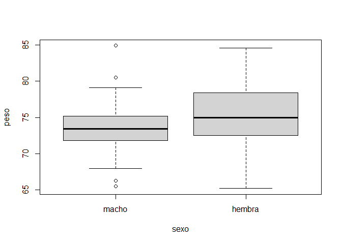<!-- -->

```r
boxplot(peso ~ region + sexo, data = dagraf)
```

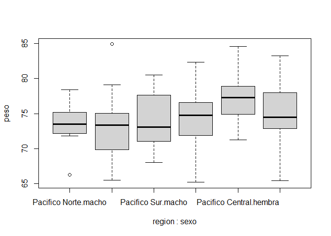<!-- -->

```r
boxplot(peso ~ region + sexo, data = dagraf,
        horizontal = TRUE, cex.axis = 0.6, las = 2)
```

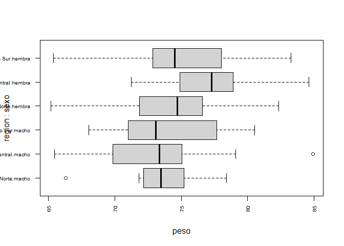<!-- -->

```r
boxplot(peso ~ region, data = dagraf, 
        xlab = "Frecuencia", 
        col = c("yellow", "blue", "forestgreen"), 
        vertical = T,
        cex.axis = 1.2, cex.lab = 1.4,
        names = c("PN", "Central", "Sur"))
```

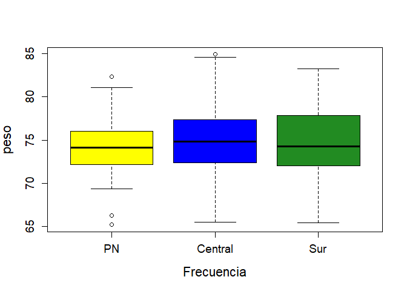<!-- -->

```r
# Establecer margenes
```

Elaboracion de boxplot de forma nativa de boxplot


```r
# Establecer margenes
par(mfcol = c(1, 1))
par(mar = c(6, 5, 1.5, 0))

boxplot(peso ~ region, data = dagraf, 
        col = "gray95",
        xlab = "", ylab = "",
        type = "n",xaxt = "n", yaxt = "n", 
        frame.plot = F, main = "Ejemplo 1")

axis(1, at = seq(1, 3, by = 1), 
     labels = c("Pacifico Norte", "Pacifico Central", "Pacifico Sur"), 
     cex.axis = 1.2)

axis(2, las = 1)

mtext("Region", side = 1, line = 3, cex = 1.5)
mtext("Frecuencia", side = 2, line = 2.6, cex = 1.5)

box(bty="l",lwd=1.1)
```

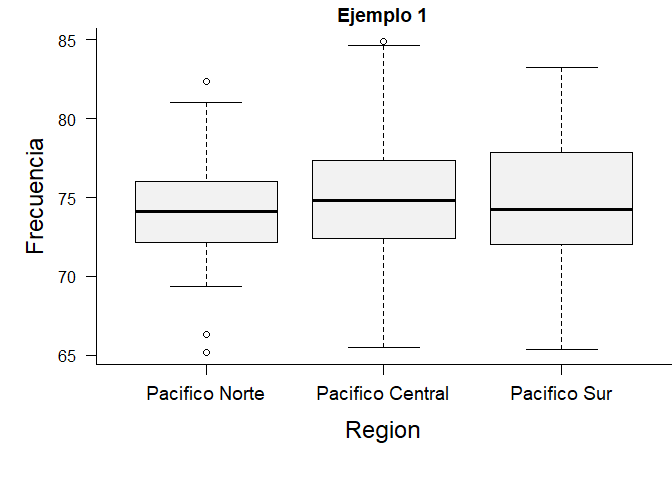<!-- -->


# **_test estadisticos basicos_** 

## test de Normalidad Shapiro-Wilk

```r
# instalamos un paquete que trae sobre pruebas de normalidad
library("nortest")
#Desarrollando el test de Normalidad

#### Test de Shapiro-Wilk

#Este test se emplea para contrastar normalidad cuando el 
#tamaño de la muestra es menor de 50. Para muestras grandes 
#es equivalente al test de kolmogorov-Smirnov.

library("dplyr")
library("ggpubr")

#Datos de medidas de dientes
#H0 : las medidas de los dientes siguen una tendencia de normalidad.
#HA : las medidas de los dientes no siguen una tendencia de normalidad.

#Ejemplo 1

quirus=ToothGrowth  # Asignamos los datos

str(quirus)         # Estructura de los datos
```

```
## 'data.frame':	60 obs. of  3 variables:
##  $ len : num  4.2 11.5 7.3 5.8 6.4 10 11.2 11.2 5.2 7 ...
##  $ supp: Factor w/ 2 levels "OJ","VC": 2 2 2 2 2 2 2 2 2 2 ...
##  $ dose: num  0.5 0.5 0.5 0.5 0.5 0.5 0.5 0.5 0.5 0.5 ...
```

```r
summary(quirus)     # Estadistica basica
```

```
##       len        supp         dose      
##  Min.   : 4.20   OJ:30   Min.   :0.500  
##  1st Qu.:13.07   VC:30   1st Qu.:0.500  
##  Median :19.25           Median :1.000  
##  Mean   :18.81           Mean   :1.167  
##  3rd Qu.:25.27           3rd Qu.:2.000  
##  Max.   :33.90           Max.   :2.000
```

```r
sd(quirus$dose)     # Desviacion estandar de dosis
```

```
## [1] 0.6288722
```

```r
sd(quirus$len)      # desviacion estandar de la longitud de los dientes
```

```
## [1] 7.649315
```

```r
var(quirus$dose) 
```

```
## [1] 0.3954802
```

```r
var(quirus$len)
```

```
## [1] 58.51202
```


Los datos del conjunto "quirus" corresponden a un estudio sobre el crecimiento dental en sujetos expuestos a diferentes dosis de una sustancia ("supp") y midiendo la longitud de los dientes ("len"). La estructura del conjunto de datos es la siguiente:

len: Variable numérica que representa la longitud de los dientes.
supp: Factor con 2 niveles ("OJ" y "VC") que indica el tipo de suplemento utilizado.
dose: Variable numérica que indica la dosis de la sustancia administrada.
El resumen estadístico de "quirus" muestra que:

La longitud de los dientes ("len") tiene una media de aproximadamente 18.81 unidades, con una mínima de 4.20 y una máxima de 33.90. La desviación estándar es de aproximadamente 7.65 y la varianza es de alrededor de 58.51.
La dosis ("dose") tiene una media de aproximadamente 1.167 unidades, con una mínima de 0.5 y una máxima de 2. La desviación estándar es de aproximadamente 0.63 y la varianza es de alrededor de 0.40.
Estos estadísticos describen la distribución y variabilidad de las medidas de longitud de los dientes y las dosis administradas en el estudio. Las medidas de longitud tienen una mayor variabilidad en comparación con las dosis administradas, como lo sugieren las desviaciones estándar y las varianzas más altas.


```r
library(ggpubr)
#grafico de densidad
A= ggdensity(quirus$len, main = "grafico de densidad de longitud de quirus", 
          xlab="longitud de quirus")

#gr?fico qqplot
B = ggqqplot(quirus$len, main= "grafico QQ quirus", 
         xlab="dispersion de longitud quirus")

C= ggarrange(A,B,
               labels = c("A", "B"),
               nrow = 1,ncol = 2)
C
```

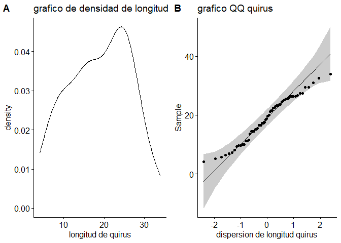<!-- -->


```r
par(mfcol = c(1, 2))
#histograma
hist(quirus$len)
#boxplot
boxplot(quirus$len)
```

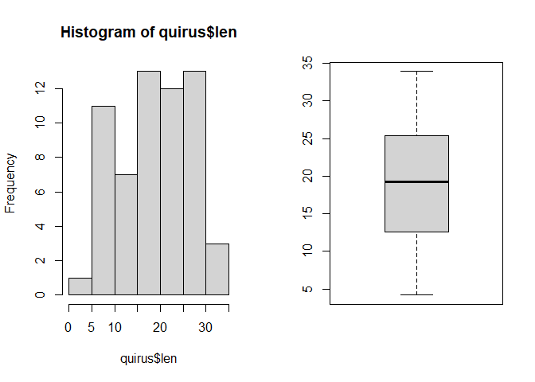<!-- -->

```r
par(mfcol = c(1, 1))
```

## test de Normalidad de Kolmogorov-Smirnov

El resultado del test de normalidad de Lilliefors (que es una variante del test de Kolmogorov-Smirnov) se interpreta de la siguiente manera:

Para el conjunto de datos "quirus$len" (longitud de los dientes), el valor p obtenido es 0.172. Este valor p es mayor que el nivel de significancia comúnmente utilizado (0.05), lo que indica que no hay suficiente evidencia para rechazar la hipótesis nula de normalidad. Por lo tanto, podemos asumir que los datos de longitud de los dientes siguen una distribución normal.


```r
#aplicando el test shapiro para conocer la tendencia de los datos
lillie.test(quirus$len) #test de normalidad de Kolmogorov-Smirnov
```

```
## 
## 	Lilliefors (Kolmogorov-Smirnov) normality test
## 
## data:  quirus$len
## D = 0.097092, p-value = 0.172
```
Para el conjunto de datos "dagraf$peso" (peso), el valor p obtenido es 0.9169. Al ser mucho mayor que 0.05, no hay suficiente evidencia para rechazar la hipótesis nula de normalidad. Por lo tanto, los datos de peso también parecen seguir una distribución normal.

```r
lillie.test(dagraf$peso) #test de normalidad de Kolmogorov-Smirnov
```

```
## 
## 	Lilliefors (Kolmogorov-Smirnov) normality test
## 
## data:  dagraf$peso
## D = 0.094151, p-value = 0.07286
```
Sin embargo, para el conjunto de datos "dagraf$Hg" (concentración de mercurio), el valor p obtenido es extremadamente pequeño (5.442e-10), muy por debajo del nivel de significancia de 0.05. Esto sugiere que hay suficiente evidencia para rechazar la hipótesis nula de normalidad. Por lo tanto, los datos de concentración de mercurio no siguen una distribución normal.

```r
lillie.test(dagraf$Hg)
```

```
## 
## 	Lilliefors (Kolmogorov-Smirnov) normality test
## 
## data:  dagraf$Hg
## D = 0.12007, p-value = 0.00568
```

### Grafico de QQ - Plot

```r
A= ggqqplot(dagraf$Hg, main= "grafico QQ Mercurio", 
         xlab="dispersion de concent Mercurio")

B= ggqqplot(dagraf$peso, main= "grafico QQ Peso", 
         xlab="dispersion de concent Peso")

C= ggqqplot(quirus$len, main= "grafico QQ longitud ", 
         xlab="dispersion de concent longitud de los dientes")

library(ggplot2)
library(caTools)
```

```
## Warning: package 'caTools' was built under R version 4.3.3
```

```r
library(benchmarkme)
```

```
## Warning: package 'benchmarkme' was built under R version 4.3.3
```

```r
library(memuse)
library(robustbase)
```

```
## Warning: package 'robustbase' was built under R version 4.3.3
```

```r
library(qqplotr)
```

```
## Warning: package 'qqplotr' was built under R version 4.3.3
```

```
## 
## Attaching package: 'qqplotr'
```

```
## The following objects are masked from 'package:ggplot2':
## 
##     stat_qq_line, StatQqLine
```

```r
# ploting data with proper labels 
# And adding line with proper properties

D =ggplot(mapping = aes(sample = quirus$len)) + 
  stat_qq_point(size = 2,color = "red") + 
  stat_qq_line(color="green") + 
  xlab("x-axis") + ylab("y-axis")

E= ggarrange(A,B,C,D,
             labels = c("A", "B", "C", "D"),
             nrow = 2,ncol = 2)
E
```

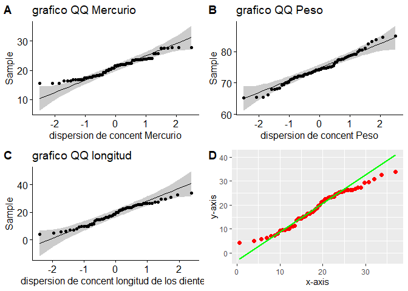<!-- -->

### test de Normalidad de Kolmogorov-Smirnov y modificacion de Lillefors

Se realiza una prueba de Kolmogorov-Smirnov (KS) para determinar si los datos de longitud de los dientes (quirus$len) provienen de una distribución normal. El KS test permite estudiar si una muestra procede de una población con una determinada distribución, no limitándose únicamente a la distribución normal.

En el código proporcionado, se utiliza la función ks.test() para llevar a cabo esta prueba. Los argumentos son:

x: Los datos que se están evaluando (quirus.len).pnorm: La distribución teórica de referencia que se está probando, en este caso, la distribución normal. mean(quirus.len): La media de los datos de longitud de los dientes.
sd(quirus$len): La desviación estándar de los datos de longitud de los dientes.
La salida del código proporcionará el resultado del KS test, indicando si hay suficiente evidencia para rechazar la hipótesis nula de que los datos provienen de una distribución normal o no.


```r
#El test de Kolmogorov-Smirnov permite estudiar si una muestra
#procede de una poblacion con una determinada distribucion 
#(media y desviacion topica), no esta limitado unicamente 
#a la distribuci?n normal. Se ejecuta con la funcion ks.test().

mtcars
```

<div data-pagedtable="false">
  <script data-pagedtable-source type="application/json">
{"columns":[{"label":[""],"name":["_rn_"],"type":[""],"align":["left"]},{"label":["mpg"],"name":[1],"type":["dbl"],"align":["right"]},{"label":["cyl"],"name":[2],"type":["dbl"],"align":["right"]},{"label":["disp"],"name":[3],"type":["dbl"],"align":["right"]},{"label":["hp"],"name":[4],"type":["dbl"],"align":["right"]},{"label":["drat"],"name":[5],"type":["dbl"],"align":["right"]},{"label":["wt"],"name":[6],"type":["dbl"],"align":["right"]},{"label":["qsec"],"name":[7],"type":["dbl"],"align":["right"]},{"label":["vs"],"name":[8],"type":["dbl"],"align":["right"]},{"label":["am"],"name":[9],"type":["dbl"],"align":["right"]},{"label":["gear"],"name":[10],"type":["dbl"],"align":["right"]},{"label":["carb"],"name":[11],"type":["dbl"],"align":["right"]}],"data":[{"1":"21.0","2":"6","3":"160.0","4":"110","5":"3.90","6":"2.620","7":"16.46","8":"0","9":"1","10":"4","11":"4","_rn_":"Mazda RX4"},{"1":"21.0","2":"6","3":"160.0","4":"110","5":"3.90","6":"2.875","7":"17.02","8":"0","9":"1","10":"4","11":"4","_rn_":"Mazda RX4 Wag"},{"1":"22.8","2":"4","3":"108.0","4":"93","5":"3.85","6":"2.320","7":"18.61","8":"1","9":"1","10":"4","11":"1","_rn_":"Datsun 710"},{"1":"21.4","2":"6","3":"258.0","4":"110","5":"3.08","6":"3.215","7":"19.44","8":"1","9":"0","10":"3","11":"1","_rn_":"Hornet 4 Drive"},{"1":"18.7","2":"8","3":"360.0","4":"175","5":"3.15","6":"3.440","7":"17.02","8":"0","9":"0","10":"3","11":"2","_rn_":"Hornet Sportabout"},{"1":"18.1","2":"6","3":"225.0","4":"105","5":"2.76","6":"3.460","7":"20.22","8":"1","9":"0","10":"3","11":"1","_rn_":"Valiant"},{"1":"14.3","2":"8","3":"360.0","4":"245","5":"3.21","6":"3.570","7":"15.84","8":"0","9":"0","10":"3","11":"4","_rn_":"Duster 360"},{"1":"24.4","2":"4","3":"146.7","4":"62","5":"3.69","6":"3.190","7":"20.00","8":"1","9":"0","10":"4","11":"2","_rn_":"Merc 240D"},{"1":"22.8","2":"4","3":"140.8","4":"95","5":"3.92","6":"3.150","7":"22.90","8":"1","9":"0","10":"4","11":"2","_rn_":"Merc 230"},{"1":"19.2","2":"6","3":"167.6","4":"123","5":"3.92","6":"3.440","7":"18.30","8":"1","9":"0","10":"4","11":"4","_rn_":"Merc 280"},{"1":"17.8","2":"6","3":"167.6","4":"123","5":"3.92","6":"3.440","7":"18.90","8":"1","9":"0","10":"4","11":"4","_rn_":"Merc 280C"},{"1":"16.4","2":"8","3":"275.8","4":"180","5":"3.07","6":"4.070","7":"17.40","8":"0","9":"0","10":"3","11":"3","_rn_":"Merc 450SE"},{"1":"17.3","2":"8","3":"275.8","4":"180","5":"3.07","6":"3.730","7":"17.60","8":"0","9":"0","10":"3","11":"3","_rn_":"Merc 450SL"},{"1":"15.2","2":"8","3":"275.8","4":"180","5":"3.07","6":"3.780","7":"18.00","8":"0","9":"0","10":"3","11":"3","_rn_":"Merc 450SLC"},{"1":"10.4","2":"8","3":"472.0","4":"205","5":"2.93","6":"5.250","7":"17.98","8":"0","9":"0","10":"3","11":"4","_rn_":"Cadillac Fleetwood"},{"1":"10.4","2":"8","3":"460.0","4":"215","5":"3.00","6":"5.424","7":"17.82","8":"0","9":"0","10":"3","11":"4","_rn_":"Lincoln Continental"},{"1":"14.7","2":"8","3":"440.0","4":"230","5":"3.23","6":"5.345","7":"17.42","8":"0","9":"0","10":"3","11":"4","_rn_":"Chrysler Imperial"},{"1":"32.4","2":"4","3":"78.7","4":"66","5":"4.08","6":"2.200","7":"19.47","8":"1","9":"1","10":"4","11":"1","_rn_":"Fiat 128"},{"1":"30.4","2":"4","3":"75.7","4":"52","5":"4.93","6":"1.615","7":"18.52","8":"1","9":"1","10":"4","11":"2","_rn_":"Honda Civic"},{"1":"33.9","2":"4","3":"71.1","4":"65","5":"4.22","6":"1.835","7":"19.90","8":"1","9":"1","10":"4","11":"1","_rn_":"Toyota Corolla"},{"1":"21.5","2":"4","3":"120.1","4":"97","5":"3.70","6":"2.465","7":"20.01","8":"1","9":"0","10":"3","11":"1","_rn_":"Toyota Corona"},{"1":"15.5","2":"8","3":"318.0","4":"150","5":"2.76","6":"3.520","7":"16.87","8":"0","9":"0","10":"3","11":"2","_rn_":"Dodge Challenger"},{"1":"15.2","2":"8","3":"304.0","4":"150","5":"3.15","6":"3.435","7":"17.30","8":"0","9":"0","10":"3","11":"2","_rn_":"AMC Javelin"},{"1":"13.3","2":"8","3":"350.0","4":"245","5":"3.73","6":"3.840","7":"15.41","8":"0","9":"0","10":"3","11":"4","_rn_":"Camaro Z28"},{"1":"19.2","2":"8","3":"400.0","4":"175","5":"3.08","6":"3.845","7":"17.05","8":"0","9":"0","10":"3","11":"2","_rn_":"Pontiac Firebird"},{"1":"27.3","2":"4","3":"79.0","4":"66","5":"4.08","6":"1.935","7":"18.90","8":"1","9":"1","10":"4","11":"1","_rn_":"Fiat X1-9"},{"1":"26.0","2":"4","3":"120.3","4":"91","5":"4.43","6":"2.140","7":"16.70","8":"0","9":"1","10":"5","11":"2","_rn_":"Porsche 914-2"},{"1":"30.4","2":"4","3":"95.1","4":"113","5":"3.77","6":"1.513","7":"16.90","8":"1","9":"1","10":"5","11":"2","_rn_":"Lotus Europa"},{"1":"15.8","2":"8","3":"351.0","4":"264","5":"4.22","6":"3.170","7":"14.50","8":"0","9":"1","10":"5","11":"4","_rn_":"Ford Pantera L"},{"1":"19.7","2":"6","3":"145.0","4":"175","5":"3.62","6":"2.770","7":"15.50","8":"0","9":"1","10":"5","11":"6","_rn_":"Ferrari Dino"},{"1":"15.0","2":"8","3":"301.0","4":"335","5":"3.54","6":"3.570","7":"14.60","8":"0","9":"1","10":"5","11":"8","_rn_":"Maserati Bora"},{"1":"21.4","2":"4","3":"121.0","4":"109","5":"4.11","6":"2.780","7":"18.60","8":"1","9":"1","10":"4","11":"2","_rn_":"Volvo 142E"}],"options":{"columns":{"min":{},"max":[10]},"rows":{"min":[10],"max":[10]},"pages":{}}}
  </script>
</div>

```r
ks.test(x = quirus$len,"pnorm", mean(quirus$len), sd(quirus$len))
```

```
## Warning in ks.test.default(x = quirus$len, "pnorm", mean(quirus$len),
## sd(quirus$len)): ties should not be present for the Kolmogorov-Smirnov test
```

```
## 
## 	Asymptotic one-sample Kolmogorov-Smirnov test
## 
## data:  quirus$len
## D = 0.097092, p-value = 0.6237
## alternative hypothesis: two-sided
```


# **_T Student, una muestra_**

## test de Normalidad Shapiro-Wilk
El estadistico aplicado es el t-student. 

```r
#Recomendado para trabajar con muestras peque?as. 
#Sin embargo, cuando se trabaja con muestras grandes 
#los datos son pr?ximos a una distribuci?n aproximadamente normal.

#Ejemplo 1
#Se realiza un experimento donde se midio la produccion de 
#vainas de frijol por cada mata producida, en 12 unidades 
#experimentales sometidas bajo las mismas condiciones.

frijol = c(18,11,17,10,20,25,13,16,25,20,19,20)
```
Hipotesis

 H0= Los datos provienen de una distribuci?n normal.
 H1: Los datos presentan una distribuci?n asim?trica.

Probamos el supuesto de normalidad de nuestros datos

```r
shapiro.test(frijol) #shapiro me dice que hay tendencia a la normalidad
```

```
## 
## 	Shapiro-Wilk normality test
## 
## data:  frijol
## W = 0.9413, p-value = 0.5152
```
Aceptamos H0: Nuestros datos cumplen con el supuesto de normalidad.

Estime el intervalo de confianza al 95% para el rendimiento 
promedio del numero de vainas producidas por cada mata de frijol. 
Los datos presentan una distribucion normal.

Soluci?n:

El intervalo de confianza es construido a trav?s de la prueba t.test (x)


```r
t.test(frijol)
```

```
## 
## 	One Sample t-test
## 
## data:  frijol
## t = 12.864, df = 11, p-value = 5.673e-08
## alternative hypothesis: true mean is not equal to 0
## 95 percent confidence interval:
##  14.78220 20.88447
## sample estimates:
## mean of x 
##  17.83333
```

```r
#El intervalo de confianza al 95% obtenido es: [14.78 a 20.88], 
#lo que representa es el intervalo de la media de la poblaci?n de 
#las vainas de frijol. As? mismo se obtienen otros resultados 
#como la media de la muestra de: 17.83.

#Se nos brinda informaci?n adicional del valor calculado de t=12.86, 
#los grados de libertad (df=11), obtenidos de la 
#formula gl=n-1 (numero de observaciones menos uno), y 
#la probabilidad resultante (p-value = 5.673e-08), en nuestro caso 
#es menor a 0.05, por lo que nuestro resultado es significativo
#dado la hip?tesis por defecto.

#H0: media igual a 0
#H1: media es diferente de 0
```


```r
#para ver gr?ficamente
boxplot(frijol,col="yellow", main="Diagrama de cajas Frijol")
points(mean(frijol), pch=20, cex = 1.5)
text(17.5, "Promedio", col="red", font=8 )
```

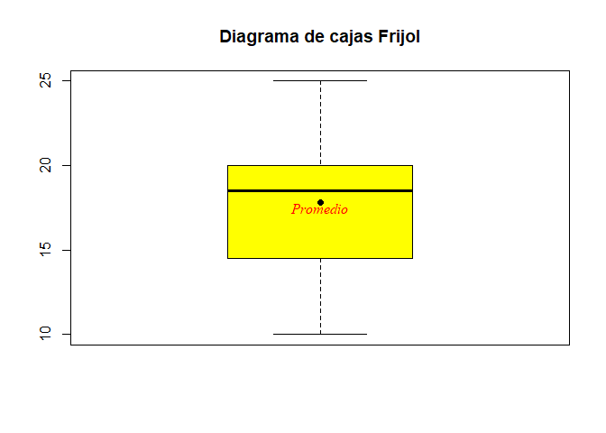<!-- -->

```r
median(frijol)
```

```
## [1] 18.5
```


```r
#Por tanto concluimos que existe diferencia significativa en cuanto a la 
#producci?n de vainas en cada planta dentro de esa muestra de 12 plantas.

#Nivel de ingreso de padres de familia en la prov. Tambopata

social=c(900,850,700,980,500,450,1025,1800,1000,640)
shapiro.test(social)
```

```
## 
## 	Shapiro-Wilk normality test
## 
## data:  social
## W = 0.85751, p-value = 0.07132
```

```r
#H0: los salarios de los 1o padres no son significativamente diferentes
#H1: los salarios de los 1o padres si son significativamente diferentes

t.test(social)
```

```
## 
## 	One Sample t-test
## 
## data:  social
## t = 7.3251, df = 9, p-value = 4.444e-05
## alternative hypothesis: true mean is not equal to 0
## 95 percent confidence interval:
##   611.3474 1157.6526
## sample estimates:
## mean of x 
##     884.5
```

```r
#conclusiOn

#El valor de la  p-value = 4.444e-05, nos indica que significativamente hay
#una diferencia en los salarios de los 10 pdf.
```

## T Test para 2 muestras independientes


```r
#El dataset births del paquete openintro contiene informaci?n sobre
#150 nacimientos junto con informaci?n de las madres. 
#Se quiere determinar si existen evidencias significativas de que el
#peso de los reci?n nacidos cuyas madres fuman (f) difiere de aquellos
#cuyas madres no fuman (nf).

#install.packages("openintro") #necesitamos de estos paquetes para trabajar 
#la base de satos births
library(openintro)
```

```
## Warning: package 'openintro' was built under R version 4.3.3
```

```
## Loading required package: airports
```

```
## Warning: package 'airports' was built under R version 4.3.3
```

```
## Loading required package: cherryblossom
```

```
## Warning: package 'cherryblossom' was built under R version 4.3.3
```

```
## Loading required package: usdata
```

```
## Warning: package 'usdata' was built under R version 4.3.3
```

```
## 
## Attaching package: 'openintro'
```

```
## The following object is masked from 'package:robustbase':
## 
##     salinity
```

```r
#install.packages("tidyverse")
library(tidyverse)
```

```
## ── Attaching core tidyverse packages ──────────────────────── tidyverse 2.0.0 ──
## ✔ forcats   1.0.0     ✔ stringr   1.5.1
## ✔ lubridate 1.9.3     ✔ tibble    3.2.1
## ✔ purrr     1.0.2     ✔ tidyr     1.3.1
```

```
## ── Conflicts ────────────────────────────────────────── tidyverse_conflicts() ──
## ✖ dplyr::filter()         masks stats::filter()
## ✖ dplyr::lag()            masks stats::lag()
## ✖ qqplotr::stat_qq_line() masks ggplot2::stat_qq_line()
## ℹ Use the conflicted package (<http://conflicted.r-lib.org/>) to force all conflicts to become errors
```

```r
data(births)
head(births, 4)
```

<div data-pagedtable="false">
  <script data-pagedtable-source type="application/json">
{"columns":[{"label":["f_age"],"name":[1],"type":["int"],"align":["right"]},{"label":["m_age"],"name":[2],"type":["int"],"align":["right"]},{"label":["weeks"],"name":[3],"type":["int"],"align":["right"]},{"label":["premature"],"name":[4],"type":["fct"],"align":["left"]},{"label":["visits"],"name":[5],"type":["int"],"align":["right"]},{"label":["gained"],"name":[6],"type":["int"],"align":["right"]},{"label":["weight"],"name":[7],"type":["dbl"],"align":["right"]},{"label":["sex_baby"],"name":[8],"type":["fct"],"align":["left"]},{"label":["smoke"],"name":[9],"type":["fct"],"align":["left"]}],"data":[{"1":"31","2":"30","3":"39","4":"full term","5":"13","6":"1","7":"6.88","8":"male","9":"smoker"},{"1":"34","2":"36","3":"39","4":"full term","5":"5","6":"35","7":"7.69","8":"male","9":"nonsmoker"},{"1":"36","2":"35","3":"40","4":"full term","5":"12","6":"29","7":"8.88","8":"male","9":"nonsmoker"},{"1":"41","2":"40","3":"40","4":"full term","5":"13","6":"30","7":"9.00","8":"female","9":"nonsmoker"}],"options":{"columns":{"min":{},"max":[10]},"rows":{"min":[10],"max":[10]},"pages":{}}}
  </script>
</div>

```r
print(births)
```

```
## # A tibble: 150 × 9
##    f_age m_age weeks premature visits gained weight sex_baby smoke    
##    <int> <int> <int> <fct>      <int>  <int>  <dbl> <fct>    <fct>    
##  1    31    30    39 full term     13      1   6.88 male     smoker   
##  2    34    36    39 full term      5     35   7.69 male     nonsmoker
##  3    36    35    40 full term     12     29   8.88 male     nonsmoker
##  4    41    40    40 full term     13     30   9    female   nonsmoker
##  5    42    37    40 full term     NA     10   7.94 male     nonsmoker
##  6    37    28    40 full term     12     35   8.25 male     smoker   
##  7    35    35    28 premie         6     29   1.63 female   nonsmoker
##  8    28    21    35 premie         9     15   5.5  female   smoker   
##  9    22    20    32 premie         5     40   2.69 male     smoker   
## 10    36    25    40 full term     13     34   8.75 female   nonsmoker
## # ℹ 140 more rows
```

```r
str(births)
```

```
## tibble [150 × 9] (S3: tbl_df/tbl/data.frame)
##  $ f_age    : int [1:150] 31 34 36 41 42 37 35 28 22 36 ...
##  $ m_age    : int [1:150] 30 36 35 40 37 28 35 21 20 25 ...
##  $ weeks    : int [1:150] 39 39 40 40 40 40 28 35 32 40 ...
##  $ premature: Factor w/ 2 levels "full term","premie": 1 1 1 1 1 1 2 2 2 1 ...
##  $ visits   : int [1:150] 13 5 12 13 NA 12 6 9 5 13 ...
##  $ gained   : int [1:150] 1 35 29 30 10 35 29 15 40 34 ...
##  $ weight   : num [1:150] 6.88 7.69 8.88 9 7.94 8.25 1.63 5.5 2.69 8.75 ...
##  $ sex_baby : Factor w/ 2 levels "female","male": 2 2 2 1 2 2 1 1 2 1 ...
##  $ smoke    : Factor w/ 2 levels "nonsmoker","smoker": 2 1 1 1 1 2 1 2 2 1 ...
```


```r
# 1. Hip?tesis

#H0: no hay diferencia entre las medias poblacionales: ??(nf)?????(f)=0
#Ha: si hay diferencia entre las medias poblacionales: ??(nf)?????(f)???0


#2. Par?metro estimado (estad?stico)
#Diferencia entre las medias muestrales:

smoker = births %>% filter(smoke == "smoker") %>% pull(weight)
nonsmoker = births %>% filter(smoke == "nonsmoker") %>% pull(weight)

mean(nonsmoker) - mean(smoker)
```

```
## [1] 0.4005
```

```r
#3. Condiciones para aplicar un t-test
#Independencia: Se trata de un muestreo aleatorio donde el 
#tama?o de las muestras no supera el 10% de todos los nacimientos 
#Se puede afirmar que los eventos son independientes.
```


```r
#Normalidad:
#muestra el histograma ggplo2
ggplot(births,aes(x = weight)) + 
  geom_histogram(aes(y = ..density.., colour = smoke)) +
  facet_grid(.~ smoke) +
  theme_bw() + theme(legend.position = "none")
```

```
## `stat_bin()` using `bins = 30`. Pick better value with `binwidth`.
```

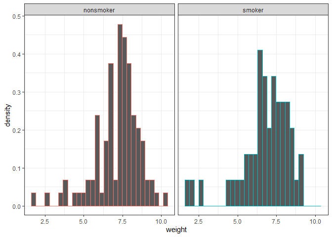<!-- -->


```r
# Para observar en los otros gr?ficos
par(mar = c(2, 2, 2, 2))
par(mfrow = c(1, 2))
qqnorm(nonsmoker, xlab = "", ylab = "",
       main = "nonsmoker", col = "firebrick")
qqline(nonsmoker)
qqnorm(smoker, xlab = "", ylab = "",
       main = "smoker", col = "springgreen4")
qqline(smoker)
```

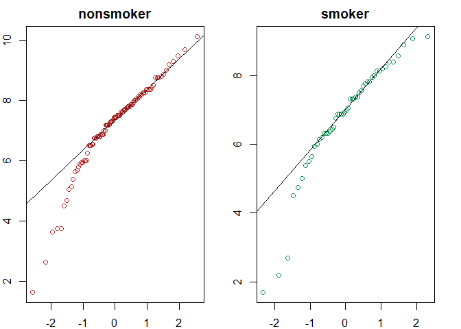<!-- -->

```r
par(mfrow = c(1, 1))
```


```r
#Aplico el test de normalidad
shapiro.test(smoker)
```

```
## 
## 	Shapiro-Wilk normality test
## 
## data:  smoker
## W = 0.89491, p-value = 0.0003276
```

```r
shapiro.test(nonsmoker) 
```

```
## 
## 	Shapiro-Wilk normality test
## 
## data:  nonsmoker
## W = 0.92374, p-value = 2.234e-05
```

```r
#Los gr?ficos qqnorm muestran asimetr?a hacia la izquierda y los test
#encuentran evidencias significativas de que los datos no 
#proceden de poblaciones con distribuci?n normal. Sin embargo, 
#dado que el tama?o de cada grupo es mayor que 30 se puede considerar 
#que el t-test sigue siendo suficientemente robusto, aunque es necesario 
#mencionarlo en las conclusiones. 
# Un test no param?trico basado en la 
#mediana (Mann-Withney-Wilcoxon test) o un test de Bootstraping ser?an m?s 
#adecuados. Otra opci?n ser?a estudiar si los datos an?malos son excepciones
#que se pueden excluir del an?lisis.
```


```r
#Datos de crecimiento de plantulas con perturbio y no perturbio, consideramos
#muestras pareadas porque sobre el mismo tratamiento estoy desarrollando


plantulas = read_excel("plantulas.xls", sheet=1)

#H0=el nro de plantulas entre parcelas, del testigo y del evento sean similares
#HA=el nro de plantulas entre parcelas, del testigo y del evento son diferentes

str(plantulas)  # Estructura de los datos
```

```
## tibble [17 × 4] (S3: tbl_df/tbl/data.frame)
##  $ Par       : num [1:17] 1 2 3 4 5 6 7 8 9 10 ...
##  $ Testigo   : num [1:17] 113 98 98 83 94 89 88 122 69 113 ...
##  $ Perterbado: num [1:17] 89 118 123 87 100 105 125 189 141 96 ...
##  $ Diferencia: num [1:17] -24 20 25 4 6 16 37 67 72 -17 ...
```

```r
head(plantulas) 
```

<div data-pagedtable="false">
  <script data-pagedtable-source type="application/json">
{"columns":[{"label":["Par"],"name":[1],"type":["dbl"],"align":["right"]},{"label":["Testigo"],"name":[2],"type":["dbl"],"align":["right"]},{"label":["Perterbado"],"name":[3],"type":["dbl"],"align":["right"]},{"label":["Diferencia"],"name":[4],"type":["dbl"],"align":["right"]}],"data":[{"1":"1","2":"113","3":"89","4":"-24"},{"1":"2","2":"98","3":"118","4":"20"},{"1":"3","2":"98","3":"123","4":"25"},{"1":"4","2":"83","3":"87","4":"4"},{"1":"5","2":"94","3":"100","4":"6"},{"1":"6","2":"89","3":"105","4":"16"}],"options":{"columns":{"min":{},"max":[10]},"rows":{"min":[10],"max":[10]},"pages":{}}}
  </script>
</div>

```r
boxplot(plantulas$Testigo, plantulas$Perterbado) # boxplot de dos columnas de los datos
```

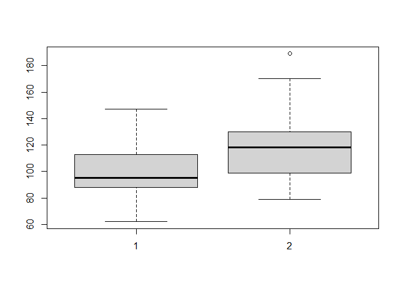<!-- -->

```r
shapiro.test(plantulas$Testigo)  # el p valor es mayor a 0.05 por lo cual si cumple con la normaldiad 
```

```
## 
## 	Shapiro-Wilk normality test
## 
## data:  plantulas$Testigo
## W = 0.96311, p-value = 0.6906
```

```r
shapiro.test(plantulas$Perterbado) # Si cumple la normaldiad 
```

```
## 
## 	Shapiro-Wilk normality test
## 
## data:  plantulas$Perterbado
## W = 0.91884, p-value = 0.1412
```

```r
t.test(plantulas$Testigo, plantulas$Perterbado, paired = T) 
```

```
## 
## 	Paired t-test
## 
## data:  plantulas$Testigo and plantulas$Perterbado
## t = -2.5981, df = 16, p-value = 0.01942
## alternative hypothesis: true mean difference is not equal to 0
## 95 percent confidence interval:
##  -33.434853  -3.388676
## sample estimates:
## mean difference 
##       -18.41176
```

```r
#Aplico el de muestras pareadas

#Conclusiones
# existe diferencia significativa entre el nro de pl?ntulas evaluadas entre 
# las parcelas testigo y las perturbadas.
```

## Prueba no parametrica de Man Wihtney o Wilcoxon
Nos reconoce a traves del test de wilcoxon. Esta prueba es para comparar dos muestras que no tienen tendencia a una distribucion de normalidad


```r
#instalamos paquete Boot
library("boot")
```

```
## 
## Attaching package: 'boot'
```

```
## The following object is masked from 'package:openintro':
## 
##     salinity
```

```
## The following object is masked from 'package:robustbase':
## 
##     salinity
```

```r
library("car")
```

```
## Loading required package: carData
```

```
## 
## Attaching package: 'car'
```

```
## The following object is masked from 'package:boot':
## 
##     logit
```

```
## The following object is masked from 'package:purrr':
## 
##     some
```

```
## The following object is masked from 'package:openintro':
## 
##     densityPlot
```

```
## The following object is masked from 'package:dplyr':
## 
##     recode
```

```r
library("dplyr")
library("ggpubr")

#trabajamos con el archivo fumasa
fumones = read.table("fumasa.txt", header=T)
names(fumones)
```

```
## [1] "capulmonar" "edad"       "altura"     "fuman"      "genero"    
## [6] "adiccion"
```

```r
fumones
```

<div data-pagedtable="false">
  <script data-pagedtable-source type="application/json">
{"columns":[{"label":["capulmonar"],"name":[1],"type":["dbl"],"align":["right"]},{"label":["edad"],"name":[2],"type":["int"],"align":["right"]},{"label":["altura"],"name":[3],"type":["dbl"],"align":["right"]},{"label":["fuman"],"name":[4],"type":["chr"],"align":["left"]},{"label":["genero"],"name":[5],"type":["chr"],"align":["left"]},{"label":["adiccion"],"name":[6],"type":["chr"],"align":["left"]}],"data":[{"1":"6.475","2":"6","3":"62.1","4":"no","5":"masculino","6":"no"},{"1":"10.125","2":"18","3":"74.7","4":"si","5":"femenino","6":"no"},{"1":"9.550","2":"16","3":"69.7","4":"no","5":"femenino","6":"si"},{"1":"11.125","2":"14","3":"71.0","4":"no","5":"masculino","6":"no"},{"1":"4.800","2":"5","3":"56.9","4":"no","5":"masculino","6":"no"},{"1":"6.225","2":"11","3":"58.7","4":"no","5":"femenino","6":"no"},{"1":"4.950","2":"8","3":"63.3","4":"no","5":"masculino","6":"si"},{"1":"7.325","2":"11","3":"70.4","4":"no","5":"masculino","6":"no"},{"1":"8.875","2":"15","3":"70.5","4":"no","5":"masculino","6":"no"},{"1":"6.800","2":"11","3":"59.2","4":"no","5":"masculino","6":"no"},{"1":"11.500","2":"19","3":"76.4","4":"no","5":"masculino","6":"si"},{"1":"10.925","2":"17","3":"71.7","4":"no","5":"masculino","6":"no"},{"1":"6.525","2":"12","3":"57.5","4":"no","5":"masculino","6":"no"},{"1":"6.000","2":"10","3":"61.1","4":"no","5":"femenino","6":"no"},{"1":"7.825","2":"10","3":"61.2","4":"no","5":"masculino","6":"no"},{"1":"9.525","2":"13","3":"63.5","4":"no","5":"masculino","6":"si"},{"1":"7.875","2":"15","3":"59.2","4":"no","5":"masculino","6":"no"},{"1":"5.050","2":"8","3":"56.1","4":"no","5":"masculino","6":"no"},{"1":"7.025","2":"11","3":"61.2","4":"si","5":"femenino","6":"no"},{"1":"9.525","2":"14","3":"70.6","4":"no","5":"femenino","6":"no"},{"1":"3.975","2":"6","3":"57.3","4":"no","5":"masculino","6":"no"},{"1":"5.325","2":"8","3":"59.7","4":"no","5":"femenino","6":"no"},{"1":"10.025","2":"16","3":"72.4","4":"no","5":"masculino","6":"no"},{"1":"8.725","2":"11","3":"68.0","4":"no","5":"masculino","6":"si"},{"1":"9.375","2":"11","3":"65.7","4":"no","5":"femenino","6":"no"},{"1":"8.350","2":"12","3":"61.3","4":"no","5":"masculino","6":"si"},{"1":"6.750","2":"12","3":"60.7","4":"no","5":"femenino","6":"no"},{"1":"9.025","2":"9","3":"65.6","4":"no","5":"masculino","6":"no"},{"1":"1.125","2":"4","3":"48.7","4":"no","5":"femenino","6":"no"},{"1":"10.475","2":"18","3":"72.0","4":"si","5":"femenino","6":"no"},{"1":"4.650","2":"4","3":"53.7","4":"no","5":"femenino","6":"no"},{"1":"7.725","2":"13","3":"64.7","4":"no","5":"masculino","6":"no"},{"1":"10.600","2":"13","3":"69.3","4":"no","5":"masculino","6":"no"},{"1":"11.025","2":"13","3":"65.6","4":"no","5":"masculino","6":"si"},{"1":"8.650","2":"12","3":"67.8","4":"no","5":"masculino","6":"no"},{"1":"8.825","2":"10","3":"65.5","4":"no","5":"masculino","6":"no"},{"1":"4.200","2":"6","3":"52.7","4":"no","5":"masculino","6":"no"},{"1":"8.775","2":"9","3":"63.6","4":"no","5":"masculino","6":"no"},{"1":"6.325","2":"11","3":"64.6","4":"no","5":"femenino","6":"no"},{"1":"11.325","2":"17","3":"77.7","4":"no","5":"masculino","6":"no"},{"1":"8.225","2":"14","3":"65.4","4":"no","5":"femenino","6":"no"},{"1":"10.725","2":"17","3":"72.5","4":"no","5":"femenino","6":"si"},{"1":"5.875","2":"8","3":"58.9","4":"no","5":"femenino","6":"no"},{"1":"7.275","2":"12","3":"67.7","4":"no","5":"masculino","6":"no"},{"1":"1.575","2":"6","3":"49.3","4":"no","5":"masculino","6":"no"},{"1":"6.700","2":"11","3":"62.6","4":"no","5":"femenino","6":"no"},{"1":"7.650","2":"11","3":"61.7","4":"no","5":"masculino","6":"si"},{"1":"8.000","2":"12","3":"64.7","4":"no","5":"femenino","6":"no"},{"1":"12.950","2":"17","3":"74.9","4":"no","5":"masculino","6":"no"},{"1":"7.350","2":"7","3":"61.6","4":"no","5":"masculino","6":"no"},{"1":"9.625","2":"15","3":"66.4","4":"no","5":"masculino","6":"no"},{"1":"12.425","2":"15","3":"74.1","4":"no","5":"masculino","6":"no"},{"1":"7.400","2":"11","3":"65.3","4":"no","5":"masculino","6":"no"},{"1":"4.875","2":"10","3":"61.4","4":"no","5":"masculino","6":"no"},{"1":"12.225","2":"18","3":"79.6","4":"no","5":"masculino","6":"no"},{"1":"4.250","2":"6","3":"52.9","4":"no","5":"masculino","6":"no"},{"1":"8.200","2":"13","3":"65.6","4":"no","5":"masculino","6":"no"},{"1":"11.400","2":"19","3":"79.1","4":"no","5":"masculino","6":"no"},{"1":"4.625","2":"9","3":"56.8","4":"no","5":"femenino","6":"no"},{"1":"7.825","2":"12","3":"65.4","4":"no","5":"masculino","6":"si"},{"1":"6.700","2":"12","3":"57.9","4":"no","5":"femenino","6":"no"},{"1":"9.200","2":"14","3":"68.2","4":"no","5":"masculino","6":"no"},{"1":"6.950","2":"9","3":"61.4","4":"no","5":"femenino","6":"no"},{"1":"6.850","2":"13","3":"58.7","4":"no","5":"femenino","6":"no"},{"1":"8.450","2":"13","3":"65.1","4":"no","5":"masculino","6":"no"},{"1":"7.350","2":"13","3":"67.5","4":"si","5":"femenino","6":"no"},{"1":"5.375","2":"11","3":"59.3","4":"si","5":"femenino","6":"no"},{"1":"7.375","2":"11","3":"63.0","4":"no","5":"femenino","6":"no"},{"1":"8.600","2":"11","3":"64.4","4":"no","5":"femenino","6":"no"},{"1":"7.900","2":"12","3":"68.0","4":"no","5":"masculino","6":"no"},{"1":"8.500","2":"14","3":"61.4","4":"no","5":"femenino","6":"si"},{"1":"9.700","2":"11","3":"72.4","4":"no","5":"masculino","6":"no"},{"1":"5.125","2":"11","3":"51.5","4":"no","5":"femenino","6":"si"},{"1":"7.825","2":"13","3":"71.0","4":"no","5":"femenino","6":"no"},{"1":"6.250","2":"13","3":"61.8","4":"no","5":"femenino","6":"no"},{"1":"4.975","2":"12","3":"62.6","4":"si","5":"femenino","6":"si"},{"1":"7.500","2":"14","3":"66.6","4":"no","5":"masculino","6":"no"},{"1":"5.875","2":"9","3":"59.0","4":"no","5":"femenino","6":"no"},{"1":"10.050","2":"17","3":"70.4","4":"no","5":"femenino","6":"no"},{"1":"10.800","2":"11","3":"69.8","4":"no","5":"masculino","6":"no"},{"1":"7.350","2":"12","3":"63.0","4":"no","5":"femenino","6":"no"},{"1":"11.900","2":"16","3":"69.3","4":"no","5":"masculino","6":"no"},{"1":"12.050","2":"17","3":"72.2","4":"no","5":"masculino","6":"no"},{"1":"11.575","2":"19","3":"78.2","4":"no","5":"femenino","6":"no"},{"1":"6.200","2":"14","3":"61.1","4":"no","5":"femenino","6":"no"},{"1":"6.125","2":"12","3":"63.3","4":"no","5":"femenino","6":"si"},{"1":"13.875","2":"19","3":"78.4","4":"no","5":"masculino","6":"si"},{"1":"7.750","2":"11","3":"63.5","4":"no","5":"femenino","6":"no"},{"1":"7.475","2":"15","3":"63.0","4":"si","5":"femenino","6":"no"},{"1":"11.575","2":"19","3":"75.5","4":"no","5":"masculino","6":"no"},{"1":"6.950","2":"9","3":"63.9","4":"no","5":"masculino","6":"si"},{"1":"9.200","2":"14","3":"69.4","4":"no","5":"masculino","6":"no"},{"1":"9.750","2":"13","3":"72.8","4":"si","5":"masculino","6":"no"},{"1":"9.650","2":"14","3":"65.2","4":"no","5":"femenino","6":"no"},{"1":"11.750","2":"19","3":"78.0","4":"si","5":"femenino","6":"si"},{"1":"10.825","2":"18","3":"75.7","4":"no","5":"femenino","6":"no"},{"1":"7.550","2":"16","3":"71.1","4":"si","5":"masculino","6":"no"},{"1":"6.950","2":"7","3":"64.7","4":"no","5":"masculino","6":"no"},{"1":"10.675","2":"16","3":"74.9","4":"no","5":"masculino","6":"no"},{"1":"6.100","2":"10","3":"57.0","4":"no","5":"masculino","6":"no"},{"1":"8.025","2":"13","3":"66.2","4":"si","5":"masculino","6":"no"},{"1":"9.225","2":"14","3":"66.9","4":"no","5":"masculino","6":"no"},{"1":"3.450","2":"13","3":"58.5","4":"no","5":"femenino","6":"si"},{"1":"10.725","2":"16","3":"75.6","4":"no","5":"femenino","6":"no"},{"1":"7.950","2":"16","3":"67.3","4":"no","5":"femenino","6":"no"},{"1":"3.425","2":"5","3":"51.7","4":"no","5":"femenino","6":"no"},{"1":"10.875","2":"16","3":"75.5","4":"no","5":"masculino","6":"no"},{"1":"8.625","2":"12","3":"64.8","4":"no","5":"masculino","6":"no"},{"1":"6.450","2":"7","3":"63.2","4":"no","5":"masculino","6":"no"},{"1":"3.100","2":"7","3":"52.1","4":"no","5":"masculino","6":"no"},{"1":"10.425","2":"15","3":"70.6","4":"no","5":"masculino","6":"no"},{"1":"12.150","2":"18","3":"76.3","4":"no","5":"femenino","6":"no"},{"1":"1.850","2":"8","3":"49.8","4":"no","5":"femenino","6":"no"},{"1":"5.875","2":"3","3":"55.9","4":"no","5":"masculino","6":"no"},{"1":"9.125","2":"15","3":"73.4","4":"no","5":"masculino","6":"no"},{"1":"8.975","2":"15","3":"67.5","4":"no","5":"femenino","6":"si"},{"1":"3.750","2":"7","3":"50.3","4":"no","5":"femenino","6":"no"},{"1":"10.275","2":"18","3":"71.0","4":"no","5":"masculino","6":"no"},{"1":"6.675","2":"8","3":"54.9","4":"no","5":"femenino","6":"no"},{"1":"11.775","2":"17","3":"76.9","4":"si","5":"masculino","6":"no"},{"1":"8.550","2":"16","3":"67.9","4":"no","5":"masculino","6":"no"},{"1":"6.450","2":"12","3":"61.0","4":"si","5":"masculino","6":"si"},{"1":"13.200","2":"17","3":"78.6","4":"no","5":"masculino","6":"si"},{"1":"11.550","2":"16","3":"75.7","4":"no","5":"masculino","6":"no"},{"1":"12.950","2":"19","3":"79.6","4":"no","5":"masculino","6":"si"},{"1":"7.825","2":"12","3":"67.5","4":"no","5":"femenino","6":"si"},{"1":"10.550","2":"17","3":"71.8","4":"no","5":"masculino","6":"si"},{"1":"11.700","2":"19","3":"76.2","4":"no","5":"femenino","6":"si"},{"1":"3.650","2":"12","3":"56.6","4":"no","5":"masculino","6":"si"},{"1":"6.650","2":"12","3":"60.0","4":"si","5":"femenino","6":"si"},{"1":"10.425","2":"15","3":"67.2","4":"no","5":"masculino","6":"no"},{"1":"12.925","2":"17","3":"75.7","4":"no","5":"femenino","6":"no"},{"1":"7.450","2":"13","3":"61.1","4":"no","5":"masculino","6":"no"},{"1":"8.600","2":"12","3":"60.1","4":"no","5":"femenino","6":"no"},{"1":"10.650","2":"16","3":"74.4","4":"no","5":"masculino","6":"no"},{"1":"4.725","2":"13","3":"65.5","4":"no","5":"femenino","6":"no"},{"1":"7.550","2":"15","3":"69.3","4":"no","5":"femenino","6":"no"},{"1":"10.175","2":"15","3":"71.4","4":"no","5":"femenino","6":"no"},{"1":"6.450","2":"14","3":"61.4","4":"no","5":"masculino","6":"no"},{"1":"9.475","2":"13","3":"67.4","4":"no","5":"masculino","6":"no"},{"1":"4.975","2":"6","3":"58.4","4":"no","5":"masculino","6":"no"},{"1":"9.900","2":"18","3":"70.9","4":"no","5":"femenino","6":"no"},{"1":"10.200","2":"18","3":"68.6","4":"no","5":"femenino","6":"no"},{"1":"12.400","2":"18","3":"81.8","4":"no","5":"masculino","6":"no"},{"1":"6.850","2":"9","3":"65.7","4":"no","5":"femenino","6":"si"},{"1":"11.825","2":"17","3":"73.9","4":"no","5":"femenino","6":"no"},{"1":"8.625","2":"14","3":"66.8","4":"no","5":"femenino","6":"si"},{"1":"11.350","2":"14","3":"70.5","4":"no","5":"masculino","6":"no"},{"1":"8.225","2":"14","3":"64.0","4":"no","5":"femenino","6":"no"},{"1":"0.507","2":"3","3":"51.6","4":"no","5":"femenino","6":"si"},{"1":"5.075","2":"11","3":"61.2","4":"no","5":"masculino","6":"no"},{"1":"6.450","2":"8","3":"62.7","4":"no","5":"masculino","6":"no"},{"1":"6.725","2":"9","3":"56.1","4":"no","5":"masculino","6":"no"},{"1":"4.525","2":"8","3":"55.5","4":"no","5":"femenino","6":"no"},{"1":"9.275","2":"16","3":"67.2","4":"no","5":"femenino","6":"no"},{"1":"2.850","2":"7","3":"51.4","4":"no","5":"femenino","6":"no"},{"1":"9.350","2":"11","3":"71.2","4":"si","5":"masculino","6":"no"},{"1":"5.550","2":"5","3":"55.8","4":"no","5":"femenino","6":"si"},{"1":"10.350","2":"16","3":"73.5","4":"no","5":"masculino","6":"si"},{"1":"6.625","2":"11","3":"62.4","4":"no","5":"masculino","6":"si"},{"1":"9.725","2":"16","3":"68.6","4":"no","5":"femenino","6":"si"},{"1":"4.900","2":"10","3":"56.8","4":"no","5":"femenino","6":"no"},{"1":"10.475","2":"12","3":"69.7","4":"no","5":"masculino","6":"no"},{"1":"10.850","2":"19","3":"70.9","4":"no","5":"masculino","6":"no"},{"1":"5.150","2":"7","3":"58.4","4":"no","5":"femenino","6":"no"},{"1":"4.425","2":"8","3":"56.6","4":"no","5":"masculino","6":"no"},{"1":"7.550","2":"13","3":"66.1","4":"no","5":"masculino","6":"no"},{"1":"8.350","2":"17","3":"66.2","4":"no","5":"masculino","6":"no"},{"1":"6.050","2":"9","3":"62.1","4":"no","5":"masculino","6":"no"},{"1":"4.325","2":"8","3":"54.8","4":"no","5":"femenino","6":"si"},{"1":"8.850","2":"15","3":"68.9","4":"no","5":"masculino","6":"no"},{"1":"4.325","2":"6","3":"56.6","4":"no","5":"masculino","6":"no"},{"1":"8.775","2":"14","3":"67.7","4":"no","5":"femenino","6":"no"},{"1":"6.450","2":"10","3":"66.5","4":"si","5":"femenino","6":"no"},{"1":"9.175","2":"17","3":"72.5","4":"no","5":"femenino","6":"no"},{"1":"9.450","2":"15","3":"65.1","4":"si","5":"masculino","6":"no"},{"1":"6.700","2":"10","3":"65.4","4":"no","5":"masculino","6":"no"},{"1":"10.950","2":"16","3":"74.3","4":"no","5":"femenino","6":"no"},{"1":"9.850","2":"17","3":"72.4","4":"si","5":"femenino","6":"si"},{"1":"9.825","2":"17","3":"65.5","4":"no","5":"femenino","6":"si"},{"1":"8.500","2":"13","3":"62.9","4":"no","5":"masculino","6":"no"},{"1":"11.875","2":"17","3":"78.9","4":"no","5":"masculino","6":"si"},{"1":"10.475","2":"15","3":"72.3","4":"no","5":"femenino","6":"no"},{"1":"9.925","2":"16","3":"75.4","4":"no","5":"masculino","6":"no"},{"1":"8.500","2":"18","3":"68.2","4":"no","5":"femenino","6":"no"},{"1":"7.200","2":"10","3":"64.3","4":"no","5":"masculino","6":"si"},{"1":"8.375","2":"16","3":"67.3","4":"no","5":"femenino","6":"no"},{"1":"5.500","2":"8","3":"58.5","4":"no","5":"masculino","6":"no"},{"1":"7.925","2":"14","3":"65.3","4":"no","5":"femenino","6":"si"},{"1":"2.875","2":"4","3":"55.4","4":"no","5":"masculino","6":"no"},{"1":"10.350","2":"17","3":"71.8","4":"no","5":"masculino","6":"no"},{"1":"9.325","2":"15","3":"67.6","4":"no","5":"femenino","6":"no"},{"1":"7.450","2":"10","3":"61.5","4":"no","5":"femenino","6":"no"},{"1":"8.625","2":"13","3":"60.6","4":"no","5":"femenino","6":"no"},{"1":"11.225","2":"16","3":"72.8","4":"no","5":"masculino","6":"no"},{"1":"12.125","2":"17","3":"73.3","4":"no","5":"masculino","6":"si"},{"1":"13.025","2":"19","3":"75.5","4":"no","5":"masculino","6":"no"},{"1":"7.850","2":"11","3":"66.0","4":"no","5":"masculino","6":"si"},{"1":"2.550","2":"8","3":"49.9","4":"no","5":"femenino","6":"no"},{"1":"7.575","2":"12","3":"66.4","4":"no","5":"femenino","6":"no"},{"1":"9.550","2":"13","3":"68.6","4":"no","5":"masculino","6":"no"},{"1":"12.225","2":"16","3":"76.2","4":"no","5":"femenino","6":"no"},{"1":"11.625","2":"15","3":"74.0","4":"no","5":"masculino","6":"no"},{"1":"10.000","2":"18","3":"73.5","4":"no","5":"femenino","6":"no"},{"1":"3.900","2":"8","3":"55.5","4":"no","5":"femenino","6":"no"},{"1":"5.850","2":"5","3":"55.1","4":"no","5":"masculino","6":"no"},{"1":"5.025","2":"10","3":"60.1","4":"no","5":"femenino","6":"no"},{"1":"5.950","2":"8","3":"58.6","4":"no","5":"femenino","6":"no"},{"1":"9.475","2":"13","3":"66.1","4":"no","5":"masculino","6":"no"},{"1":"6.400","2":"7","3":"60.4","4":"no","5":"masculino","6":"no"},{"1":"8.225","2":"11","3":"63.6","4":"no","5":"masculino","6":"no"},{"1":"10.775","2":"15","3":"75.2","4":"no","5":"masculino","6":"no"},{"1":"6.150","2":"10","3":"62.0","4":"no","5":"masculino","6":"no"},{"1":"9.400","2":"15","3":"66.4","4":"no","5":"femenino","6":"no"},{"1":"7.250","2":"8","3":"59.9","4":"no","5":"masculino","6":"no"},{"1":"5.850","2":"7","3":"58.8","4":"no","5":"masculino","6":"no"},{"1":"4.125","2":"10","3":"55.5","4":"no","5":"femenino","6":"si"},{"1":"10.925","2":"18","3":"77.6","4":"no","5":"masculino","6":"no"},{"1":"7.350","2":"15","3":"61.9","4":"si","5":"femenino","6":"si"},{"1":"10.475","2":"19","3":"76.0","4":"no","5":"masculino","6":"no"},{"1":"6.575","2":"14","3":"59.7","4":"si","5":"femenino","6":"si"},{"1":"1.175","2":"3","3":"51.9","4":"no","5":"masculino","6":"no"},{"1":"2.950","2":"6","3":"47.8","4":"no","5":"masculino","6":"si"},{"1":"9.000","2":"12","3":"62.0","4":"no","5":"femenino","6":"no"},{"1":"8.100","2":"14","3":"61.6","4":"no","5":"femenino","6":"no"},{"1":"7.275","2":"8","3":"64.7","4":"no","5":"masculino","6":"si"},{"1":"11.075","2":"15","3":"69.9","4":"no","5":"masculino","6":"no"},{"1":"3.100","2":"5","3":"47.4","4":"no","5":"femenino","6":"no"},{"1":"4.700","2":"3","3":"52.7","4":"no","5":"masculino","6":"no"},{"1":"5.850","2":"11","3":"60.5","4":"no","5":"femenino","6":"no"},{"1":"7.925","2":"11","3":"65.1","4":"no","5":"masculino","6":"no"},{"1":"7.300","2":"13","3":"61.5","4":"no","5":"femenino","6":"no"},{"1":"9.275","2":"18","3":"67.6","4":"no","5":"femenino","6":"no"},{"1":"11.125","2":"19","3":"71.5","4":"no","5":"masculino","6":"no"},{"1":"8.625","2":"15","3":"68.4","4":"no","5":"femenino","6":"si"},{"1":"9.825","2":"18","3":"70.8","4":"no","5":"masculino","6":"no"},{"1":"5.725","2":"8","3":"58.3","4":"no","5":"femenino","6":"si"},{"1":"7.925","2":"11","3":"67.1","4":"si","5":"masculino","6":"no"},{"1":"9.475","2":"17","3":"64.8","4":"si","5":"femenino","6":"no"},{"1":"10.900","2":"14","3":"71.3","4":"no","5":"femenino","6":"si"},{"1":"9.675","2":"12","3":"70.9","4":"no","5":"masculino","6":"no"},{"1":"9.950","2":"14","3":"71.6","4":"no","5":"femenino","6":"no"},{"1":"6.575","2":"8","3":"59.8","4":"no","5":"femenino","6":"no"},{"1":"8.600","2":"12","3":"61.6","4":"no","5":"masculino","6":"si"},{"1":"9.500","2":"11","3":"63.4","4":"no","5":"masculino","6":"no"},{"1":"3.825","2":"6","3":"55.1","4":"no","5":"femenino","6":"no"},{"1":"8.000","2":"9","3":"66.4","4":"no","5":"masculino","6":"no"},{"1":"7.475","2":"11","3":"60.7","4":"no","5":"masculino","6":"si"},{"1":"10.700","2":"18","3":"74.2","4":"si","5":"masculino","6":"no"},{"1":"10.125","2":"18","3":"71.0","4":"no","5":"femenino","6":"no"},{"1":"11.225","2":"19","3":"74.8","4":"no","5":"femenino","6":"no"},{"1":"7.275","2":"9","3":"63.7","4":"no","5":"masculino","6":"no"},{"1":"12.500","2":"18","3":"80.3","4":"no","5":"masculino","6":"no"},{"1":"7.625","2":"9","3":"60.0","4":"no","5":"femenino","6":"no"},{"1":"5.300","2":"7","3":"57.3","4":"no","5":"masculino","6":"si"},{"1":"5.600","2":"8","3":"58.5","4":"no","5":"femenino","6":"no"},{"1":"11.050","2":"18","3":"72.6","4":"si","5":"femenino","6":"no"},{"1":"8.025","2":"11","3":"65.5","4":"no","5":"masculino","6":"si"},{"1":"9.950","2":"12","3":"68.2","4":"no","5":"femenino","6":"no"},{"1":"7.400","2":"11","3":"63.3","4":"si","5":"femenino","6":"no"},{"1":"8.850","2":"14","3":"65.1","4":"no","5":"femenino","6":"no"},{"1":"11.875","2":"14","3":"71.2","4":"no","5":"masculino","6":"no"},{"1":"4.850","2":"5","3":"53.5","4":"no","5":"masculino","6":"no"},{"1":"5.175","2":"12","3":"56.6","4":"no","5":"femenino","6":"si"},{"1":"10.175","2":"19","3":"69.2","4":"no","5":"masculino","6":"si"},{"1":"5.225","2":"9","3":"53.7","4":"no","5":"femenino","6":"no"},{"1":"8.975","2":"17","3":"70.9","4":"no","5":"masculino","6":"si"},{"1":"7.350","2":"10","3":"61.0","4":"no","5":"femenino","6":"no"},{"1":"7.975","2":"9","3":"61.9","4":"no","5":"masculino","6":"no"},{"1":"8.775","2":"9","3":"59.2","4":"no","5":"femenino","6":"no"},{"1":"6.100","2":"10","3":"57.4","4":"no","5":"femenino","6":"no"},{"1":"8.800","2":"14","3":"70.5","4":"no","5":"femenino","6":"no"},{"1":"8.700","2":"14","3":"73.1","4":"no","5":"masculino","6":"si"},{"1":"6.975","2":"12","3":"58.8","4":"no","5":"masculino","6":"no"},{"1":"9.375","2":"17","3":"69.7","4":"no","5":"masculino","6":"no"},{"1":"7.400","2":"10","3":"59.7","4":"no","5":"masculino","6":"si"},{"1":"8.800","2":"12","3":"65.9","4":"no","5":"femenino","6":"no"},{"1":"6.700","2":"13","3":"66.0","4":"no","5":"masculino","6":"si"},{"1":"7.250","2":"11","3":"64.1","4":"no","5":"masculino","6":"no"},{"1":"9.725","2":"12","3":"71.4","4":"no","5":"masculino","6":"no"},{"1":"8.500","2":"17","3":"72.5","4":"si","5":"masculino","6":"no"},{"1":"10.975","2":"14","3":"71.2","4":"no","5":"masculino","6":"no"},{"1":"9.700","2":"15","3":"64.8","4":"no","5":"femenino","6":"no"},{"1":"4.775","2":"8","3":"55.7","4":"no","5":"femenino","6":"no"},{"1":"10.325","2":"13","3":"69.3","4":"no","5":"masculino","6":"no"},{"1":"6.200","2":"11","3":"66.9","4":"no","5":"femenino","6":"si"},{"1":"8.000","2":"10","3":"63.4","4":"no","5":"masculino","6":"no"},{"1":"3.025","2":"6","3":"47.4","4":"no","5":"femenino","6":"no"},{"1":"6.125","2":"10","3":"64.7","4":"no","5":"masculino","6":"no"},{"1":"9.550","2":"18","3":"70.8","4":"si","5":"femenino","6":"no"},{"1":"7.050","2":"6","3":"56.7","4":"no","5":"masculino","6":"no"},{"1":"10.450","2":"18","3":"72.9","4":"si","5":"masculino","6":"si"},{"1":"5.475","2":"3","3":"52.9","4":"no","5":"masculino","6":"no"},{"1":"11.400","2":"15","3":"74.6","4":"no","5":"masculino","6":"no"},{"1":"7.150","2":"13","3":"63.4","4":"no","5":"femenino","6":"no"},{"1":"12.200","2":"19","3":"72.2","4":"no","5":"femenino","6":"no"},{"1":"6.725","2":"11","3":"59.4","4":"no","5":"femenino","6":"no"},{"1":"8.725","2":"13","3":"66.6","4":"no","5":"femenino","6":"si"},{"1":"2.625","2":"5","3":"49.0","4":"no","5":"masculino","6":"no"},{"1":"7.400","2":"8","3":"62.1","4":"no","5":"masculino","6":"no"},{"1":"8.200","2":"18","3":"69.0","4":"si","5":"femenino","6":"si"},{"1":"6.850","2":"13","3":"63.3","4":"no","5":"masculino","6":"si"},{"1":"6.550","2":"10","3":"59.7","4":"no","5":"masculino","6":"no"},{"1":"10.525","2":"18","3":"71.9","4":"no","5":"femenino","6":"no"},{"1":"6.625","2":"12","3":"59.8","4":"no","5":"femenino","6":"no"},{"1":"6.550","2":"9","3":"58.7","4":"no","5":"femenino","6":"no"},{"1":"8.475","2":"15","3":"69.3","4":"si","5":"masculino","6":"no"},{"1":"10.925","2":"14","3":"69.4","4":"no","5":"femenino","6":"no"},{"1":"6.075","2":"8","3":"58.4","4":"no","5":"femenino","6":"no"},{"1":"8.350","2":"19","3":"68.2","4":"no","5":"femenino","6":"no"},{"1":"2.475","2":"7","3":"55.6","4":"no","5":"femenino","6":"no"},{"1":"9.675","2":"13","3":"71.2","4":"no","5":"masculino","6":"no"},{"1":"8.775","2":"14","3":"67.5","4":"no","5":"femenino","6":"no"},{"1":"13.100","2":"19","3":"76.6","4":"no","5":"masculino","6":"no"},{"1":"6.500","2":"9","3":"59.2","4":"no","5":"masculino","6":"no"},{"1":"7.300","2":"12","3":"67.5","4":"no","5":"masculino","6":"no"},{"1":"3.900","2":"10","3":"58.0","4":"si","5":"femenino","6":"no"},{"1":"1.025","2":"3","3":"47.0","4":"no","5":"femenino","6":"no"},{"1":"6.775","2":"13","3":"63.9","4":"no","5":"masculino","6":"no"},{"1":"10.975","2":"16","3":"79.3","4":"no","5":"masculino","6":"si"},{"1":"7.625","2":"13","3":"68.0","4":"no","5":"masculino","6":"no"},{"1":"7.225","2":"10","3":"59.1","4":"no","5":"masculino","6":"no"},{"1":"8.900","2":"15","3":"64.9","4":"no","5":"femenino","6":"no"},{"1":"9.150","2":"11","3":"62.1","4":"no","5":"masculino","6":"no"},{"1":"5.200","2":"11","3":"60.9","4":"no","5":"femenino","6":"no"},{"1":"11.075","2":"19","3":"70.4","4":"no","5":"femenino","6":"no"},{"1":"8.325","2":"15","3":"69.0","4":"no","5":"masculino","6":"no"},{"1":"3.625","2":"11","3":"53.8","4":"no","5":"masculino","6":"no"},{"1":"9.625","2":"19","3":"73.9","4":"no","5":"femenino","6":"no"},{"1":"4.500","2":"8","3":"60.0","4":"no","5":"femenino","6":"no"},{"1":"4.150","2":"7","3":"53.3","4":"no","5":"femenino","6":"si"},{"1":"6.000","2":"10","3":"59.4","4":"no","5":"femenino","6":"no"},{"1":"10.050","2":"13","3":"67.4","4":"no","5":"masculino","6":"no"},{"1":"10.750","2":"14","3":"70.4","4":"no","5":"masculino","6":"no"},{"1":"7.375","2":"14","3":"69.1","4":"no","5":"femenino","6":"si"},{"1":"5.250","2":"9","3":"55.5","4":"no","5":"masculino","6":"si"},{"1":"8.875","2":"11","3":"66.9","4":"no","5":"masculino","6":"si"},{"1":"10.900","2":"13","3":"71.5","4":"no","5":"masculino","6":"si"},{"1":"9.800","2":"15","3":"73.5","4":"no","5":"masculino","6":"si"},{"1":"10.250","2":"18","3":"72.5","4":"no","5":"femenino","6":"no"},{"1":"7.425","2":"15","3":"62.6","4":"no","5":"femenino","6":"no"},{"1":"6.325","2":"13","3":"59.9","4":"si","5":"masculino","6":"si"},{"1":"5.550","2":"9","3":"58.7","4":"no","5":"masculino","6":"no"},{"1":"1.625","2":"8","3":"46.6","4":"no","5":"femenino","6":"no"},{"1":"5.050","2":"7","3":"54.3","4":"no","5":"masculino","6":"no"},{"1":"10.100","2":"17","3":"74.2","4":"no","5":"femenino","6":"no"},{"1":"4.725","2":"11","3":"59.2","4":"no","5":"femenino","6":"si"},{"1":"5.025","2":"12","3":"55.0","4":"no","5":"femenino","6":"no"},{"1":"3.425","2":"9","3":"51.0","4":"no","5":"masculino","6":"no"},{"1":"8.475","2":"14","3":"62.2","4":"no","5":"femenino","6":"si"},{"1":"5.650","2":"8","3":"53.7","4":"no","5":"femenino","6":"si"},{"1":"11.675","2":"16","3":"72.7","4":"no","5":"masculino","6":"no"},{"1":"10.600","2":"17","3":"74.4","4":"no","5":"masculino","6":"no"},{"1":"4.725","2":"9","3":"59.3","4":"no","5":"femenino","6":"no"},{"1":"7.575","2":"12","3":"61.5","4":"no","5":"femenino","6":"no"},{"1":"7.750","2":"19","3":"69.2","4":"no","5":"femenino","6":"si"},{"1":"11.700","2":"17","3":"71.8","4":"no","5":"masculino","6":"no"},{"1":"8.325","2":"15","3":"63.3","4":"no","5":"masculino","6":"no"},{"1":"6.650","2":"12","3":"58.9","4":"si","5":"femenino","6":"si"},{"1":"3.675","2":"7","3":"56.3","4":"no","5":"masculino","6":"no"},{"1":"3.975","2":"8","3":"56.8","4":"no","5":"femenino","6":"no"},{"1":"10.050","2":"15","3":"70.2","4":"no","5":"masculino","6":"no"},{"1":"10.200","2":"18","3":"73.5","4":"si","5":"femenino","6":"si"},{"1":"7.275","2":"11","3":"60.1","4":"no","5":"femenino","6":"no"},{"1":"6.050","2":"10","3":"58.3","4":"no","5":"femenino","6":"no"},{"1":"6.225","2":"9","3":"63.5","4":"no","5":"masculino","6":"no"},{"1":"9.300","2":"11","3":"64.4","4":"no","5":"femenino","6":"no"},{"1":"8.975","2":"16","3":"69.1","4":"no","5":"femenino","6":"si"},{"1":"8.650","2":"16","3":"74.3","4":"si","5":"femenino","6":"no"},{"1":"11.650","2":"18","3":"73.3","4":"no","5":"masculino","6":"no"},{"1":"11.075","2":"16","3":"68.7","4":"no","5":"femenino","6":"si"},{"1":"7.700","2":"10","3":"62.1","4":"no","5":"masculino","6":"no"},{"1":"6.925","2":"13","3":"62.4","4":"no","5":"femenino","6":"si"},{"1":"10.725","2":"16","3":"77.4","4":"no","5":"femenino","6":"no"},{"1":"14.375","2":"18","3":"80.8","4":"no","5":"masculino","6":"no"},{"1":"6.175","2":"9","3":"63.9","4":"no","5":"femenino","6":"si"},{"1":"7.825","2":"13","3":"62.0","4":"no","5":"femenino","6":"no"},{"1":"8.625","2":"11","3":"70.2","4":"no","5":"masculino","6":"si"},{"1":"4.900","2":"5","3":"60.4","4":"no","5":"masculino","6":"no"},{"1":"4.200","2":"6","3":"56.1","4":"no","5":"masculino","6":"no"},{"1":"5.850","2":"12","3":"62.6","4":"no","5":"masculino","6":"no"},{"1":"7.375","2":"9","3":"59.9","4":"no","5":"femenino","6":"no"},{"1":"8.775","2":"15","3":"64.7","4":"si","5":"femenino","6":"no"},{"1":"8.000","2":"13","3":"69.4","4":"no","5":"femenino","6":"no"},{"1":"11.075","2":"16","3":"68.8","4":"no","5":"masculino","6":"no"},{"1":"10.600","2":"18","3":"70.0","4":"no","5":"femenino","6":"si"},{"1":"5.150","2":"11","3":"59.3","4":"no","5":"masculino","6":"no"},{"1":"6.475","2":"13","3":"66.3","4":"si","5":"femenino","6":"no"},{"1":"5.375","2":"7","3":"56.6","4":"no","5":"masculino","6":"no"},{"1":"3.400","2":"4","3":"55.6","4":"no","5":"masculino","6":"no"},{"1":"6.525","2":"13","3":"61.4","4":"no","5":"femenino","6":"no"},{"1":"11.325","2":"16","3":"71.2","4":"no","5":"femenino","6":"no"},{"1":"11.650","2":"17","3":"73.9","4":"no","5":"masculino","6":"no"},{"1":"6.725","2":"10","3":"60.2","4":"no","5":"femenino","6":"no"},{"1":"7.775","2":"11","3":"65.0","4":"no","5":"masculino","6":"no"},{"1":"5.700","2":"7","3":"56.8","4":"no","5":"masculino","6":"no"},{"1":"6.825","2":"11","3":"61.9","4":"no","5":"femenino","6":"si"},{"1":"10.500","2":"16","3":"70.1","4":"no","5":"femenino","6":"no"},{"1":"8.725","2":"13","3":"69.0","4":"no","5":"masculino","6":"si"},{"1":"4.475","2":"8","3":"53.9","4":"no","5":"femenino","6":"no"},{"1":"2.000","2":"3","3":"51.0","4":"no","5":"femenino","6":"no"},{"1":"5.325","2":"12","3":"60.7","4":"no","5":"masculino","6":"no"},{"1":"8.425","2":"15","3":"69.1","4":"no","5":"femenino","6":"si"},{"1":"1.900","2":"8","3":"48.1","4":"no","5":"masculino","6":"si"},{"1":"3.225","2":"4","3":"52.8","4":"no","5":"femenino","6":"no"},{"1":"8.775","2":"13","3":"68.1","4":"no","5":"femenino","6":"no"},{"1":"2.650","2":"7","3":"52.8","4":"no","5":"femenino","6":"no"},{"1":"12.150","2":"15","3":"74.0","4":"no","5":"masculino","6":"no"},{"1":"10.100","2":"15","3":"74.5","4":"no","5":"masculino","6":"no"},{"1":"11.500","2":"18","3":"69.9","4":"no","5":"femenino","6":"no"},{"1":"5.650","2":"7","3":"57.4","4":"no","5":"femenino","6":"no"},{"1":"8.675","2":"13","3":"68.8","4":"si","5":"femenino","6":"no"},{"1":"9.275","2":"18","3":"70.1","4":"no","5":"femenino","6":"no"},{"1":"11.000","2":"19","3":"75.8","4":"no","5":"femenino","6":"si"},{"1":"8.125","2":"10","3":"66.8","4":"no","5":"masculino","6":"no"},{"1":"3.175","2":"6","3":"56.2","4":"no","5":"femenino","6":"no"},{"1":"7.450","2":"13","3":"63.6","4":"no","5":"femenino","6":"no"},{"1":"9.100","2":"14","3":"68.4","4":"si","5":"masculino","6":"no"},{"1":"9.875","2":"15","3":"71.6","4":"si","5":"masculino","6":"no"},{"1":"2.250","2":"5","3":"57.2","4":"no","5":"femenino","6":"si"},{"1":"9.025","2":"12","3":"64.9","4":"no","5":"femenino","6":"no"},{"1":"11.225","2":"17","3":"76.8","4":"no","5":"masculino","6":"no"},{"1":"5.950","2":"8","3":"59.4","4":"no","5":"masculino","6":"no"},{"1":"7.800","2":"12","3":"73.3","4":"si","5":"femenino","6":"si"},{"1":"8.550","2":"12","3":"68.5","4":"no","5":"masculino","6":"no"},{"1":"5.875","2":"12","3":"61.5","4":"no","5":"masculino","6":"no"},{"1":"5.425","2":"7","3":"61.1","4":"no","5":"femenino","6":"si"},{"1":"12.275","2":"19","3":"75.9","4":"no","5":"masculino","6":"si"},{"1":"11.225","2":"17","3":"75.8","4":"si","5":"masculino","6":"no"},{"1":"9.450","2":"16","3":"68.0","4":"no","5":"femenino","6":"no"},{"1":"7.025","2":"6","3":"62.9","4":"no","5":"femenino","6":"no"},{"1":"5.500","2":"12","3":"61.8","4":"no","5":"masculino","6":"no"},{"1":"3.900","2":"6","3":"56.3","4":"no","5":"femenino","6":"no"},{"1":"5.050","2":"6","3":"59.3","4":"no","5":"masculino","6":"no"},{"1":"10.450","2":"14","3":"69.9","4":"si","5":"masculino","6":"no"},{"1":"11.300","2":"15","3":"73.7","4":"no","5":"masculino","6":"no"},{"1":"2.875","2":"7","3":"48.2","4":"no","5":"masculino","6":"no"},{"1":"8.425","2":"14","3":"67.7","4":"no","5":"femenino","6":"no"},{"1":"10.500","2":"16","3":"68.9","4":"no","5":"masculino","6":"no"},{"1":"9.925","2":"11","3":"62.6","4":"no","5":"masculino","6":"no"},{"1":"5.250","2":"9","3":"57.7","4":"no","5":"masculino","6":"no"},{"1":"9.750","2":"19","3":"71.5","4":"no","5":"femenino","6":"si"},{"1":"9.800","2":"17","3":"71.1","4":"si","5":"femenino","6":"no"},{"1":"8.300","2":"15","3":"68.2","4":"no","5":"femenino","6":"no"},{"1":"7.700","2":"13","3":"67.7","4":"no","5":"femenino","6":"no"},{"1":"6.150","2":"5","3":"55.1","4":"no","5":"masculino","6":"no"},{"1":"6.300","2":"11","3":"59.0","4":"no","5":"femenino","6":"no"},{"1":"9.850","2":"11","3":"69.7","4":"no","5":"femenino","6":"si"},{"1":"4.325","2":"10","3":"57.8","4":"no","5":"femenino","6":"no"},{"1":"7.925","2":"13","3":"63.1","4":"no","5":"femenino","6":"si"},{"1":"4.350","2":"10","3":"58.5","4":"no","5":"femenino","6":"no"},{"1":"4.425","2":"9","3":"57.1","4":"no","5":"masculino","6":"si"},{"1":"13.075","2":"15","3":"79.8","4":"no","5":"femenino","6":"no"},{"1":"10.450","2":"13","3":"75.3","4":"no","5":"masculino","6":"no"},{"1":"11.525","2":"17","3":"73.1","4":"no","5":"masculino","6":"no"},{"1":"1.925","2":"5","3":"48.0","4":"no","5":"masculino","6":"no"},{"1":"6.825","2":"14","3":"62.6","4":"no","5":"femenino","6":"no"},{"1":"6.575","2":"10","3":"63.2","4":"si","5":"masculino","6":"si"},{"1":"7.975","2":"13","3":"67.0","4":"no","5":"masculino","6":"no"},{"1":"7.700","2":"8","3":"63.0","4":"no","5":"masculino","6":"si"},{"1":"8.600","2":"17","3":"68.1","4":"no","5":"femenino","6":"no"},{"1":"9.975","2":"13","3":"64.1","4":"no","5":"masculino","6":"no"},{"1":"7.125","2":"10","3":"60.2","4":"no","5":"masculino","6":"no"},{"1":"9.600","2":"10","3":"67.5","4":"no","5":"masculino","6":"no"},{"1":"10.700","2":"16","3":"70.2","4":"no","5":"masculino","6":"no"},{"1":"3.175","2":"5","3":"52.0","4":"no","5":"masculino","6":"no"},{"1":"9.100","2":"15","3":"67.4","4":"no","5":"masculino","6":"no"},{"1":"10.275","2":"11","3":"72.2","4":"si","5":"masculino","6":"no"},{"1":"7.000","2":"12","3":"66.1","4":"no","5":"masculino","6":"no"},{"1":"10.400","2":"19","3":"74.0","4":"no","5":"masculino","6":"no"},{"1":"7.850","2":"10","3":"65.4","4":"no","5":"masculino","6":"si"},{"1":"12.625","2":"18","3":"74.0","4":"no","5":"masculino","6":"no"},{"1":"10.650","2":"13","3":"68.3","4":"no","5":"masculino","6":"no"},{"1":"11.025","2":"15","3":"73.5","4":"si","5":"masculino","6":"si"},{"1":"9.050","2":"16","3":"68.1","4":"si","5":"femenino","6":"no"},{"1":"8.075","2":"17","3":"69.8","4":"si","5":"femenino","6":"no"},{"1":"9.675","2":"14","3":"67.4","4":"no","5":"masculino","6":"no"},{"1":"6.950","2":"9","3":"63.4","4":"no","5":"masculino","6":"no"},{"1":"8.425","2":"16","3":"70.5","4":"si","5":"masculino","6":"no"},{"1":"9.525","2":"16","3":"73.6","4":"no","5":"femenino","6":"si"},{"1":"5.675","2":"16","3":"63.4","4":"no","5":"femenino","6":"si"},{"1":"10.375","2":"16","3":"72.9","4":"no","5":"femenino","6":"no"},{"1":"8.975","2":"12","3":"66.2","4":"no","5":"masculino","6":"no"},{"1":"9.675","2":"16","3":"68.6","4":"si","5":"masculino","6":"no"},{"1":"6.300","2":"7","3":"55.6","4":"no","5":"masculino","6":"no"},{"1":"11.600","2":"18","3":"70.0","4":"no","5":"femenino","6":"no"},{"1":"2.375","2":"4","3":"51.7","4":"no","5":"femenino","6":"si"},{"1":"10.100","2":"19","3":"68.6","4":"no","5":"femenino","6":"no"},{"1":"6.075","2":"11","3":"65.8","4":"no","5":"femenino","6":"no"},{"1":"6.725","2":"15","3":"63.3","4":"no","5":"masculino","6":"si"},{"1":"4.250","2":"8","3":"56.0","4":"no","5":"femenino","6":"si"},{"1":"12.900","2":"15","3":"75.2","4":"no","5":"masculino","6":"no"},{"1":"2.875","2":"5","3":"47.7","4":"no","5":"femenino","6":"no"},{"1":"5.375","2":"6","3":"53.8","4":"no","5":"masculino","6":"no"},{"1":"14.675","2":"19","3":"76.5","4":"no","5":"masculino","6":"no"},{"1":"9.000","2":"14","3":"66.6","4":"no","5":"femenino","6":"no"},{"1":"8.350","2":"14","3":"64.2","4":"no","5":"masculino","6":"si"},{"1":"2.725","2":"7","3":"50.7","4":"no","5":"femenino","6":"si"},{"1":"8.125","2":"15","3":"65.6","4":"no","5":"femenino","6":"no"},{"1":"7.900","2":"13","3":"64.1","4":"no","5":"masculino","6":"no"},{"1":"6.100","2":"9","3":"56.6","4":"no","5":"masculino","6":"si"},{"1":"8.000","2":"13","3":"65.9","4":"no","5":"masculino","6":"si"},{"1":"10.600","2":"18","3":"71.5","4":"no","5":"femenino","6":"no"},{"1":"2.925","2":"5","3":"54.5","4":"no","5":"femenino","6":"no"},{"1":"8.600","2":"14","3":"75.7","4":"no","5":"masculino","6":"si"},{"1":"4.475","2":"7","3":"53.2","4":"no","5":"femenino","6":"no"},{"1":"9.100","2":"18","3":"74.7","4":"no","5":"femenino","6":"no"},{"1":"13.375","2":"17","3":"75.4","4":"no","5":"masculino","6":"no"},{"1":"10.300","2":"14","3":"70.3","4":"no","5":"masculino","6":"no"},{"1":"12.050","2":"13","3":"77.2","4":"no","5":"femenino","6":"si"},{"1":"9.025","2":"11","3":"72.1","4":"no","5":"femenino","6":"si"},{"1":"6.700","2":"12","3":"63.9","4":"si","5":"femenino","6":"no"},{"1":"11.500","2":"18","3":"76.3","4":"si","5":"femenino","6":"no"},{"1":"1.675","2":"3","3":"51.9","4":"no","5":"masculino","6":"no"},{"1":"6.225","2":"14","3":"60.2","4":"si","5":"femenino","6":"no"},{"1":"8.075","2":"9","3":"63.6","4":"no","5":"masculino","6":"no"},{"1":"8.275","2":"10","3":"65.6","4":"no","5":"femenino","6":"no"},{"1":"9.325","2":"9","3":"66.5","4":"no","5":"masculino","6":"no"},{"1":"9.900","2":"15","3":"65.8","4":"no","5":"femenino","6":"no"},{"1":"6.475","2":"14","3":"57.1","4":"no","5":"femenino","6":"no"},{"1":"9.725","2":"16","3":"69.3","4":"no","5":"femenino","6":"no"},{"1":"9.850","2":"12","3":"73.4","4":"no","5":"masculino","6":"si"},{"1":"10.200","2":"9","3":"67.6","4":"no","5":"masculino","6":"si"},{"1":"8.250","2":"13","3":"70.9","4":"no","5":"femenino","6":"no"},{"1":"10.400","2":"15","3":"71.9","4":"no","5":"femenino","6":"no"},{"1":"8.350","2":"11","3":"68.1","4":"no","5":"masculino","6":"no"},{"1":"5.225","2":"6","3":"54.7","4":"no","5":"femenino","6":"no"},{"1":"9.000","2":"12","3":"65.5","4":"no","5":"masculino","6":"si"},{"1":"9.625","2":"17","3":"74.2","4":"si","5":"femenino","6":"no"},{"1":"7.050","2":"12","3":"61.6","4":"no","5":"masculino","6":"si"},{"1":"4.075","2":"3","3":"53.6","4":"no","5":"masculino","6":"si"},{"1":"8.500","2":"12","3":"65.4","4":"no","5":"femenino","6":"no"},{"1":"5.775","2":"7","3":"59.4","4":"no","5":"femenino","6":"no"},{"1":"8.175","2":"12","3":"65.5","4":"no","5":"femenino","6":"si"},{"1":"6.075","2":"8","3":"61.3","4":"no","5":"masculino","6":"si"},{"1":"6.900","2":"9","3":"60.3","4":"no","5":"femenino","6":"no"},{"1":"7.925","2":"15","3":"67.2","4":"no","5":"femenino","6":"no"},{"1":"7.550","2":"11","3":"62.3","4":"no","5":"masculino","6":"no"},{"1":"12.325","2":"15","3":"73.8","4":"no","5":"masculino","6":"si"},{"1":"11.950","2":"12","3":"71.6","4":"no","5":"masculino","6":"no"},{"1":"6.800","2":"9","3":"63.4","4":"no","5":"femenino","6":"si"},{"1":"6.850","2":"10","3":"60.6","4":"no","5":"masculino","6":"no"},{"1":"6.925","2":"6","3":"62.1","4":"no","5":"masculino","6":"no"},{"1":"7.875","2":"12","3":"71.4","4":"no","5":"femenino","6":"no"},{"1":"11.175","2":"14","3":"73.8","4":"no","5":"masculino","6":"no"},{"1":"9.575","2":"15","3":"61.8","4":"no","5":"masculino","6":"no"},{"1":"8.425","2":"8","3":"69.3","4":"no","5":"masculino","6":"si"},{"1":"10.775","2":"19","3":"71.7","4":"no","5":"femenino","6":"si"},{"1":"7.625","2":"12","3":"65.0","4":"no","5":"masculino","6":"no"},{"1":"7.650","2":"7","3":"60.4","4":"no","5":"masculino","6":"no"},{"1":"10.300","2":"17","3":"71.9","4":"si","5":"femenino","6":"no"},{"1":"1.775","2":"7","3":"51.2","4":"no","5":"femenino","6":"no"},{"1":"9.025","2":"12","3":"65.7","4":"no","5":"femenino","6":"no"},{"1":"8.025","2":"13","3":"69.0","4":"no","5":"femenino","6":"no"},{"1":"8.575","2":"15","3":"65.4","4":"no","5":"femenino","6":"no"},{"1":"8.850","2":"15","3":"68.8","4":"no","5":"masculino","6":"no"},{"1":"2.725","2":"6","3":"56.5","4":"no","5":"femenino","6":"si"},{"1":"7.100","2":"13","3":"64.6","4":"no","5":"femenino","6":"no"},{"1":"10.575","2":"19","3":"75.0","4":"no","5":"femenino","6":"no"},{"1":"6.575","2":"12","3":"60.4","4":"no","5":"femenino","6":"si"},{"1":"7.900","2":"9","3":"62.4","4":"no","5":"femenino","6":"si"},{"1":"8.275","2":"17","3":"73.6","4":"si","5":"femenino","6":"no"},{"1":"10.200","2":"19","3":"71.4","4":"no","5":"masculino","6":"si"},{"1":"4.550","2":"10","3":"57.4","4":"no","5":"femenino","6":"si"},{"1":"8.000","2":"12","3":"64.5","4":"si","5":"masculino","6":"no"},{"1":"7.225","2":"14","3":"63.5","4":"no","5":"masculino","6":"no"},{"1":"8.700","2":"12","3":"67.8","4":"no","5":"femenino","6":"no"},{"1":"10.700","2":"18","3":"72.5","4":"no","5":"femenino","6":"si"},{"1":"1.325","2":"5","3":"48.9","4":"no","5":"femenino","6":"no"},{"1":"13.375","2":"19","3":"75.6","4":"no","5":"masculino","6":"si"},{"1":"11.900","2":"17","3":"75.8","4":"no","5":"masculino","6":"si"},{"1":"8.625","2":"13","3":"67.8","4":"si","5":"femenino","6":"no"},{"1":"6.900","2":"9","3":"60.6","4":"no","5":"femenino","6":"no"},{"1":"2.250","2":"7","3":"53.2","4":"no","5":"masculino","6":"no"},{"1":"10.025","2":"16","3":"67.6","4":"no","5":"femenino","6":"no"},{"1":"13.050","2":"16","3":"73.0","4":"no","5":"masculino","6":"no"},{"1":"12.325","2":"17","3":"78.4","4":"no","5":"masculino","6":"si"},{"1":"10.700","2":"17","3":"72.6","4":"si","5":"femenino","6":"no"},{"1":"9.100","2":"18","3":"68.3","4":"no","5":"masculino","6":"si"},{"1":"8.225","2":"7","3":"65.7","4":"no","5":"masculino","6":"no"},{"1":"5.150","2":"7","3":"58.0","4":"no","5":"masculino","6":"no"},{"1":"8.000","2":"12","3":"64.1","4":"no","5":"femenino","6":"no"},{"1":"6.050","2":"12","3":"60.3","4":"no","5":"femenino","6":"no"},{"1":"4.450","2":"8","3":"55.1","4":"no","5":"femenino","6":"no"},{"1":"5.350","2":"8","3":"55.2","4":"no","5":"masculino","6":"no"},{"1":"8.825","2":"14","3":"71.9","4":"no","5":"masculino","6":"no"},{"1":"8.925","2":"11","3":"65.6","4":"si","5":"masculino","6":"si"},{"1":"12.375","2":"17","3":"71.1","4":"no","5":"masculino","6":"no"},{"1":"9.475","2":"13","3":"69.6","4":"no","5":"masculino","6":"no"},{"1":"8.350","2":"13","3":"67.9","4":"no","5":"femenino","6":"no"},{"1":"9.150","2":"15","3":"65.8","4":"no","5":"femenino","6":"no"},{"1":"2.250","2":"5","3":"53.0","4":"no","5":"femenino","6":"no"},{"1":"8.025","2":"10","3":"61.4","4":"no","5":"femenino","6":"no"},{"1":"8.700","2":"15","3":"63.7","4":"no","5":"femenino","6":"no"},{"1":"7.825","2":"11","3":"62.8","4":"no","5":"masculino","6":"no"},{"1":"1.450","2":"3","3":"45.3","4":"no","5":"femenino","6":"no"},{"1":"3.925","2":"6","3":"56.4","4":"no","5":"femenino","6":"no"},{"1":"2.825","2":"7","3":"51.9","4":"no","5":"femenino","6":"si"},{"1":"8.975","2":"12","3":"65.9","4":"no","5":"femenino","6":"si"},{"1":"6.275","2":"14","3":"61.1","4":"no","5":"masculino","6":"no"},{"1":"11.800","2":"13","3":"73.5","4":"no","5":"femenino","6":"no"},{"1":"11.800","2":"19","3":"74.6","4":"no","5":"femenino","6":"no"},{"1":"9.375","2":"15","3":"73.1","4":"no","5":"femenino","6":"no"},{"1":"7.675","2":"14","3":"66.4","4":"no","5":"femenino","6":"no"},{"1":"2.650","2":"7","3":"51.5","4":"no","5":"femenino","6":"no"},{"1":"8.575","2":"16","3":"67.1","4":"no","5":"masculino","6":"si"},{"1":"9.875","2":"16","3":"66.3","4":"no","5":"femenino","6":"no"},{"1":"10.825","2":"16","3":"78.9","4":"si","5":"masculino","6":"no"},{"1":"4.825","2":"7","3":"55.4","4":"no","5":"masculino","6":"no"},{"1":"4.250","2":"7","3":"51.1","4":"no","5":"femenino","6":"no"},{"1":"9.750","2":"16","3":"73.7","4":"no","5":"masculino","6":"si"},{"1":"8.550","2":"15","3":"63.2","4":"no","5":"femenino","6":"no"},{"1":"8.600","2":"12","3":"68.6","4":"no","5":"femenino","6":"si"},{"1":"3.700","2":"6","3":"52.7","4":"no","5":"femenino","6":"no"},{"1":"8.275","2":"11","3":"61.8","4":"no","5":"femenino","6":"no"},{"1":"8.125","2":"13","3":"63.3","4":"no","5":"femenino","6":"no"},{"1":"10.675","2":"15","3":"76.6","4":"no","5":"masculino","6":"si"},{"1":"7.650","2":"13","3":"62.5","4":"no","5":"femenino","6":"no"},{"1":"9.175","2":"18","3":"69.4","4":"si","5":"masculino","6":"no"},{"1":"8.250","2":"15","3":"69.4","4":"no","5":"femenino","6":"no"},{"1":"3.675","2":"3","3":"54.2","4":"no","5":"masculino","6":"si"},{"1":"10.625","2":"16","3":"74.2","4":"si","5":"masculino","6":"si"},{"1":"8.200","2":"12","3":"66.3","4":"no","5":"femenino","6":"no"},{"1":"7.675","2":"12","3":"64.1","4":"no","5":"masculino","6":"no"},{"1":"2.725","2":"5","3":"50.5","4":"no","5":"masculino","6":"no"},{"1":"8.350","2":"12","3":"66.0","4":"no","5":"masculino","6":"si"},{"1":"9.225","2":"14","3":"75.1","4":"no","5":"femenino","6":"no"},{"1":"2.925","2":"6","3":"49.2","4":"no","5":"femenino","6":"no"},{"1":"8.350","2":"19","3":"66.3","4":"no","5":"femenino","6":"no"},{"1":"3.700","2":"9","3":"57.3","4":"no","5":"femenino","6":"no"},{"1":"6.425","2":"11","3":"63.5","4":"no","5":"masculino","6":"no"},{"1":"8.775","2":"10","3":"66.5","4":"no","5":"femenino","6":"no"},{"1":"5.650","2":"7","3":"56.7","4":"no","5":"masculino","6":"no"},{"1":"10.200","2":"16","3":"68.7","4":"no","5":"masculino","6":"no"},{"1":"2.025","2":"5","3":"52.8","4":"no","5":"femenino","6":"no"},{"1":"6.175","2":"8","3":"54.9","4":"no","5":"femenino","6":"no"},{"1":"9.050","2":"15","3":"65.3","4":"no","5":"masculino","6":"si"},{"1":"7.000","2":"10","3":"62.8","4":"si","5":"masculino","6":"si"},{"1":"5.025","2":"10","3":"64.4","4":"no","5":"femenino","6":"no"},{"1":"7.550","2":"13","3":"65.0","4":"no","5":"femenino","6":"no"},{"1":"14.550","2":"18","3":"74.9","4":"no","5":"masculino","6":"no"},{"1":"6.975","2":"12","3":"64.0","4":"no","5":"masculino","6":"si"},{"1":"7.950","2":"13","3":"66.0","4":"si","5":"femenino","6":"no"},{"1":"10.875","2":"19","3":"73.2","4":"si","5":"masculino","6":"no"},{"1":"7.325","2":"10","3":"66.9","4":"no","5":"masculino","6":"no"},{"1":"13.375","2":"19","3":"76.8","4":"no","5":"masculino","6":"no"},{"1":"7.850","2":"16","3":"68.9","4":"no","5":"femenino","6":"no"},{"1":"9.100","2":"13","3":"65.0","4":"no","5":"femenino","6":"no"},{"1":"6.825","2":"13","3":"60.2","4":"no","5":"masculino","6":"no"},{"1":"6.450","2":"14","3":"62.8","4":"no","5":"femenino","6":"no"},{"1":"6.550","2":"9","3":"60.4","4":"no","5":"masculino","6":"no"},{"1":"6.175","2":"8","3":"55.9","4":"no","5":"femenino","6":"no"},{"1":"5.575","2":"10","3":"58.8","4":"no","5":"femenino","6":"no"},{"1":"7.800","2":"13","3":"65.4","4":"no","5":"femenino","6":"no"},{"1":"8.900","2":"12","3":"65.8","4":"no","5":"masculino","6":"si"},{"1":"4.625","2":"6","3":"56.9","4":"no","5":"femenino","6":"no"},{"1":"5.625","2":"14","3":"59.5","4":"no","5":"femenino","6":"no"},{"1":"10.025","2":"18","3":"72.0","4":"no","5":"masculino","6":"no"},{"1":"6.500","2":"14","3":"61.7","4":"si","5":"femenino","6":"no"},{"1":"3.250","2":"3","3":"52.0","4":"no","5":"masculino","6":"no"},{"1":"11.225","2":"16","3":"73.6","4":"no","5":"femenino","6":"no"},{"1":"7.325","2":"10","3":"55.7","4":"no","5":"femenino","6":"no"},{"1":"8.425","2":"12","3":"69.2","4":"no","5":"masculino","6":"no"},{"1":"5.550","2":"10","3":"58.0","4":"no","5":"femenino","6":"no"},{"1":"10.400","2":"16","3":"69.6","4":"no","5":"masculino","6":"no"},{"1":"7.825","2":"10","3":"64.4","4":"no","5":"masculino","6":"no"},{"1":"7.550","2":"8","3":"67.3","4":"no","5":"masculino","6":"no"},{"1":"8.050","2":"10","3":"65.4","4":"no","5":"masculino","6":"no"},{"1":"2.625","2":"5","3":"51.7","4":"no","5":"masculino","6":"no"},{"1":"4.575","2":"8","3":"56.5","4":"no","5":"femenino","6":"no"},{"1":"4.975","2":"8","3":"54.9","4":"no","5":"masculino","6":"no"},{"1":"11.275","2":"18","3":"73.0","4":"si","5":"masculino","6":"si"},{"1":"6.125","2":"6","3":"59.2","4":"no","5":"masculino","6":"no"},{"1":"5.950","2":"10","3":"62.5","4":"no","5":"masculino","6":"no"},{"1":"7.475","2":"14","3":"62.8","4":"no","5":"masculino","6":"no"},{"1":"12.125","2":"17","3":"69.4","4":"no","5":"masculino","6":"no"},{"1":"13.325","2":"18","3":"76.9","4":"si","5":"masculino","6":"no"},{"1":"9.200","2":"14","3":"68.7","4":"no","5":"femenino","6":"si"},{"1":"8.125","2":"14","3":"66.6","4":"si","5":"femenino","6":"si"},{"1":"3.925","2":"10","3":"60.8","4":"no","5":"femenino","6":"no"},{"1":"10.025","2":"13","3":"68.4","4":"no","5":"masculino","6":"no"},{"1":"9.825","2":"18","3":"72.4","4":"no","5":"femenino","6":"no"},{"1":"5.825","2":"11","3":"60.0","4":"no","5":"masculino","6":"si"},{"1":"8.525","2":"15","3":"65.3","4":"si","5":"femenino","6":"no"},{"1":"12.700","2":"19","3":"76.1","4":"no","5":"femenino","6":"si"},{"1":"8.800","2":"16","3":"64.3","4":"no","5":"femenino","6":"no"},{"1":"6.150","2":"16","3":"66.0","4":"no","5":"femenino","6":"si"},{"1":"7.475","2":"15","3":"64.0","4":"no","5":"femenino","6":"no"},{"1":"4.450","2":"8","3":"55.6","4":"no","5":"masculino","6":"no"},{"1":"4.700","2":"7","3":"55.6","4":"no","5":"femenino","6":"no"},{"1":"4.425","2":"12","3":"62.0","4":"no","5":"femenino","6":"no"},{"1":"6.200","2":"10","3":"61.9","4":"no","5":"masculino","6":"no"},{"1":"6.050","2":"13","3":"58.4","4":"no","5":"femenino","6":"no"},{"1":"1.950","2":"7","3":"48.8","4":"no","5":"masculino","6":"no"},{"1":"6.750","2":"13","3":"65.3","4":"no","5":"femenino","6":"no"},{"1":"8.250","2":"14","3":"67.5","4":"no","5":"masculino","6":"si"},{"1":"6.375","2":"9","3":"59.9","4":"no","5":"femenino","6":"si"},{"1":"6.450","2":"16","3":"66.5","4":"si","5":"masculino","6":"no"},{"1":"7.950","2":"15","3":"67.3","4":"si","5":"femenino","6":"no"},{"1":"7.425","2":"13","3":"62.7","4":"no","5":"masculino","6":"no"},{"1":"6.600","2":"10","3":"58.4","4":"no","5":"femenino","6":"no"},{"1":"10.400","2":"14","3":"71.9","4":"no","5":"femenino","6":"no"},{"1":"9.675","2":"12","3":"66.0","4":"no","5":"masculino","6":"no"},{"1":"3.600","2":"7","3":"53.9","4":"no","5":"masculino","6":"no"},{"1":"6.225","2":"15","3":"58.9","4":"no","5":"femenino","6":"no"},{"1":"12.425","2":"19","3":"73.6","4":"no","5":"femenino","6":"si"},{"1":"9.175","2":"15","3":"71.1","4":"no","5":"masculino","6":"no"},{"1":"5.275","2":"12","3":"58.5","4":"no","5":"femenino","6":"si"},{"1":"6.900","2":"15","3":"64.5","4":"no","5":"femenino","6":"no"},{"1":"4.850","2":"10","3":"63.7","4":"no","5":"femenino","6":"no"},{"1":"12.325","2":"17","3":"73.5","4":"no","5":"masculino","6":"no"},{"1":"4.625","2":"5","3":"55.6","4":"no","5":"femenino","6":"si"},{"1":"3.425","2":"3","3":"51.0","4":"no","5":"masculino","6":"si"},{"1":"9.325","2":"14","3":"65.5","4":"no","5":"masculino","6":"no"},{"1":"9.925","2":"16","3":"68.3","4":"no","5":"femenino","6":"no"},{"1":"8.725","2":"19","3":"68.4","4":"no","5":"femenino","6":"no"},{"1":"7.075","2":"11","3":"66.7","4":"no","5":"masculino","6":"si"},{"1":"8.825","2":"16","3":"71.3","4":"si","5":"femenino","6":"no"},{"1":"7.175","2":"17","3":"68.8","4":"no","5":"masculino","6":"si"},{"1":"7.325","2":"9","3":"66.3","4":"no","5":"masculino","6":"no"},{"1":"5.725","2":"9","3":"56.0","4":"no","5":"femenino","6":"no"},{"1":"9.050","2":"18","3":"72.0","4":"si","5":"masculino","6":"si"},{"1":"3.850","2":"11","3":"60.5","4":"si","5":"femenino","6":"no"},{"1":"9.825","2":"15","3":"64.9","4":"no","5":"femenino","6":"no"},{"1":"7.100","2":"10","3":"67.7","4":"no","5":"masculino","6":"no"}],"options":{"columns":{"min":{},"max":[10]},"rows":{"min":[10],"max":[10]},"pages":{}}}
  </script>
</div>

```r
fumones=data.frame(fumones)
```


```r
par(mfrow = c(1, 2))
boxplot(fumones$edad ~ fumones$genero, col = "green",
        main = "Diferencias por grupo")

#para los que fuman y no fuman
boxplot(fumones$edad ~ fumones$fuman, col = "green",
        main = "Diferencias por grupo")
```

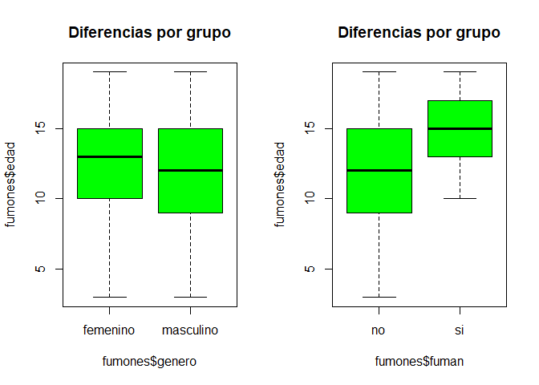<!-- -->

```r
par(mfrow = c(1, 1))

library(ggstatsplot)
```

```
## Warning: package 'ggstatsplot' was built under R version 4.3.3
```

```
## You can cite this package as:
##      Patil, I. (2021). Visualizations with statistical details: The 'ggstatsplot' approach.
##      Journal of Open Source Software, 6(61), 3167, doi:10.21105/joss.03167
```

```r
data = data.frame(edad= c(fumones$edad),
                  genero =(fumones$genero))

ggbetweenstats(data, genero, edad,
               
               type = "p",
               conf.level = 0.95)
```

```
## Warning in min(x): ningún argumento finito para min; retornando Inf
```

```
## Warning in max(x): ningun argumento finito para max; retornando -Inf
```

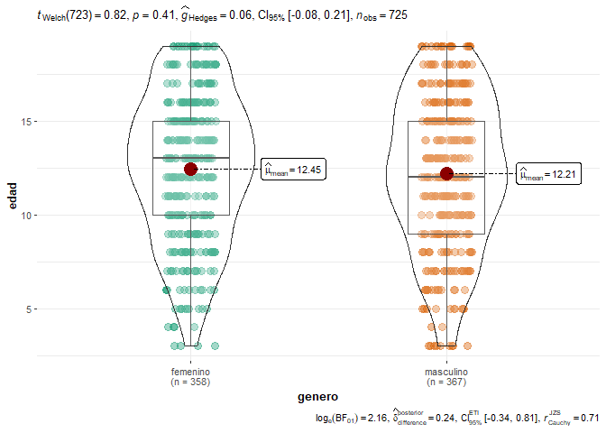<!-- -->


```r
#Selecciono para aplicar el test de normalidad
sifuman = fumones %>% filter(fuman == "si") %>% pull(edad)
nofuman = fumones %>% filter(fuman == "no") %>% pull(edad)

mean(sifuman) - mean(nofuman)
```

```
## [1] 2.743727
```


```r
#Aplico el test de normalidad para validar la no normalidad
shapiro.test(sifuman)
```

```
## 
## 	Shapiro-Wilk normality test
## 
## data:  sifuman
## W = 0.92949, p-value = 0.0003636
```

```r
shapiro.test(nofuman)  #validamos la no tendencia a la normalidad
```

```
## 
## 	Shapiro-Wilk normality test
## 
## data:  nofuman
## W = 0.97507, p-value = 4.708e-09
```

Existe diferencias significativas por que el p valor es menor a 0.05

```r
#Aplico el test de Mann Wihtne (wilcox.tes)
wilcox.test(edad~fuman, fumones) 
```

```
## 
## 	Wilcoxon rank sum test with continuity correction
## 
## data:  edad by fuman
## W = 15020, p-value = 1.013e-08
## alternative hypothesis: true location shift is not equal to 0
```


# **_ANOVA_**


```r
medley = read.table("medley.txt", header = T)
medley
```

<div data-pagedtable="false">
  <script data-pagedtable-source type="application/json">
{"columns":[{"label":["rio"],"name":[1],"type":["chr"],"align":["left"]},{"label":["zinc"],"name":[2],"type":["chr"],"align":["left"]},{"label":["diversidad"],"name":[3],"type":["dbl"],"align":["right"]}],"data":[{"1":"Eagle","2":"BACK","3":"2.27"},{"1":"Eagle","2":"HIGH","3":"1.25"},{"1":"Eagle","2":"HIGH","3":"1.15"},{"1":"Eagle","2":"MED","3":"1.62"},{"1":"Blue","2":"BACK","3":"1.70"},{"1":"Blue","2":"HIGH","3":"0.63"},{"1":"Blue","2":"BACK","3":"2.05"},{"1":"Blue","2":"BACK","3":"1.98"},{"1":"Blue","2":"HIGH","3":"1.04"},{"1":"Blue","2":"MED","3":"2.19"},{"1":"Blue","2":"MED","3":"2.10"},{"1":"Snake","2":"BACK","3":"2.20"},{"1":"Snake","2":"MED","3":"2.06"},{"1":"Snake","2":"HIGH","3":"1.90"},{"1":"Snake","2":"HIGH","3":"1.88"},{"1":"Snake","2":"HIGH","3":"0.85"},{"1":"Arkan","2":"LOW","3":"1.40"},{"1":"Arkan","2":"LOW","3":"2.18"},{"1":"Arkan","2":"LOW","3":"1.83"},{"1":"Arkan","2":"LOW","3":"1.88"},{"1":"Arkan","2":"MED","3":"2.02"},{"1":"Arkan","2":"MED","3":"1.94"},{"1":"Arkan","2":"LOW","3":"2.10"},{"1":"Chalk","2":"LOW","3":"2.38"},{"1":"Chalk","2":"HIGH","3":"1.43"},{"1":"Chalk","2":"HIGH","3":"1.37"},{"1":"Chalk","2":"MED","3":"1.75"},{"1":"Chalk","2":"LOW","3":"2.83"},{"1":"Splat","2":"BACK","3":"1.53"},{"1":"Splat","2":"BACK","3":"0.76"},{"1":"Splat","2":"MED","3":"0.80"},{"1":"Splat","2":"LOW","3":"1.66"},{"1":"Splat","2":"MED","3":"0.98"},{"1":"Splat","2":"BACK","3":"1.89"}],"options":{"columns":{"min":{},"max":[10]},"rows":{"min":[10],"max":[10]},"pages":{}}}
  </script>
</div>

```r
str(medley)
```

```
## 'data.frame':	34 obs. of  3 variables:
##  $ rio       : chr  "Eagle" "Eagle" "Eagle" "Eagle" ...
##  $ zinc      : chr  "BACK" "HIGH" "HIGH" "MED" ...
##  $ diversidad: num  2.27 1.25 1.15 1.62 1.7 0.63 2.05 1.98 1.04 2.19 ...
```

```r
#reorganizamos los niveles del factor categ?rico en un orden m?s l?gico.

medley$zinc = factor(medley$zinc, levels = c("HIGH", "MED",
                                             "LOW", "BACK"), ordered = F)

str(medley$zinc)
```

```
##  Factor w/ 4 levels "HIGH","MED","LOW",..: 4 1 1 2 4 1 4 4 1 2 ...
```

```r
#Evaluamos la normalidad/homogeneidad de la varianza utilizando 
#el diagrama de cajas de la diversidad de especies vs de zinc

boxplot(diversidad~zinc, medley)
```

<!-- -->
Concluimos que no hay alteraciones obvias de Normalidad u homogeneidad de la varianza, el diagramas de caja no son asimetricos y no varian mucho en tamaño


```r
#Evaluamos la suposici?n de homogeneidad de varianza con una 
#tabla y / o gr?fica de media vs varianza

plot(tapply(medley$diversidad, medley$zinc, mean),
     tapply(medley$diversidad, medley$zinc, var))
```

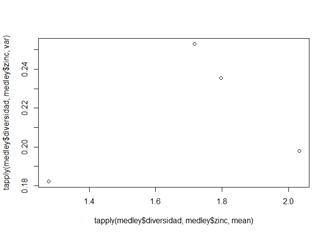<!-- -->

```r
#no existe una relaci?n buena entre las medias y varianzas.
```

Ahora realizamos la prueba H0, que las medias de los grupos poblacionales son iguales: ejecutamos un an?lisis de varianza (ajuste del modelo lineal) de la diversidad de especies en comparaci?n con el grupo a nivel de zinc y examinamos los diagn?sticos (grafico residual) ojo dividir la pantalla en 2 fil y 2 col

```r
help(aov) #vemos de que trata el argumento aov
```

```
## starting httpd help server ... done
```

```r
par(mfrow=c(2, 2))
medley.aov = aov(diversidad ~ zinc, medley)
plot(medley.aov)
```

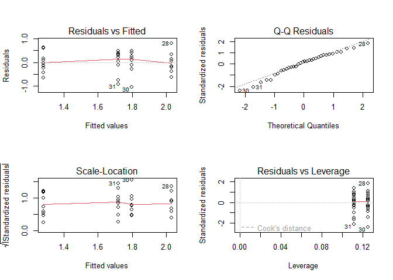<!-- -->

```r
par(mfrow=c(1, 1))
```

No hay alteraciones obvias de la normalidad o la homogeneidad de la varianza (no obvias forma de cu?a en residuos, grafico Q-Q normal aproximadamente lineal). Tener en cuenta que los valores de D de Cook sin sentido en ANOVA.


```r
#no hay alteraciones obvias de la normalidad o la homogeneidad de la 
#varianza (no obvias forma de cu?a en residuos, gr?fico Q-Q normal
#aproximadamente lineal). Tener en cuenta que los valores de D de
#Cook sin sentido en ANOVA.

#Ahora construimos la tabla de ANOVA

anova(medley.aov)
```

<div data-pagedtable="false">
  <script data-pagedtable-source type="application/json">
{"columns":[{"label":[""],"name":["_rn_"],"type":[""],"align":["left"]},{"label":["Df"],"name":[1],"type":["int"],"align":["right"]},{"label":["Sum Sq"],"name":[2],"type":["dbl"],"align":["right"]},{"label":["Mean Sq"],"name":[3],"type":["dbl"],"align":["right"]},{"label":["F value"],"name":[4],"type":["dbl"],"align":["right"]},{"label":["Pr(>F)"],"name":[5],"type":["dbl"],"align":["right"]}],"data":[{"1":"3","2":"2.566612","3":"0.8555375","4":"3.93869","5":"0.01755956","_rn_":"zinc"},{"1":"30","2":"6.516411","3":"0.2172137","4":"NA","5":"NA","_rn_":"Residuals"}],"options":{"columns":{"min":{},"max":[10]},"rows":{"min":[10],"max":[10]},"pages":{}}}
  </script>
</div>

```r
#Por tanto concluimos manifestando que se rechaz H0, que las medias de los
#grupos de poblaci?n son iguales, se encontr? que ZINC tiene un
#impacto significativo en la DIVERSIDAD de las diatomeas 
#(F3,30 = 3.939, P = 0.018).

#Ahora haremos el an?lisis post hot mediante el proc. "TUYKEYS", para
#ver las difrencias entre cada una.

library(multcomp)#habilitamos esta libreria para que nos de simultanea
```

```
## Warning: package 'multcomp' was built under R version 4.3.3
```

```
## Loading required package: mvtnorm
```

```
## Loading required package: survival
```

```
## 
## Attaching package: 'survival'
```

```
## The following object is masked from 'package:boot':
## 
##     aml
```

```
## The following object is masked from 'package:openintro':
## 
##     transplant
```

```
## The following object is masked from 'package:robustbase':
## 
##     heart
```

```
## Loading required package: TH.data
```

```
## Warning: package 'TH.data' was built under R version 4.3.3
```

```
## Loading required package: MASS
```

```
## 
## Attaching package: 'MASS'
```

```
## The following objects are masked from 'package:openintro':
## 
##     housing, mammals
```

```
## The following object is masked from 'package:dplyr':
## 
##     select
```

```
## 
## Attaching package: 'TH.data'
```

```
## The following object is masked from 'package:MASS':
## 
##     geyser
```

```
## The following object is masked from 'package:openintro':
## 
##     birds
```

```r
library(sandwich)
```

```
## Warning: package 'sandwich' was built under R version 4.3.3
```

```r
library(TH.data)
#mente todas las comparaciones
summary(glht(medley.aov, linfct = mcp(zinc = "Tukey")))
```

```
## 
## 	 Simultaneous Tests for General Linear Hypotheses
## 
## Multiple Comparisons of Means: Tukey Contrasts
## 
## 
## Fit: aov(formula = diversidad ~ zinc, data = medley)
## 
## Linear Hypotheses:
##                  Estimate Std. Error t value Pr(>|t|)  
## MED - HIGH == 0   0.44000    0.21970   2.003   0.2095  
## LOW - HIGH == 0   0.75472    0.22647   3.333   0.0116 *
## BACK - HIGH == 0  0.51972    0.22647   2.295   0.1220  
## LOW - MED == 0    0.31472    0.22647   1.390   0.5153  
## BACK - MED == 0   0.07972    0.22647   0.352   0.9847  
## BACK - LOW == 0  -0.23500    0.23303  -1.008   0.7457  
## ---
## Signif. codes:  0 '***' 0.001 '**' 0.01 '*' 0.05 '.' 0.1 ' ' 1
## (Adjusted p values reported -- single-step method)
```

```r
#Concluimos que la diversidad de especies de diatomeas es 
#significativamente mayor en sitios con bajo contenido de zinc que
#con alto contenido de zinc sitios (t15 = 3.333, P = 0.011). 
#Ning?n otro H0 es rechazado. Nota, los valores P ajustados de Tukey son
#basado en procedimientos robustos que no estaban disponibles para Quinn
#y Keough (2002). Cuanto mas
#la prueba reciente de Tukey utiliza procedimientos de aleatorizaci?n
#y, por lo tanto, los valores P exactos difieren de una carrera a otra.

boxplot(diversidad~zinc, medley)
```

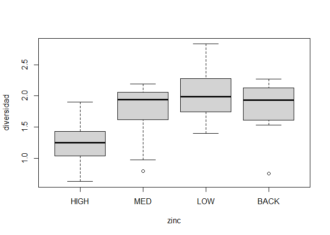<!-- -->

```r
library(ggstatsplot)
library(rstantools)
```

```
## Warning: package 'rstantools' was built under R version 4.3.3
```

```
## This is rstantools version 2.4.0
```

```r
ggbetweenstats(
  data = medley,
  x = zinc,
  y = diversidad
)
```

```
## Warning in min(x): ningún argumento finito para min; retornando Inf
```

```
## Warning in max(x): ningun argumento finito para max; retornando -Inf
```

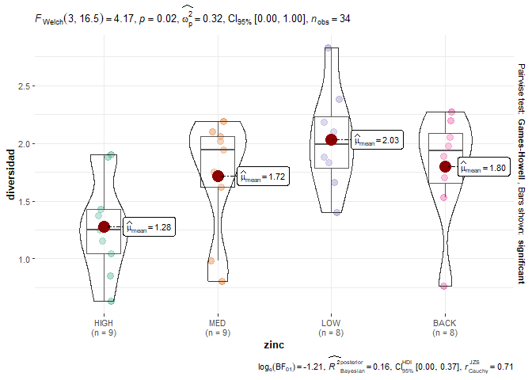<!-- -->


```r
library(readxl)
mademuerta = read_excel("densidad.xls", sheet=1)
str(mademuerta)
```

```
## tibble [73 × 2] (S3: tbl_df/tbl/data.frame)
##  $ Densidad       : num [1:73] 0.21 0.61 0.76 0.48 0.49 0.46 0.31 0.35 0.35 0.09 ...
##  $ Estad_descompos: chr [1:73] "B2" "A1_5" "A1_5" "A1_5" ...
```

```r
head(mademuerta)
```

<div data-pagedtable="false">
  <script data-pagedtable-source type="application/json">
{"columns":[{"label":["Densidad"],"name":[1],"type":["dbl"],"align":["right"]},{"label":["Estad_descompos"],"name":[2],"type":["chr"],"align":["left"]}],"data":[{"1":"0.21","2":"B2"},{"1":"0.61","2":"A1_5"},{"1":"0.76","2":"A1_5"},{"1":"0.48","2":"A1_5"},{"1":"0.49","2":"C2_5"},{"1":"0.46","2":"A1_5"}],"options":{"columns":{"min":{},"max":[10]},"rows":{"min":[10],"max":[10]},"pages":{}}}
  </script>
</div>

```r
mademuerta=data.frame(mademuerta)
#identificamos el n?mero de grupos y cantidad de observaciones por grupo 
#para determinar si es un modelo equilibrado. Tambi?n se calculan la
#media y desviaci?n t?pica de cada grupo

table(mademuerta$Estad_descompos)
```

```
## 
## A1_5   B2 C2_5   D3 
##   17   20   18   18
```

```r
aggregate(Densidad ~ Estad_descompos, data = mademuerta, FUN = mean)
```

<div data-pagedtable="false">
  <script data-pagedtable-source type="application/json">
{"columns":[{"label":["Estad_descompos"],"name":[1],"type":["chr"],"align":["left"]},{"label":["Densidad"],"name":[2],"type":["dbl"],"align":["right"]}],"data":[{"1":"A1_5","2":"0.5335294"},{"1":"B2","2":"0.4015000"},{"1":"C2_5","2":"0.3661111"},{"1":"D3","2":"0.3822222"}],"options":{"columns":{"min":{},"max":[10]},"rows":{"min":[10],"max":[10]},"pages":{}}}
  </script>
</div>

```r
aggregate(Densidad ~ Estad_descompos, data = mademuerta, FUN = sd)
```

<div data-pagedtable="false">
  <script data-pagedtable-source type="application/json">
{"columns":[{"label":["Estad_descompos"],"name":[1],"type":["chr"],"align":["left"]},{"label":["Densidad"],"name":[2],"type":["dbl"],"align":["right"]}],"data":[{"1":"A1_5","2":"0.1562026"},{"1":"B2","2":"0.1821299"},{"1":"C2_5","2":"0.1400478"},{"1":"D3","2":"0.1369223"}],"options":{"columns":{"min":{},"max":[10]},"rows":{"min":[10],"max":[10]},"pages":{}}}
  </script>
</div>

```r
#La representaci?n gr?fica mas ?til antes de realizar un ANOVA es el modelo 
#Box-Plot.

ggplot(data = mademuerta, aes(x = Estad_descompos, y = Densidad, 
                              color = Estad_descompos)) + geom_boxplot() + theme_bw()
```

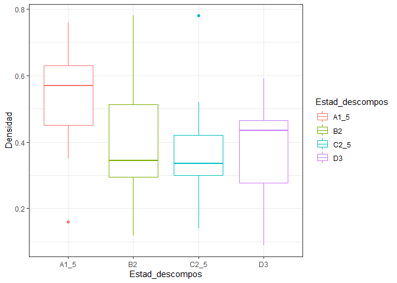<!-- -->

```r
ggbetweenstats(
  data = mademuerta,
  x = Estad_descompos,
  y = Densidad
)
```

```
## Warning in min(x): ningún argumento finito para min; retornando Inf
```

```
## Warning in max(x): ningun argumento finito para max; retornando -Inf
```

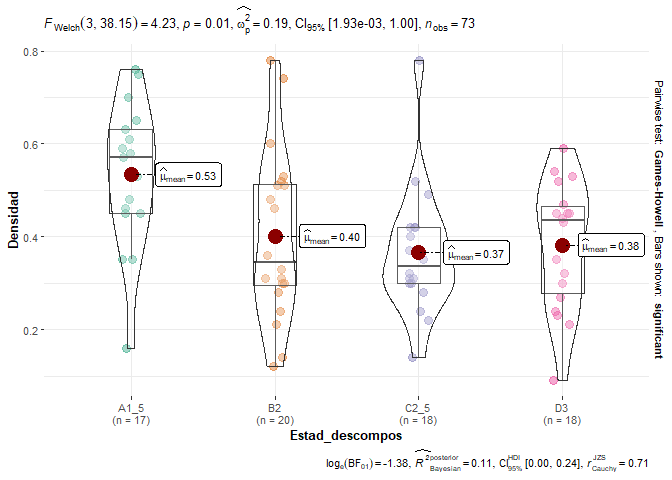<!-- -->

```r
#2.Verificar condiciones para un ANOVA
par(mfrow = c(1,1))
par(mfrow = c(2,2))
qqnorm(mademuerta[mademuerta$Estad_descompos == "A1_5","Densidad"],main = "A1_5")
qqline(mademuerta[mademuerta$Estad_descompos == "A1_5","Densidad"])
qqnorm(mademuerta[mademuerta$Estad_descompos == "B2","Densidad"],main = "B2")
qqline(mademuerta[mademuerta$Estad_descompos == "B2","Densidad"])
qqnorm(mademuerta[mademuerta$Estad_descompos == "C2_5","Densidad"],main = "C2_5")
qqline(mademuerta[mademuerta$Estad_descompos == "C2_5","Densidad"])
qqnorm(mademuerta[mademuerta$Estad_descompos == "D3","Densidad"],main = "D3")
qqline(mademuerta[mademuerta$Estad_descompos == "D3","Densidad"])
```

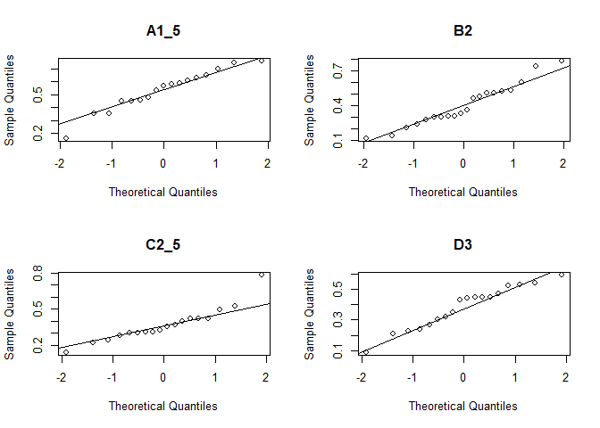<!-- -->

```r
#Volvemos a la pantalla simpe
par(mfrow = c(1,1))

#Dado que los grupos tienen mas de 50 eventos se emplea el test de 
#Kolmogorov-Smirnov con la correcci?n de Lilliefors. La funci?n en 
#R se llama lillie.test() y se encuentra en el paquete nortest. Si fuesen 
#menos de 50 eventos por grupo se emplear?a el test Shapiro-Wilk.

require(nortest)
by(data = mademuerta,INDICES = mademuerta$Estad_descompos,
   FUN = function(x){ lillie.test(x$Densidad)}) #sale tendencia normal todos
```

```
## mademuerta$Estad_descompos: A1_5
## 
## 	Lilliefors (Kolmogorov-Smirnov) normality test
## 
## data:  x$Densidad
## D = 0.12172, p-value = 0.7224
## 
## ------------------------------------------------------------ 
## mademuerta$Estad_descompos: B2
## 
## 	Lilliefors (Kolmogorov-Smirnov) normality test
## 
## data:  x$Densidad
## D = 0.15268, p-value = 0.2561
## 
## ------------------------------------------------------------ 
## mademuerta$Estad_descompos: C2_5
## 
## 	Lilliefors (Kolmogorov-Smirnov) normality test
## 
## data:  x$Densidad
## D = 0.18353, p-value = 0.1121
## 
## ------------------------------------------------------------ 
## mademuerta$Estad_descompos: D3
## 
## 	Lilliefors (Kolmogorov-Smirnov) normality test
## 
## data:  x$Densidad
## D = 0.19199, p-value = 0.07821
```

```r
by(data = mademuerta,INDICES = mademuerta$Estad_descompos,
   FUN = function(x){ shapiro.test(x$Densidad)}) #sale tendencia normal todos
```

```
## mademuerta$Estad_descompos: A1_5
## 
## 	Shapiro-Wilk normality test
## 
## data:  x$Densidad
## W = 0.9577, p-value = 0.5887
## 
## ------------------------------------------------------------ 
## mademuerta$Estad_descompos: B2
## 
## 	Shapiro-Wilk normality test
## 
## data:  x$Densidad
## W = 0.95129, p-value = 0.3871
## 
## ------------------------------------------------------------ 
## mademuerta$Estad_descompos: C2_5
## 
## 	Shapiro-Wilk normality test
## 
## data:  x$Densidad
## W = 0.8969, p-value = 0.05075
## 
## ------------------------------------------------------------ 
## mademuerta$Estad_descompos: D3
## 
## 	Shapiro-Wilk normality test
## 
## data:  x$Densidad
## W = 0.95135, p-value = 0.4465
```

```r
#Para evaluar la varianza entre grupos (homocedasticidad)

fligner.test(Densidad ~ Estad_descompos,mademuerta)
```

```
## 
## 	Fligner-Killeen test of homogeneity of variances
## 
## data:  Densidad by Estad_descompos
## Fligner-Killeen:med chi-squared = 2.589, df = 3, p-value = 0.4594
```

```r
require(car)
leveneTest(Densidad ~ Estad_descompos,mademuerta,center = "median")
```

```
## Warning in leveneTest.default(y = y, group = group, ...): group coerced to
## factor.
```

<div data-pagedtable="false">
  <script data-pagedtable-source type="application/json">
{"columns":[{"label":[""],"name":["_rn_"],"type":[""],"align":["left"]},{"label":["Df"],"name":[1],"type":["int"],"align":["right"]},{"label":["F value"],"name":[2],"type":["dbl"],"align":["right"]},{"label":["Pr(>F)"],"name":[3],"type":["dbl"],"align":["right"]}],"data":[{"1":"3","2":"0.7889245","3":"0.5041816","_rn_":"group"},{"1":"69","2":"NA","3":"NA","_rn_":""}],"options":{"columns":{"min":{},"max":[10]},"rows":{"min":[10],"max":[10]},"pages":{}}}
  </script>
</div>

```r
#No hay evidencias significativas de falta de homocedasticidad en 
#ninguno de los dos test.

#3.Analisis de varianza ANOVA
anova = aov(mademuerta$Densidad ~ mademuerta$Estad_descompos)
summary(anova)
```

```
##                            Df Sum Sq Mean Sq F value Pr(>F)   
## mademuerta$Estad_descompos  3 0.3038 0.10127   4.177 0.0089 **
## Residuals                  69 1.6728 0.02424                  
## ---
## Signif. codes:  0 '***' 0.001 '**' 0.01 '*' 0.05 '.' 0.1 ' ' 1
```

```r
#en al menos uno de los grupos hay diferencia significativa

plot(anova)
```

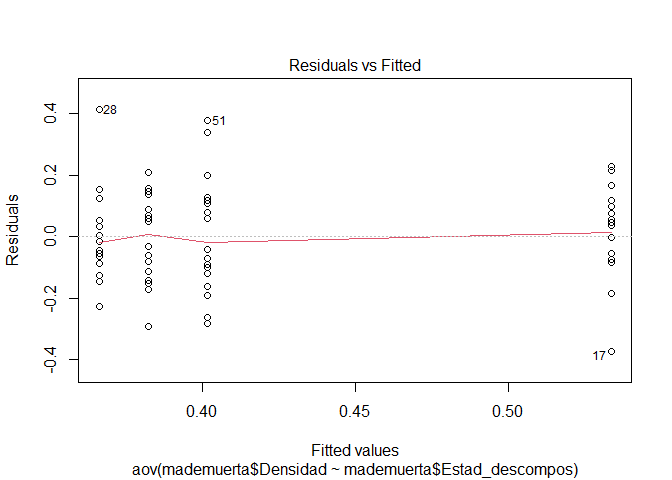<!-- -->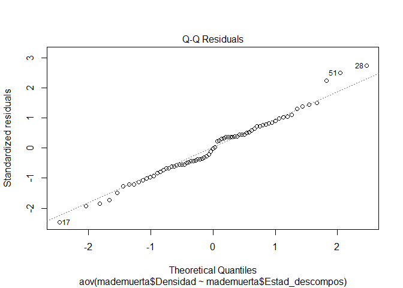<!-- -->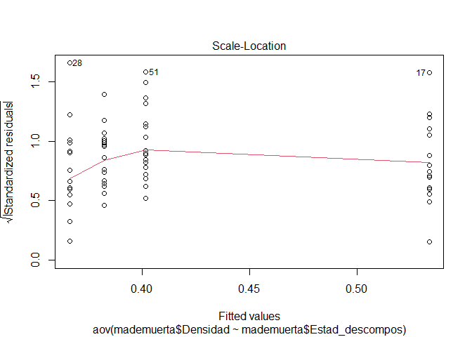<!-- -->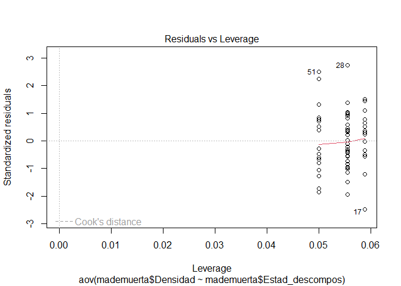<!-- -->

```r
#4.Calcular el tamaño del efecto de un ANOVA

eta_cuadrado <- 0.3038/(0.3038 + 1.6728)
eta_cuadrado  # sale 0.15369
```

```
## [1] 0.1536983
```

```r
#5.Comparaciones m?ltiples

#Necesitamos conocer cual es al menos uno de los grupos que difiere con los 
#demas
pairwise.t.test(x = mademuerta$Densidad, g = mademuerta$Estad_descompos, 
                p.adjust.method = "holm",pool.sd = TRUE, 
                paired = FALSE, alternative = "two.sided")
```

```
## 
## 	Pairwise comparisons using t tests with pooled SD 
## 
## data:  mademuerta$Densidad and mademuerta$Estad_descompos 
## 
##      A1_5  B2    C2_5 
## B2   0.049 -     -    
## C2_5 0.013 1.000 -    
## D3   0.027 1.000 1.000
## 
## P value adjustment method: holm
```

```r
TukeyHSD(anova)
```

```
##   Tukey multiple comparisons of means
##     95% family-wise confidence level
## 
## Fit: aov(formula = mademuerta$Densidad ~ mademuerta$Estad_descompos)
## 
## $`mademuerta$Estad_descompos`
##                  diff        lwr         upr     p adj
## B2-A1_5   -0.13202941 -0.2672579  0.00319910 0.0581760
## C2_5-A1_5 -0.16741830 -0.3060556 -0.02878097 0.0115986
## D3-A1_5   -0.15130719 -0.2899445 -0.01266986 0.0270328
## C2_5-B2   -0.03538889 -0.1685715  0.09779369 0.8968982
## D3-B2     -0.01927778 -0.1524604  0.11390480 0.9810094
## D3-C2_5    0.01611111 -0.1205313  0.15275355 0.9895399
```

```r
par(mfrow = c(1,1))
plot(TukeyHSD(anova))
```

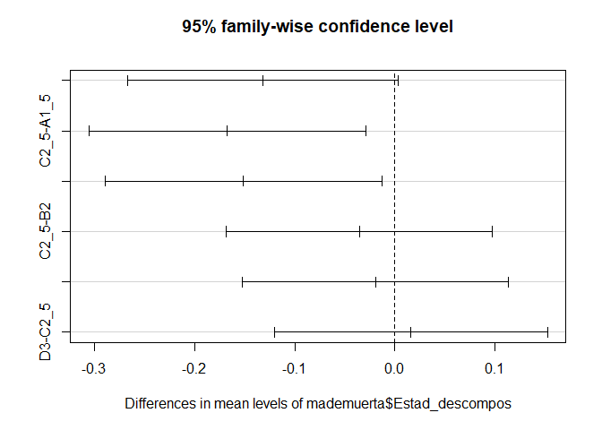<!-- -->

```r
#6.Conclusion
#En el estudio realizado se ha observado un tama?o de efecto peque?o y 
#la tecnicas de inferencia ANOVA han encontrado significancia estadistica
#para aceptar que las medias no son iguales entre todos los grupos.
```

# **_KRUSKAL WALLIS_**


```r
#Prueba de Kruskal-Wallis con prueba post-hoc no parametrica
##Ejem: Sokal y Rohlf (1997) presentan un conjunto de datos no publicados
#(W. Purves) en el que el efecto de Tratamientos de az?car en diferentes %
#(Control, 2% de glucosa agregada, 2% de fructosa agregada, 1% de glucosa
#y Se investig? el 1% de fructosa y el 2% de sacarosa en la longitud
#de guisante.


#usamos los datos Purvey
purves <- read.table("purves.csv", header = T, sep = ",")

#vemos las tendencias de normalidad
par(mfrow=c(1, 1))
boxplot(LENGTH ~ TREAT, data = purves) 
```

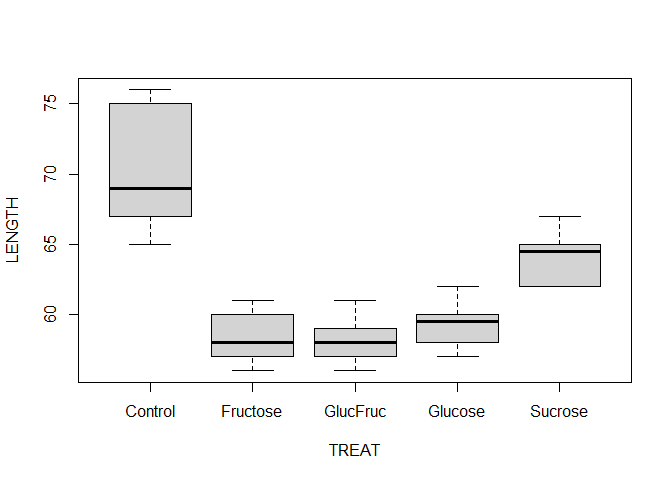<!-- -->

```r
ggbetweenstats(
  data = purves,
  x = TREAT,
  y = LENGTH,
  pairwise.display = "no significant"
)
```

```
## Warning in min(x): ningún argumento finito para min; retornando Inf
```

```
## Warning in max(x): ningun argumento finito para max; retornando -Inf
```

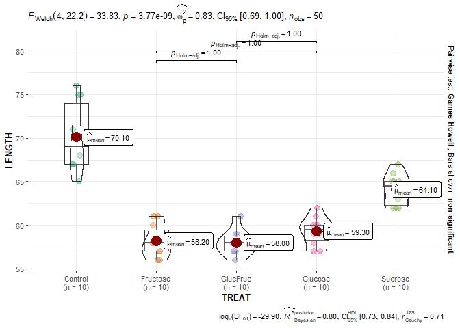<!-- -->

```r
#hay fuertes diferencias de varianzas, tendencia no param?trica

#hacemos el analisis kruskall
kruskal.test(LENGTH~TREAT, data = purves)
```

```
## 
## 	Kruskal-Wallis rank sum test
## 
## data:  LENGTH by TREAT
## Kruskal-Wallis chi-squared = 38.437, df = 4, p-value = 9.105e-08
```

```r
#nos dice que si hay diferecnia significativa, la cantidad de azucar
#influencia

#Un estudio compara el numero de huevos que pone la mosca infecciosa Culex
#bajo 3 ambientes distintos. ?Existen diferencias significativas 
#dependiendo de las condiciones?

insecto = data.frame(condicion = c(rep("bosque", 18), rep("potrero", 18), 
                                   rep("ciudad", 18)), n_huevos = c(1, 2, 3, 4, 5, 6, 7, 8, 9, 
                                                                    16, 27, 28, 29, 30, 51, 52, 53, 342, 40, 41, 42, 43, 44, 45, 46,
                                                                    47, 48, 67, 88, 89, 90, 91,92, 93, 94, 293, 19, 20, 21, 22, 23,
                                                                    24, 25, 26, 27, 28, 25, 36, 37, 58, 59, 60, 71, 72))
head(insecto)
```

<div data-pagedtable="false">
  <script data-pagedtable-source type="application/json">
{"columns":[{"label":[""],"name":["_rn_"],"type":[""],"align":["left"]},{"label":["condicion"],"name":[1],"type":["chr"],"align":["left"]},{"label":["n_huevos"],"name":[2],"type":["dbl"],"align":["right"]}],"data":[{"1":"bosque","2":"1","_rn_":"1"},{"1":"bosque","2":"2","_rn_":"2"},{"1":"bosque","2":"3","_rn_":"3"},{"1":"bosque","2":"4","_rn_":"4"},{"1":"bosque","2":"5","_rn_":"5"},{"1":"bosque","2":"6","_rn_":"6"}],"options":{"columns":{"min":{},"max":[10]},"rows":{"min":[10],"max":[10]},"pages":{}}}
  </script>
</div>

```r
aggregate(n_huevos ~ condicion, data = insecto, FUN = median)
```

<div data-pagedtable="false">
  <script data-pagedtable-source type="application/json">
{"columns":[{"label":["condicion"],"name":[1],"type":["chr"],"align":["left"]},{"label":["n_huevos"],"name":[2],"type":["dbl"],"align":["right"]}],"data":[{"1":"bosque","2":"12.5"},{"1":"ciudad","2":"26.5"},{"1":"potrero","2":"57.5"}],"options":{"columns":{"min":{},"max":[10]},"rows":{"min":[10],"max":[10]},"pages":{}}}
  </script>
</div>

```r
aggregate(n_huevos ~ condicion, data = insecto, FUN = sd)
```

<div data-pagedtable="false">
  <script data-pagedtable-source type="application/json">
{"columns":[{"label":["condicion"],"name":[1],"type":["chr"],"align":["left"]},{"label":["n_huevos"],"name":[2],"type":["dbl"],"align":["right"]}],"data":[{"1":"bosque","2":"78.10637"},{"1":"ciudad","2":"18.59097"},{"1":"potrero","2":"58.41750"}],"options":{"columns":{"min":{},"max":[10]},"rows":{"min":[10],"max":[10]},"pages":{}}}
  </script>
</div>

```r
library(ggplot2) #habilitammos el ggplot2

#aplicamos boxplot para ver la dispersion de los datos
ggplot(data = insecto, mapping = aes(x = condicion, y = n_huevos, 
                                     col = condicion)) +   geom_boxplot() +
  theme_bw() + theme(legend.position = "none")
```

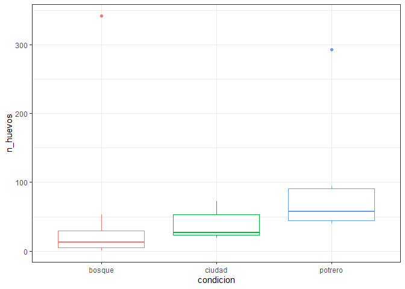<!-- -->

```r
ggbetweenstats(
  data = insecto,
  x = condicion,
  y = n_huevos,
  pairwise.display = "no significant"
)
```

```
## Warning in min(x): ningún argumento finito para min; retornando Inf

## Warning in min(x): ningun argumento finito para max; retornando -Inf
```

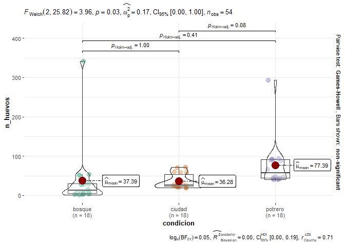<!-- -->

```r
#aplicamos un histograma
ggplot(data = insecto, mapping = aes(x = n_huevos, colour = condicion)) +
  geom_histogram() + theme_bw() + facet_grid(. ~ condicion) +
  theme(legend.position = "none")
```

```
## `stat_bin()` using `bins = 30`. Pick better value with `binwidth`.
```

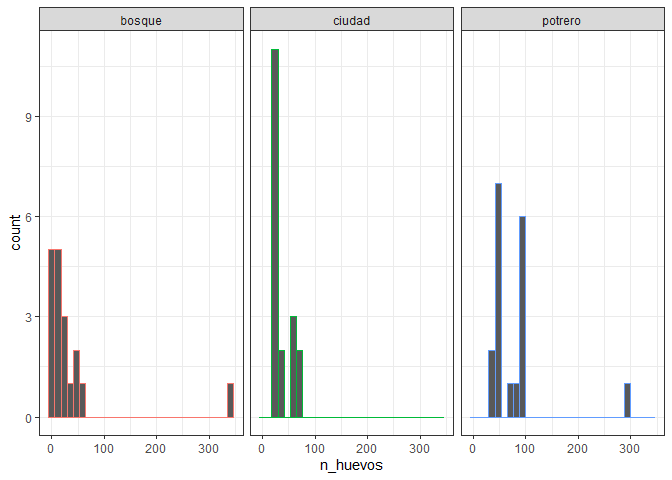<!-- -->

```r
#La representacion grafica de los datos muestra que las muestras no se 
#distribuyen de forma normal, lo que supone una limitacion para emplear 
#un test ANOVA. Las tres muestras presentan el mismo tipo de distribucion,
#asimetria hacia la derecha, a falta de comprobar la homogeneidad de varianza 
#el test de Kruskal-Wallis es la opcion m?s adecuada.


#Condiciones

#Homocedasticidad: la varianza debe de ser constante entre todos los grupos.

library(car)
leveneTest(n_huevos ~ condicion, data = insecto, center = "median")
```

```
## Warning in leveneTest.default(y = y, group = group, ...): group coerced to
## factor.
```

<div data-pagedtable="false">
  <script data-pagedtable-source type="application/json">
{"columns":[{"label":[""],"name":["_rn_"],"type":[""],"align":["left"]},{"label":["Df"],"name":[1],"type":["int"],"align":["right"]},{"label":["F value"],"name":[2],"type":["dbl"],"align":["right"]},{"label":["Pr(>F)"],"name":[3],"type":["dbl"],"align":["right"]}],"data":[{"1":"2","2":"0.7929454","3":"0.458009","_rn_":"group"},{"1":"51","2":"NA","3":"NA","_rn_":""}],"options":{"columns":{"min":{},"max":[10]},"rows":{"min":[10],"max":[10]},"pages":{}}}
  </script>
</div>

```r
#No se muestra evidencias en contra de la homogeneidad de varianzas.

#Aplicamos la pruerba de Kruskall wallis

kruskal.test(n_huevos ~ condicion, data = insecto)
```

```
## 
## 	Kruskal-Wallis rank sum test
## 
## data:  n_huevos by condicion
## Kruskal-Wallis chi-squared = 19.964, df = 2, p-value = 4.623e-05
```

```r
#El test encuentra significancia en la diferencia de al menos dos grupos.

#Comparaciones post-hoc para saber que dos grupos difieren
#Existen diferentes m?todos de correcci?n del nivel de significancia, 
#entre ellos destacan el de Bonferroni que es muy estricto y el de holm, 
#este ultimo parece ser m?s recomendado.

pairwise.wilcox.test(x = insecto$n_huevos, g = insecto$condicion, 
                     p.adjust.method = "holm" )
```

```
## Warning in wilcox.test.default(xi, xj, paired = paired, ...): cannot compute
## exact p-value with ties
```

```
## Warning in wilcox.test.default(xi, xj, paired = paired, ...): cannot compute
## exact p-value with ties
```

```
## 
## 	Pairwise comparisons using Wilcoxon rank sum test with continuity correction 
## 
## data:  insecto$n_huevos and insecto$condicion 
## 
##         bosque  ciudad 
## ciudad  0.04795 -      
## potrero 0.00029 0.00058
## 
## P value adjustment method: holm
```

```r
#Solucion
#Entre los tres ambientes hay diferencias significativas en cuanto a la 
#produccion de huevos de las moscas Culex
```

# **_Metodos de ordenación_**

## Analsis de componentes principales PCA

El análisis de componentes principales (PCA) es una técnica multivariada utilizada para explorar y reducir la dimensionalidad de conjuntos de datos grandes y complejos. Su objetivo principal es encontrar patrones o estructuras subyacentes en los datos, lo que permite resumir la información contenida en múltiples variables en un conjunto más pequeño de variables llamadas componentes principales.

Por ejemplo, consideremos un estudio que recolecta datos sobre diferentes ambientes forestales, como la densidad de árboles, la temperatura, la precipitación y la presencia de mamíferos. Estos datos pueden ser representados como puntos en un espacio multidimensional, donde cada dimensión corresponde a una variable medida. El PCA busca identificar combinaciones lineales de estas variables que capturen la mayor cantidad de variabilidad en los datos.

Interpretar los resultados del PCA implica comprender cómo las variables originales contribuyen a cada componente principal identificado. Por ejemplo, si un componente principal captura una gran cantidad de variabilidad en la densidad de árboles y la temperatura, podemos inferir que estas dos variables están fuertemente relacionadas en los datos.

Además, la posición de los puntos en el espacio de componentes principales puede proporcionar información sobre la similitud entre las observaciones. Por ejemplo, si dos puntos están cerca en el espacio de componentes principales, esto sugiere que las observaciones correspondientes son similares en términos de las variables medidas.

En resumen, el PCA es una herramienta poderosa para explorar la estructura de los datos multivariados y puede ayudar a identificar patrones, reducir la dimensionalidad de los datos y entender las relaciones entre las variables.

Analsis multivariados, son datos grandes aleatorios, a traves de estos metodos poder encontrar un orden o agrupacion.
Ejemplo: diferentes ambientes, bosque alto donde hay factores ambientales favorables y otro que seria los animales, otro ambiente donde el bosque es menor y hay mas lluvias por lo cual hay facotres ambientales diferentes y otra variable son los maniferos, y lo que buscamos con la tecnica es relacionar si las varaibles incluyen en la abundancia de mamiferos. Si los datos se agrupan en el centro significa que no estan influenciada


```r
# instalamos esos paquetes

library(ggpubr)
library(factoextra)
```

```
## Warning: package 'factoextra' was built under R version 4.3.3
```

```
## Welcome! Want to learn more? See two factoextra-related books at https://goo.gl/ve3WBa
```

```r
####################       ANALISIS PCA        ####################

## • Compute PCA using the R base function prcomp()
## • Visualize the output using the factoextra R package (an extension to ggplot2)
## (Kassambara and Mundt, 2017)

nodupca = read.table("nodupca.txt", header = TRUE)

str(nodupca)
```

```
## 'data.frame':	22 obs. of  12 variables:
##  $ pH2   : num  1 1 1 1 0.5 1 1 1 1 1 ...
##  $ Tem13 : int  2 2 2 2 2 2 2 2 2 2 ...
##  $ Tem42 : num  1 0.667 3 1 2 ...
##  $ Sal8  : num  0.2 0 1 2 0.5 0 0 0 1.5 2 ...
##  $ Sal6  : num  1.2 0 1.5 3 2 1 1 1 2.75 3 ...
##  $ Sal4  : num  2 1.33 3 2 2.5 ...
##  $ pH9   : num  1.8 3.33 1.5 1 1.5 ...
##  $ Tem4  : num  1.2 1.33 2 2 1.5 ...
##  $ pH4   : num  1.6 3.33 1.5 2 1 ...
##  $ Sal1.5: num  2.2 2.33 3 3 2.5 ...
##  $ Sal2.5: num  2.2 1.33 3.5 3 2.5 ...
##  $ pH8   : num  2.2 3.67 2.5 2 2.5 ...
```

```r
library("factoextra")
nodPCA = nodupca # Remove the grouping variable
res.pca = prcomp(nodPCA, scale = TRUE)
fviz_eig(res.pca) ## Para halar el aporte de las varianzas
```

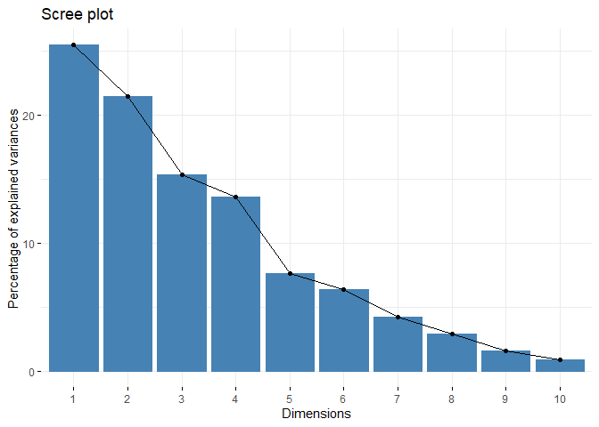<!-- -->
Este gráfico representa las dimensiones y su contribución, donde la primera dimensión aporta un 26% del total. Sin embargo, debido a la gran cantidad de dimensiones, la explicación se vuelve difícil y poco clara. Para abordar esta complejidad, es necesario filtrar las variables más influyentes que puedan explicar las relaciones entre las dimensiones. Esto se debe a que el gran número de variables puede dificultar la comprensión de los patrones subyacentes y hacer que la interpretación sea menos precisa. Al identificar y centrarse en las variables más relevantes, se puede mejorar la comprensión y la interpretación de los datos, permitiendo una visión más clara y significativa de las relaciones presentes en el conjunto de datos.


```r
fviz_pca_ind(res.pca,
             col.ind = "cos2", # Color by the quality of representation
             gradient.cols = c("#00AFBB", "#E7B800", "#FC4E07"),
             repel = TRUE )    # Avoid text overlapping
```

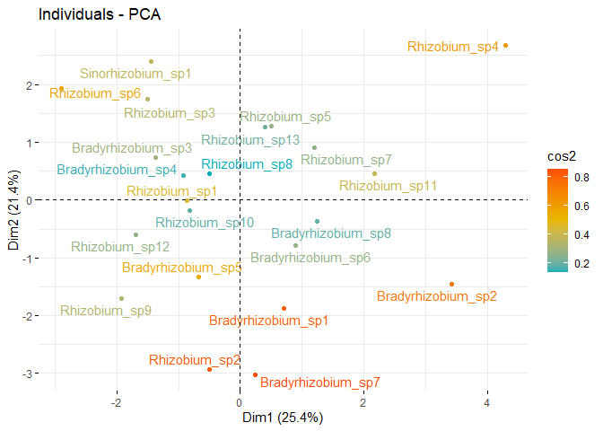<!-- -->

Este análisis indica la presencia de puntos extremos en la distribución de bacterias, lo que sugiere una notable capacidad de adaptación a diferentes niveles de salinidad. Estos puntos extremos podrían indicar cepas de bacterias que pueden sobrevivir y prosperar en condiciones de salinidad muy alta o muy baja. Esta adaptabilidad es un rasgo destacado que puede ser crucial en entornos cambiantes o variables, donde la concentración de salinidad puede fluctuar significativamente. La presencia de estas bacterias extremas puede tener implicaciones importantes en diversos campos, como la biotecnología y la ecología, donde comprender y aprovechar la capacidad de adaptación de organismos puede conducir a aplicaciones innovadoras o a una mejor comprensión de los ecosistemas.


```r
fviz_pca_var(res.pca,
             col.var = "contrib", # Color by contributions to the PC
             gradient.cols = c("#00AFBB", "#E7B800", "#FC4E07"),
             repel = TRUE  )   # Avoid text overlapping
```

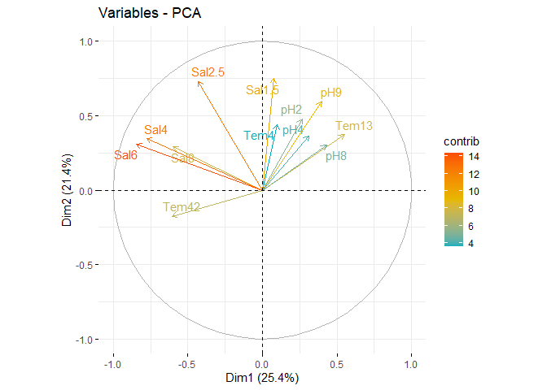<!-- -->

La observación sugiere que la temperatura no ejerce una influencia significativa en el conjunto de datos, ya que su posición en el gráfico está más cerca del centro en comparación con otras variables. Esto podría indicar que la temperatura no es un factor determinante en la variabilidad observada en los datos. Sin embargo, es importante tener en cuenta que esta evaluación se basa únicamente en la posición relativa de la temperatura en el gráfico y no excluye la posibilidad de que la temperatura tenga un impacto en ciertos aspectos específicos o en combinación con otras variables. Por lo tanto, aunque la temperatura no parece ser un factor destacado en este análisis visual, es necesario considerar más información y análisis para comprender completamente su papel en el conjunto de datos.


```r
##variables y dimensiones

fviz_pca_biplot(res.pca, repel = TRUE,
                col.var = "#2E9FDF", # Variables color
                col.ind = "#696969")  # Individuals color
```

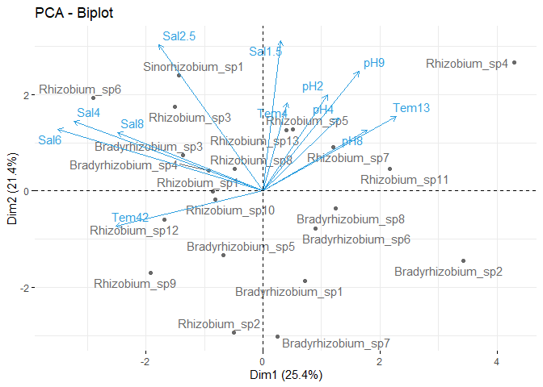<!-- -->


La observación señala que las dimensiones 1 y 2 representan un porcentaje significativo del total, aproximadamente el 21% y el 25% respectivamente. Esto sugiere que estas dos dimensiones capturan una proporción considerable de la variabilidad en los datos. Además, se sugiere que la presencia de tantas variables podría indicar que las bacterias muestran cierta capacidad de resistencia o adaptación a todos los tratamientos aplicados. Esta adaptabilidad generalizada podría reflejar la robustez de las bacterias frente a una variedad de condiciones o factores externos. Sin embargo, es importante tener en cuenta que esta interpretación se basa en la observación de los porcentajes de contribución de las dimensiones y la presencia de múltiples variables en el conjunto de datos, y se requeriría un análisis más detallado para confirmar completamente estas suposiciones y comprender la dinámica subyacente.


```r
### Para la variable Temperaturas

nodutemp = read.table("noduTemp.txt", header = TRUE)

nodutemp
```

<div data-pagedtable="false">
  <script data-pagedtable-source type="application/json">
{"columns":[{"label":[""],"name":["_rn_"],"type":[""],"align":["left"]},{"label":["Tem4"],"name":[1],"type":["dbl"],"align":["right"]},{"label":["Tem13"],"name":[2],"type":["int"],"align":["right"]},{"label":["Tem40"],"name":[3],"type":["dbl"],"align":["right"]}],"data":[{"1":"1.200000","2":"2","3":"1.0000000","_rn_":"Bradyrhizobium_sp1"},{"1":"1.333333","2":"2","3":"0.6666667","_rn_":"Bradyrhizobium_sp2"},{"1":"2.000000","2":"2","3":"3.0000000","_rn_":"Bradyrhizobium_sp3"},{"1":"2.000000","2":"2","3":"1.0000000","_rn_":"Bradyrhizobium_sp4"},{"1":"1.500000","2":"2","3":"2.0000000","_rn_":"Bradyrhizobium_sp5"},{"1":"2.000000","2":"2","3":"2.0000000","_rn_":"Bradyrhizobium_sp6"},{"1":"1.000000","2":"2","3":"2.0000000","_rn_":"Bradyrhizobium_sp7"},{"1":"1.000000","2":"2","3":"1.5000000","_rn_":"Bradyrhizobium_sp8"},{"1":"1.500000","2":"2","3":"2.5000000","_rn_":"Rhizobium_sp1"},{"1":"1.500000","2":"2","3":"3.0000000","_rn_":"Rhizobium_sp10"},{"1":"1.000000","2":"2","3":"0.1000000","_rn_":"Rhizobium_sp11"},{"1":"1.000000","2":"2","3":"1.0000000","_rn_":"Rhizobium_sp12"},{"1":"2.000000","2":"2","3":"0.1000000","_rn_":"Rhizobium_sp13"},{"1":"1.000000","2":"2","3":"3.0000000","_rn_":"Rhizobium_sp2"},{"1":"2.000000","2":"2","3":"4.0000000","_rn_":"Rhizobium_sp3"},{"1":"2.000000","2":"3","3":"1.0000000","_rn_":"Rhizobium_sp4"},{"1":"1.666667","2":"2","3":"1.0000000","_rn_":"Rhizobium_sp5"},{"1":"0.500000","2":"2","3":"3.0000000","_rn_":"Rhizobium_sp6"},{"1":"1.000000","2":"2","3":"1.0000000","_rn_":"Rhizobium_sp7"},{"1":"2.000000","2":"2","3":"2.0000000","_rn_":"Rhizobium_sp8"},{"1":"1.000000","2":"2","3":"4.0000000","_rn_":"Rhizobium_sp9"},{"1":"2.000000","2":"2","3":"1.0000000","_rn_":"Sinorhizobium_sp1"}],"options":{"columns":{"min":{},"max":[10]},"rows":{"min":[10],"max":[10]},"pages":{}}}
  </script>
</div>

```r
library("factoextra")
res.pca = prcomp(nodutemp, scale = TRUE)
fviz_eig(res.pca) ## Para halar el aporte de las varianzas
```

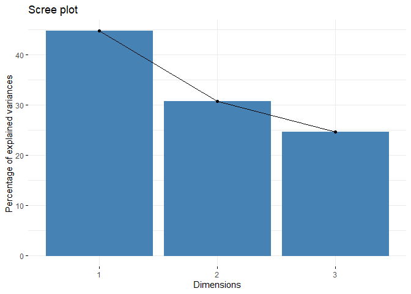<!-- -->

```r
fviz_pca_biplot(res.pca, repel = TRUE,
                col.var = "#2E9FDF", # Variables color
                col.ind = "#696969")  # Individuals color
```

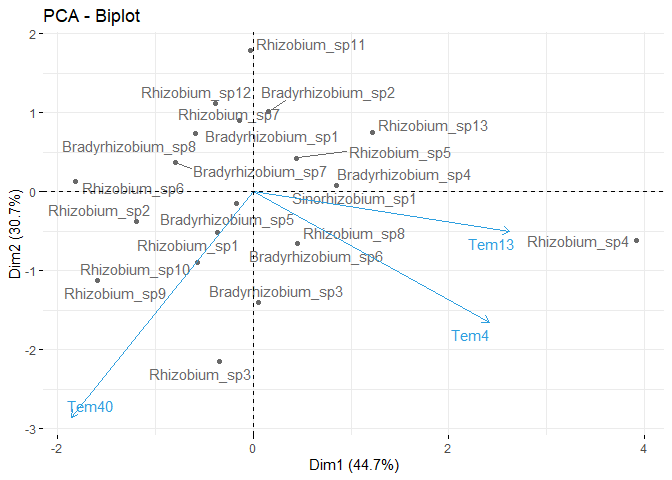<!-- -->
Esta observación resalta que la dimensión uno explica el 44.7% de la variabilidad, seguida por el 30% en la dimensión dos. Además, se destaca que en el centroide no se evidencia un grado de relación o explicación respecto a las variables de temperatura. Se menciona específicamente que el Rhizobium_sp4 logró sobrevivir o soportar la temperatura de 13 grados Celsius. También se señala que las bacterias ubicadas en la parte superior del gráfico no están agrupadas con las otras variables.

Esta descripción sugiere que la dimensión uno tiene un impacto significativo en la variabilidad de los datos, seguida por la dimensión dos. Además, destaca una falta de relación aparente entre el centroide y las variables de temperatura, lo que sugiere que estas últimas podrían no estar directamente asociadas con los patrones observados en el conjunto de datos. La supervivencia o resistencia del Rhizobium_sp4 a una temperatura específica indica una capacidad de adaptación a condiciones ambientales adversas. Por último, la falta de agrupación de las bacterias en la parte superior del gráfico con otras variables puede indicar una diferencia notable en su comportamiento o respuesta a los tratamientos en comparación con las demás bacterias.


```r
### Para Salinidad
nodusal = read.table("noduSal.txt", header = TRUE)
res.pca <- prcomp(nodusal, scale = TRUE)
fviz_eig(res.pca) ## Para halar el aporte de las varianzas
```

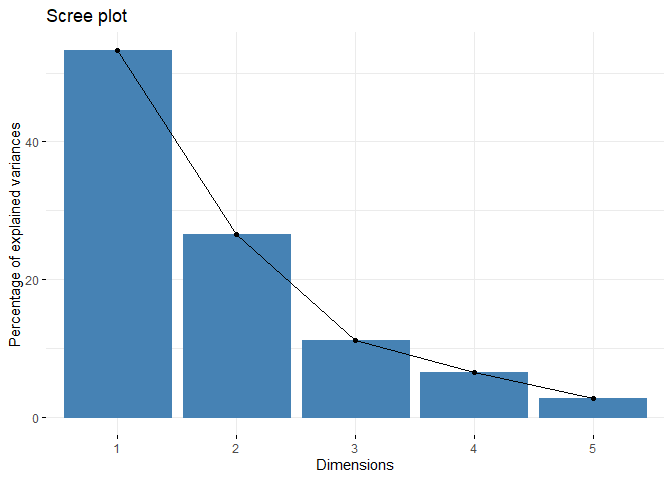<!-- -->

```r
fviz_pca_biplot(res.pca, repel = TRUE,
                col.var = "#2E9FDF", # Variables color
                col.ind = "#696969")  # Individuals color
```

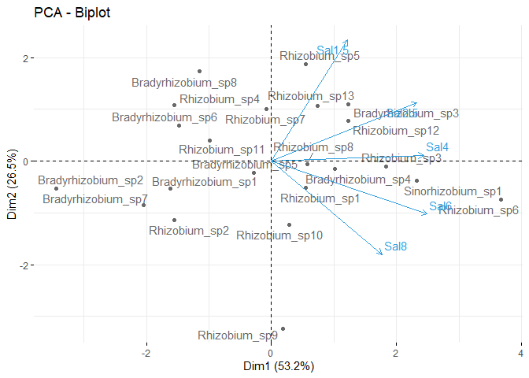<!-- -->
Esta observación destaca que el 53% de la variabilidad en los datos puede ser explicada por las variables que se encuentran en el lado izquierdo del gráfico. Además, se sugiere que la salinidad 6 está más estrechamente relacionada con esta variabilidad.

Esta interpretación implica que las variables ubicadas en el lado izquierdo del gráfico son las principales contribuyentes a la variabilidad observada en el conjunto de datos. La relación específica con la salinidad 6 indica que este factor podría tener un impacto significativo en los patrones o comportamientos observados en los datos. Esto podría sugerir que la salinidad 6 es un factor importante a considerar al analizar y comprender las dinámicas de las bacterias en el conjunto de datos. Sin embargo, es importante tener en cuenta que esta interpretación se basa en la observación visual y podría requerir un análisis más detallado para confirmar y comprender completamente estas relaciones.


```r
### Para pH
noduph = read.table("nodupH.txt", header = TRUE)
res.pca <- prcomp(noduph, scale = TRUE)
fviz_eig(res.pca) ## Para halar el aporte de las varianzas
```

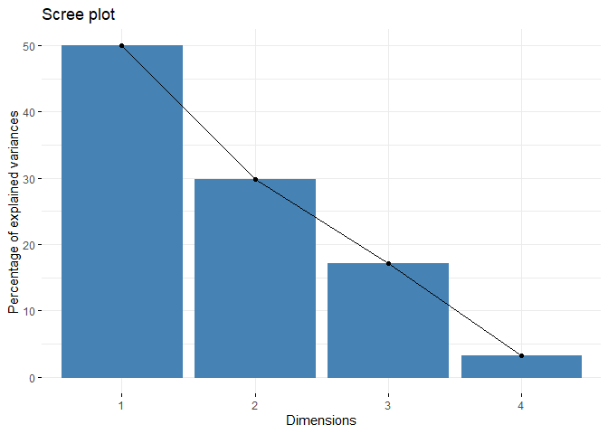<!-- -->

```r
fviz_pca_biplot(res.pca, repel = TRUE,
                col.var = "#2E9FDF", # Variables color
                col.ind = "#696969")  # Individuals color
```

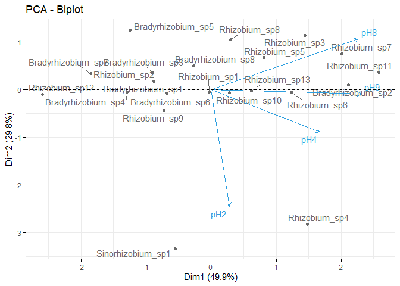<!-- -->


Esta observación destaca una relación significativa entre las bacterias y un pH de 8, donde se puede observar la presencia de la mayoría de las bacterias.

Esta interpretación sugiere que el pH de 8 puede ser un factor clave que influye en la distribución y la abundancia de las bacterias en el conjunto de datos. La concentración de bacterias en este pH específico puede indicar que las condiciones asociadas con un pH de 8 son óptimas o altamente favorables para el crecimiento y la proliferación bacteriana. Esta relación resalta la importancia del pH como un factor ambiental que puede modular la diversidad y la actividad bacteriana en el ecosistema en cuestión.

Sin embargo, es importante recordar que esta interpretación se basa en una observación visual y que se necesitarían análisis adicionales para confirmar y comprender completamente esta relación entre el pH y la distribución de bacterias.


